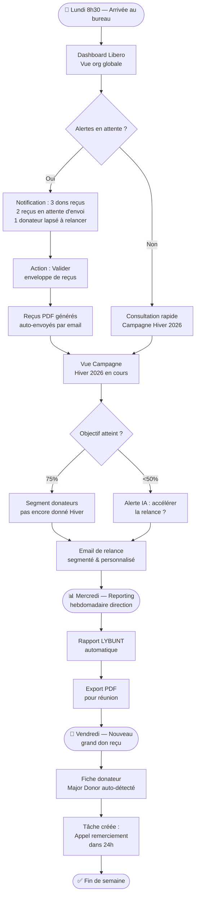
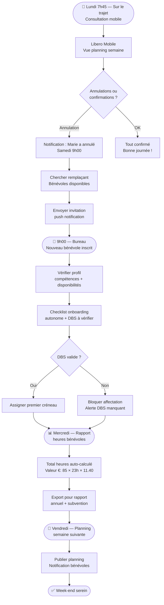
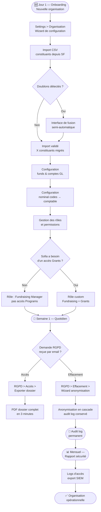
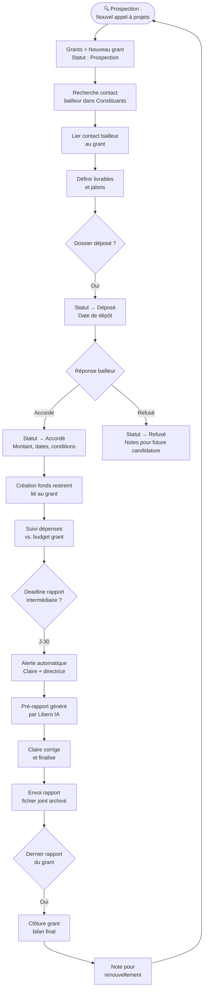
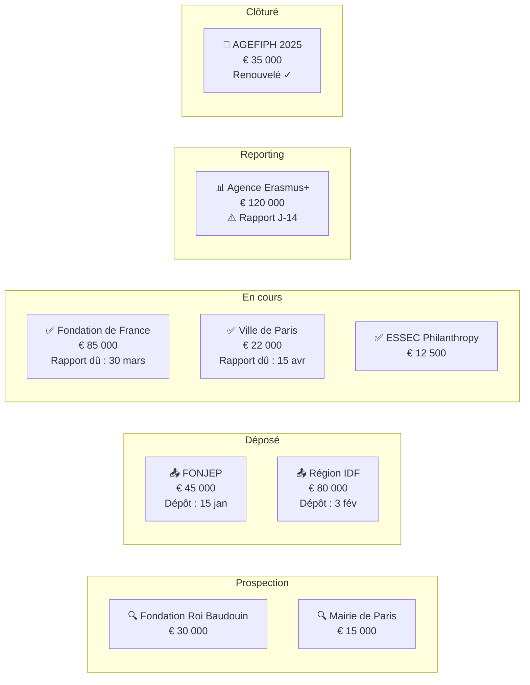
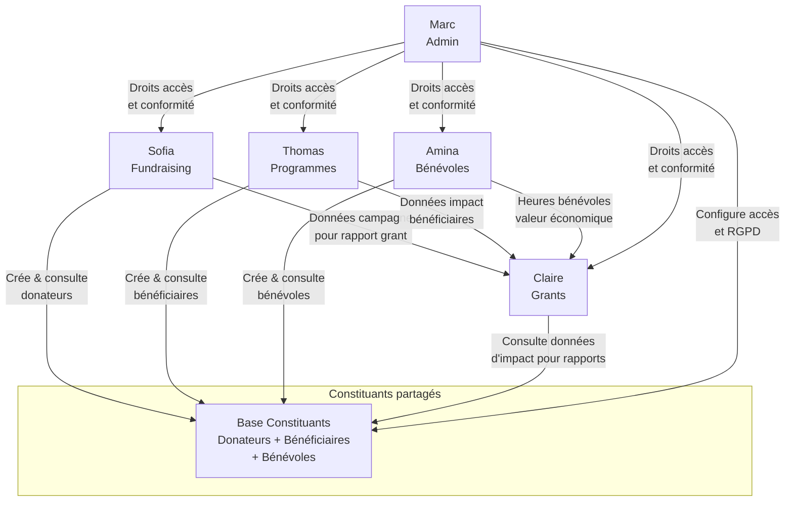

# 12 — User Journey Maps

> **Libero NPO Platform** — User journeys pour chaque persona cible.
> Last updated: 2026-02-26
> Auteur : Design Architect (UX Research)

---

## Introduction

Ce document cartographie les parcours utilisateurs complets pour les cinq personas principaux de Libero NPO Platform. Chaque journey map est conçue pour :

1. **Comprendre le contexte réel** de l'utilisateur (frustrations actuelles, contexte organisationnel)
2. **Identifier les moments clés** dans la plateforme (entrée, travail quotidien, sorties)
3. **Repérer les frictions potentielles** avant le développement
4. **Définir les moments d'enchantement** que Libero doit absolument réussir
5. **Formuler les questions UX** à tester avec de vraies personnes

Ces journeys servent de référence pour les équipes produit, design et développement. Ils sont volontairement détaillés et réalistes — basés sur le profil des ONG françaises et suisses de 5 à 150 personnes, en 2026.

---

## Table des matières

1. [Sofia — Responsable fundraising](#1-sofia--responsable-fundraising)
2. [Thomas — Coordinateur de programmes](#2-thomas--coordinateur-de-programmes-et-bénéficiaires)
3. [Amina — Coordinatrice bénévoles](#3-amina--coordinatrice-bénévoles)
4. [Marc — Administrateur système](#4-marc--administrateur-système)
5. [Claire — Responsable subventions (grants)](#5-claire--responsable-subventions-grants)
6. [Synthèse transversale](#6-synthèse-transversale)

---

## 1. Sofia — Responsable fundraising

### 1.1 Profil

| Attribut | Détail |
|---|---|
| **Nom** | Sofia Marchetti |
| **Âge** | 38 ans |
| **Organisation** | Solidarité Méditerranée — ONG basée à Lyon, 25 personnes, aide aux réfugiés |
| **Budget annuel** | ~€ 1,8 M (dont 60 % dons individuels, 30 % subventions, 10 % événements) |
| **Rôle** | Responsable fundraising & communication — seule en charge de la collecte |
| **Expérience tech** | 7 ans sur Salesforce NPSP ; utilise Excel pour tout ce que Salesforce ne fait pas bien |
| **Dispositifs** | MacBook Pro 14" au bureau, iPhone 13 pour consulter en déplacement |
| **Langues** | Français (natif), anglais (professionnel) |

#### Frustrations actuelles (Salesforce / Excel)

- **Salesforce trop complexe** : chaque rapport nécessite de comprendre les "report types" — Sofia appelle le consultant externe Julien au moins 2× par mois pour des rapports qui devraient être évidents
- **Coût explosif** : l'organisation paie 12 licences à €75/mois = €900/mois juste pour le CRM, inacceptable
- **Les reçus fiscaux ne sont pas aux normes françaises** : elle doit les retoucher dans Word avant envoi
- **RGPD non natif** : le consentement est géré dans un Google Sheet séparé — elle a peur à chaque contrôle CNIL
- **Doublon donors** : elle trouve régulièrement 2-3 fiches pour le même donateur, ce qui fausse les totaux de campagne
- **Pas de vue "donateur vivant"** : impossible de voir en un clic depuis quand un donateur donne, combien, et si un remerciement a été envoyé

#### Objectif principal dans Libero

> *"Je veux pouvoir commencer ma journée en 2 minutes, savoir exactement où j'en suis sur chaque campagne, identifier les donateurs à relancer, et envoyer un remerciement correct — sans avoir à appeler Julien."*

---

### 1.2 User Journey — Journée type (lundi matin → vendredi soir)

#### Vue d'ensemble du parcours hebdomadaire



#### Tableau du journey étape par étape

| # | Moment | Écran Libero | Action | Émotion | Friction potentielle | Moment de joie |
|---|---|---|---|---|---|---|
| 1 | **Lundi 8h30** — Arrivée, café, ouverture Libero | `Dashboard` — Vue organisation | Sofia voit le résumé : dons de la semaine, progression des campagnes actives, alertes | 😐 Routine | Si le dashboard est trop chargé et n'est pas personnalisable | ✨ Le chiffre "Total collecté ce mois : 43 250 €" saute aux yeux, avec progression vs. mois dernier |
| 2 | **8h35** — Traitement des alertes | `Notifications / Inbox` | 3 nouvelles alertes : 2 dons en ligne (HelloAsso), 1 reçu en attente, 1 donateur lapsé depuis 14 mois | 🙂 Engagée | Notifications trop nombreuses si mal configurées | ✨ Chaque alerte a une action directe : "Envoyer le reçu" → 1 clic |
| 3 | **8h40** — Envoi des reçus fiscaux | `Dons > Reçus en attente` | Valide le lot de 2 reçus ; les PDFs sont générés en format cerfa-compatible et envoyés | 😊 Soulagée | Si le template reçu ne correspond pas exactement au format Bercy/DGIP | ✨ "2 reçus envoyés automatiquement — conformes au format fiscal français 2026" |
| 4 | **8h50** — Suivi campagne Hiver 2026 | `Fundraising > Campagnes > Hiver 2026` | Consulte la progression : 73 % de l'objectif (€ 43 750 / € 60 000), 234 donateurs, don moyen € 187 | 😊 Focus | Si les métriques ne correspondent pas à ce qu'elle attend (ex: dons en ligne vs. chèques) | ✨ Barre de progression avec jalons (25%, 50%, 75%, 100%) — satisfaction visuelle immédiate |
| 5 | **9h00** — Identification des relances prioritaires | `Constituants > Segments > "Donateurs Hiver 2025 pas encore Hiver 2026"` | Libero propose automatiquement le segment "Ont donné l'hiver dernier, pas encore cette année" | 😊 Productive | La construction de segments est complexe si non guidée | ✨ L'IA suggère le segment pré-configuré — elle n'a qu'à valider |
| 6 | **9h15** — Rédaction email de relance | `Communications > Nouvelle campagne email` | Utilise un template "Relance fidèles" ; personnalise avec le prénom et le montant du don précédent | 😊 Créative | Si la fusion des champs (merge fields) est peu intuitive | ✨ Aperçu live du mail personnalisé avec vraies données donateur |
| 7 | **9h45** — Envoi et test | `Communications > Envoi > Confirmer` | Envoie d'abord un email test à elle-même, puis planifie l'envoi pour mardi 10h | 🙂 Prudente | Pas d'envoi de test évident avant l'envoi réel | ✨ "Email planifié pour 89 destinataires — mardi 10h00" |
| 8 | **10h00** — Revue dossier grand donateur | `Constituants > Personnes > Jean-Pierre Fontaine` | Jean-Pierre a fait un virement de €2 000 hier — Libero l'a automatiquement classé "Major Donor" | 😮 Surprise positive | Si le seuil major donor n'est pas configurable | ✨ Alerte IA : "Jean-Pierre Fontaine a franchi le seuil major donor — souhaitez-vous créer une tâche de suivi personnalisé ?" |
| 9 | **10h10** — Tâche de suivi | `Tâches > Nouvelle tâche` | Crée une tâche "Appel remerciement J-P Fontaine" pour demain 14h | 🙂 Organisée | — | — |
| 10 | **Mercredi 9h00** — Préparation reporting | `Rapports > LYBUNT 2025` | Lance le rapport LYBUNT (Gave Last Year But Unfortunately Not This) pour l'AG mensuelle | 😌 Rassurée | Si le rapport LYBUNT nécessite une configuration manuelle | ✨ Le rapport est pré-configuré, cliquable, exportable en PDF en 10 secondes |
| 11 | **Mercredi 9h15** — Export et présentation | `Rapports > Exporter en PDF` | Exporte le rapport avec le logo de l'organisation pour présenter à la directrice | 😊 Professionnelle | Si le PDF exporté est trop brut (sans mise en page) | ✨ Le PDF inclut automatiquement le logo, les couleurs, la date du rapport |
| 12 | **Vendredi 15h00** — Clôture de semaine | `Dashboard` | Sofia vérifie le total de la semaine : +€ 8 340 collectés | 😊 Satisfaite | — | ✨ Le dashboard affiche "+18% vs. même semaine l'an dernier" — validation instantanée |

---

### 1.3 Écrans traversés dans ce parcours

```
Dashboard (organisation overview)
├── Notifications / Inbox (alertes & actions rapides)
├── Dons > Reçus en attente (lot de reçus à valider)
├── Fundraising > Campagnes > [Nom campagne] (vue détail campagne)
├── Constituants > Segments > [Nom segment] (vue segment)
├── Constituants > Personnes > [Fiche donateur] (detail constituent)
├── Communications > Nouvelle campagne email
├── Communications > Historique envois
├── Tâches > Liste & Création
└── Rapports > LYBUNT / Export PDF
```

---

### 1.4 Moments de friction potentiels

| Friction | Probabilité | Impact | Mitigation recommandée |
|---|---|---|---|
| Dashboard trop chargé au premier lancement | Haute | Haut | Onboarding progressif ; afficher seulement 3-4 widgets clés par défaut |
| Template reçu fiscal non conforme au format français | Haute | Critique | Livrer avec templates pré-validés pour FR, CH, BE — conformité vérifiée par expert comptable |
| Constructeur de segment trop technique | Moyenne | Haut | Proposer des segments pré-définis ("LYBUNT", "Donateurs fidèles", "À relancer") avec 1 clic |
| Merge fields email peu intuitifs | Moyenne | Moyen | Autocomplétion des champs + prévisualisation live |
| Seuil major donor non configurable | Faible | Moyen | Paramètre dans Settings > Fundraising > Seuils |
| Rapport LYBUNT nécessitant une config manuelle | Haute | Haut | Rapport pré-configuré disponible dès le premier jour |

---

### 1.5 Moments de joie (Sofia doit sourire ici)

1. **8h35** : "Tes 2 reçus ont été envoyés automatiquement à Marie et Georges — conformes au format fiscal 2026." Zéro effort.
2. **9h00** : L'IA a déjà préparé le segment "À relancer Hiver 2026" — elle n'a qu'à cliquer "Envoyer".
3. **9h45** : L'aperçu de l'email montre "Cher Jean-Pierre, merci pour votre fidélité depuis 2019 et votre don de 350 € l'an dernier." Personnalisé, précis, sans copier-coller.
4. **10h10** : Libero suggère automatiquement une tâche de suivi pour le major donor — elle se sent épaulée.
5. **Mercredi 9h10** : Le rapport LYBUNT est prêt en PDF avec le logo de Solidarité Méditerranée — elle peut aller en réunion dans 5 minutes.

---

### 1.6 Questions ouvertes UX (à tester avec de vraies personnes)

1. **Quelle est la première information que Sofia cherche en ouvrant Libero le matin ?** Tester différentes configurations de dashboard (chiffres clés / alertes / campagnes actives).
2. **Comment Sofia construit-elle un segment de relance aujourd'hui ?** Observer la tâche actuelle dans Salesforce pour mesurer le gain de temps Libero.
3. **Quel est son niveau de confiance dans les reçus fiscaux générés automatiquement ?** Risque : elle imprime et vérifie systématiquement — est-ce évitable ?
4. **Combien de temps passe-t-elle sur les rapports chaque semaine ?** Objectif : réduire de 3h à 20 minutes.
5. **Qu'est-ce qu'elle ferait différemment si le reporting était instantané ?** Ouvrir de nouvelles habitudes de travail ou libérer du temps créatif.

---

## 2. Thomas — Coordinateur de programmes et bénéficiaires

### 2.1 Profil

| Attribut | Détail |
|---|---|
| **Nom** | Thomas Dubois |
| **Âge** | 31 ans |
| **Organisation** | Centre d'Accueil et de Soins — ONG genevoise, 40 personnes, soins ambulatoires pour précaires |
| **Budget annuel** | ~CHF 2,4 M (subventions publiques cantonales + fonds privés) |
| **Rôle** | Coordinateur programmes & suivi bénéficiaires — 3 travailleurs sociaux sous sa coordination |
| **Expérience tech** | Débutant sur le CRM (a utilisé Excel et des dossiers papier) ; à l'aise avec WhatsApp |
| **Dispositifs** | Ordinateur de bureau au centre + tablette Android en déplacement (visites domicile) |
| **Langues** | Français (natif), arabe (conversation) |

#### Frustrations actuelles (Excel / dossiers papier)

- **Dossiers éparpillés** : les notes de suivi sont dans Word, le tableau de suivi dans Excel, les rendez-vous dans Google Calendar — jamais au même endroit
- **Pas de vision globale de la file active** : il ne sait pas en 2 minutes combien de bénéficiaires sont en cours, combien en attente, combien ont été clôturés ce mois
- **Notes de suivi non standardisées** : chaque travailleur social note différemment ; impossible de reprendre un dossier si quelqu'un est absent
- **Reporting subvention laborieux** : chaque trimestre, il compile manuellement les heures de service délivrées depuis 4 feuilles Excel — 2 jours de travail
- **Confidentialité approximative** : tout le monde a accès à tout dans le Google Drive partagé

#### Objectif principal dans Libero

> *"Je veux que chaque travailleur social puisse ouvrir le dossier d'un bénéficiaire, voir tout son historique, écrire une note de suivi, et que ça soit immédiatement partagé avec toute l'équipe — sans sortir d'Excel."*

---

### 2.2 User Journey — Journée type sur le terrain

```mermaid
flowchart TD
    A([🌅 8h00 — Briefing équipe\nauCentre d'Accueil]) --> B[Libero > Programs\nVue charge de travail]
    B --> C[Sélectionne la liste\ndes cas actifs du jour]
    C --> D{Nouveau bénéficiaire\narrivé ?}
    D -->|Oui| E[Créer fiche bénéficiaire\nRecherche doublon auto]
    D -->|Non| F[Ouvrir dossier existant\nTimeline activité]
    E --> G[Enrôlement programme\n"Soins ambulatoires"]
    G --> H[Note de suivi initiale\n— standardisée]
    F --> I[Lire notes précédentes\ndes collègues]
    I --> J{Rendez-vous\nprévu aujourd'hui ?}
    J -->|Oui| K[Enregistrer prestation\n1 séance soin primaire]
    J -->|Non| L[Vérifier statut\nliste d'attente]
    H --> K
    K --> M([🚗 11h30 — Visite\nà domicile, tablette])
    M --> N[Ouvrir fiche sur tablette\nMode hors-ligne]
    N --> O[Ajouter note de visite\ndictée vocalement]
    O --> P[Synchronisation auto\ndès réseau disponible]
    P --> Q([📊 16h00 — Rapport\ntrimestrel subvention])
    Q --> R[Rapport Impact\nheures délivrées auto-calculées]
    R --> S[Export pour canton GE\nformat requis]
    S --> T([✅ 17h00 — Fin])
```

#### Tableau du journey étape par étape

| # | Moment | Écran Libero | Action | Émotion | Friction potentielle | Moment de joie |
|---|---|---|---|---|---|---|
| 1 | **8h00** — Briefing équipe, Thomas prépare la journée | `Programs > Cases > Ma file active` | Voit ses 23 cas actifs avec statut (actif, en pause, en attente de rendez-vous) | 😐 Concentré | Si la liste ne distingue pas ses cas de ceux de ses collègues | ✨ Vue "Ma file" personnalisée — Thomas voit uniquement ses bénéficiaires assignés |
| 2 | **8h10** — Arrivée d'un nouveau bénéficiaire | `Constituants > Nouveau > Personne` | Saisit nom + date de naissance — Libero vérifie immédiatement les doublons | 😐 Attentif | Formulaire trop long pour une saisie rapide à l'accueil | ✨ Doublon détecté : "Il existe un dossier pour Karim A., 41 ans — est-ce la même personne ?" Évite la duplication |
| 3 | **8h15** — Enrôlement programme | `Programs > Enrôlement > Nouveau` | Enrôle Karim dans le programme "Soins ambulatoires – Genève 2026" | 😊 Organisé | Si la liste de programmes n'est pas claire (trop de programmes actifs/archivés) | ✨ L'enrôlement crée automatiquement le premier rendez-vous suggéré dans le calendrier |
| 4 | **8h20** — Note initiale | `Cases > Notes > Nouvelle note` | Saisit la note d'accueil structurée : situation, besoins, orientation | 😊 Professionnel | Si le champ note est un textarea brut sans structure | ✨ Template de note "Premier accueil" pré-chargé avec les sections clés — Thomas complète, ne repart pas de zéro |
| 5 | **9h00** — Consultation dossier existant | `Constituants > Amira Ben Salah > Timeline` | Consulte l'historique complet d'Amira : notes de ses collègues, prestations, rendez-vous | 😊 Informé | Si les notes des collègues ne sont pas clairement attribuées | ✨ Chaque note affiche l'auteur + horodatage — Thomas voit qui a fait quoi et quand |
| 6 | **9h15** — Enregistrement de prestation | `Cases > Amira > Prestations > Ajouter` | Enregistre 1 consultation médicale de 45 minutes — type, durée, intervenant | 😊 Précis | Si la saisie de prestation nécessite trop de clics | ✨ Saisie rapide : 3 champs (type, durée, date) + validation en 10 secondes |
| 7 | **11h30** — Visite à domicile, tablette | `Cases > Mehdi Laroussi > Notes` (mode tablette) | Ouvre le dossier de Mehdi depuis la tablette — hors-ligne si réseau absent | 😐 Prudent | Si la tablette ne fonctionne pas hors-ligne | ✨ Banner "Mode hors-ligne — vos données seront synchronisées dès que vous aurez du réseau." Pas de panique |
| 8 | **11h45** — Dictée de note | `Cases > Note > Dictée vocale` | Dicte la note de visite à la voix (tablette Android) — transcription automatique | 😮 Impressionné | Qualité de la transcription vocale avec jargon social/médical | ✨ Thomas n'a pas besoin de taper sur une tablette avec des gants — il parle, ça s'écrit |
| 9 | **12h00** — Synchronisation | `Sync indicator > ✅ Synchronisé` | Dès qu'il retrouve du réseau, la note est synchronisée | 😌 Soulagé | Si la sync échoue sans notification claire | ✨ "1 note synchronisée avec succès — Mehdi Laroussi à 12h03" |
| 10 | **14h00** — Gestion liste d'attente | `Programs > Liste d'attente` | Consulte les 7 personnes en attente d'une place ; vérifie si une place s'est libérée | 😐 Concentré | Si la liste d'attente n'indique pas depuis quand chaque personne attend | ✨ La liste d'attente trie automatiquement par ancienneté + urgence marquée manuellement |
| 11 | **16h00** — Rapport trimestriel subvention Canton GE | `Reports > Impact > Programmes > T1 2026` | Lance le rapport des prestations délivrées sur le T1 : heures, types, bénéficiaires uniques | 😮 Impressionné | Si les données ne correspondent pas exactement au format demandé par le canton | ✨ Le rapport est pré-mappé au format du rapport de subvention cantonal — copier-coller direct |
| 12 | **16h30** — Export et envoi | `Reports > Export CSV/PDF` | Exporte le rapport en PDF et en CSV (pour le service de subventions du DCS) | 😊 Professionnel | — | ✨ Ce rapport lui prenait 2 jours avec Excel. Libero : 15 minutes. |

---

### 2.3 Écrans traversés dans ce parcours

```
Programs > Cases > Ma file active (vue caseload personnel)
├── Constituants > Nouveau Bénéficiaire (création + doublon check)
├── Programs > Enrôlement (wizard 3 étapes)
├── Cases > [Bénéficiaire] > Timeline (historique complet)
├── Cases > [Bénéficiaire] > Notes (lecture + saisie + templates)
├── Cases > [Bénéficiaire] > Prestations (service delivery)
├── Programs > Liste d'attente
├── Reports > Impact > Programmes > [Période]
└── Reports > Export (PDF / CSV)
```

---

### 2.4 Moments de friction potentiels

| Friction | Probabilité | Impact | Mitigation recommandée |
|---|---|---|---|
| Formulaire d'accueil trop long, ralentit la saisie à l'accueil | Haute | Haut | Mode "saisie rapide" : nom, DOB, téléphone — reste ultérieurement |
| Interface tablette non optimisée pour le terrain | Haute | Critique | Design mobile-first pour les vues terrain ; tester avec une vraie tablette Android |
| Hors-ligne non supporté (réseau instable sur le terrain) | Haute | Critique | PWA avec IndexedDB local ; sync intelligente à la reconnexion |
| Notes non structurées difficiles à reprendre | Haute | Haut | Templates de notes par type de prestation (accueil, suivi, clôture) |
| Rapport de subvention ne correspond pas au format du bailleur | Haute | Critique | Configurer des templates de rapport funder-spécifiques dès l'onboarding |
| Transcription vocale imprécise avec jargon médico-social | Moyenne | Moyen | Fine-tuning sur vocabulaire ONG + option de correction inline |

---

### 2.5 Moments de joie

1. **8h10** : Doublon détecté en temps réel — Karim n'est pas créé deux fois, l'historique est préservé.
2. **8h20** : Template de note "Premier accueil" déjà structuré — Thomas remplit des cases, ne reformate pas.
3. **11h30** : La tablette fonctionne hors-ligne en visite terrain — pas de stress réseau.
4. **11h45** : Dictée vocale en déplacement — plus besoin de taper sur l'écran avec les doigts froids de l'hiver genevois.
5. **16h15** : Le rapport trimestriel est prêt en 15 minutes — contre 2 jours dans Excel. Thomas peut rentrer chez lui à l'heure.

---

### 2.6 Questions ouvertes UX

1. **Comment Thomas sait-il quelle note prendre quand ? Existe-t-il une procédure formelle dans son organisation ?** Observer pour ne pas imposer une structure trop rigide.
2. **La dictée vocale est-elle acceptable dans les contextes sensibles (confidentialité, présence du bénéficiaire) ?** Explorer les contextes d'usage réels.
3. **Quel niveau de droits d'accès Thomas attend-il vis-à-vis de ses collègues ?** Peut-il voir les dossiers des autres travailleurs sociaux, ou seulement les siens ?
4. **Quel est le workflow de clôture de dossier ?** Est-il standardisé ou chaque organisation a-t-elle ses propres critères ?
5. **Comment Thomas gère-t-il les situations d'urgence (bénéficiaire en danger) dans le CRM ?** Y a-t-il besoin d'un flag "urgence" avec notification à la direction ?

---

## 3. Amina — Coordinatrice bénévoles

### 3.1 Profil

| Attribut | Détail |
|---|---|
| **Nom** | Amina Benali |
| **Âge** | 27 ans |
| **Organisation** | Les Restos du Cœur — antenne de Strasbourg, 8 salariés, 85 bénévoles actifs |
| **Budget annuel** | ~€ 380 000 (subventions + collectes nationales) |
| **Rôle** | Coordinatrice bénévoles — recrutement, planning, suivi des heures |
| **Expérience tech** | Digital native ; utilise WhatsApp pour tout, Google Sheets pour les plannings |
| **Dispositifs** | iPhone 14 principalement, MacBook Air au bureau occasionnellement |
| **Langues** | Français (natif) |

#### Frustrations actuelles (WhatsApp / Google Sheets)

- **Planning dans un Google Sheet partagé** : mises à jour simultanées = conflits, formules cassées, données perdues
- **WhatsApp groupe pour les annonces** : 85 bénévoles dans un groupe, le bruit est insupportable, les messages importants sont noyés
- **Suivi des heures fait à la main** : elle additionne les feuilles de présence papier chaque mois — 4 heures de travail pour rien
- **Pas de suivi des compétences** : elle ne sait pas qui peut conduire un camion, qui parle arabe, qui a un DBS (casier judiciaire vérifié)
- **Vérifications judiciaires expirées** : elle a découvert trop tard qu'un bénévole en contact avec des enfants avait un extrait de casier périmé

#### Objectif principal dans Libero

> *"Je veux que mes bénévoles puissent s'inscrire à un créneau depuis leur téléphone, que je reçoive une alerte si quelqu'un annule, et que le total des heures se calcule tout seul en fin de mois."*

---

### 3.2 User Journey — Semaine de coordination bénévoles



#### Tableau du journey étape par étape

| # | Moment | Écran Libero | Action | Émotion | Friction potentielle | Moment de joie |
|---|---|---|---|---|---|---|
| 1 | **Lundi 7h45** — Dans le tram, iPhone | `Volunteers > Mon planning` (mobile) | Consulte les confirmations/annulations de la semaine | 😊 Organisée | Si la vue mobile est une version dégradée du desktop | ✨ Interface mobile fluide, adaptée à une consultation rapide dans le tram |
| 2 | **7h50** — Annulation reçue | `Notifications > Annulation Marie S.` | Marie a annulé pour samedi — Amina doit trouver un remplaçant | 😟 Stressée | Si elle doit chercher manuellement dans la liste | ✨ Libero affiche directement "3 bénévoles disponibles samedi 9h et compétents pour ce rôle" |
| 3 | **7h55** — Invitation remplaçant | `Volunteers > Lena K. > Inviter ce créneau` | Envoie une invitation push à Lena — qui accepte en 10 minutes | 😌 Soulagée | Lena ne répond pas — qui contacter ensuite ? | ✨ File d'attente de remplaçants — si Lena décline, Libero propose automatiquement le suivant |
| 4 | **9h00** — Nouveau bénévolat en ligne | `Volunteers > Inscriptions > Lucas M.` | Lucas s'est inscrit via le formulaire bénévole en ligne — profil créé dans Libero | 😊 Heureuse | Si le formulaire en ligne ne s'intègre pas automatiquement dans Libero | ✨ Profil Lucas créé automatiquement — avec ses compétences et disponibilités déclarées |
| 5 | **9h10** — Onboarding checklist | `Volunteers > Lucas M. > Onboarding` | Libero génère la checklist : entretien, référence, DBS, induction, premier créneau | 😊 Organisée | Si la checklist n'est pas customisable par l'organisation | ✨ Checklist d'onboarding préconfigurée — Amina coche, délègue, relance automatiquement |
| 6 | **9h30** — Vérification DBS/casier | `Volunteers > Lucas M. > Documents > DBS` | Lucas doit fournir un extrait de casier récent (contact enfants) — Libero envoie un rappel automatique | 😐 Prudente | Si Libero ne distingue pas les rôles nécessitant un DBS | ✨ Libero bloque l'affectation sur les rôles "contact enfants" jusqu'à validation DBS |
| 7 | **10h00** — Consultation compétences | `Volunteers > Filtres > Permis PL + Disponible week-end` | Cherche un bénévole avec permis poids lourd disponible ce week-end | 😊 Efficace | Si les filtres de compétences ne sont pas assez fins | ✨ Résultat instantané : "2 bénévoles correspondants : Ahmed (Strasbourg Nord), Sophie (Strasbourg Sud)" |
| 8 | **Mercredi 9h00** — Calcul heures mensuelles | `Volunteers > Rapports > Heures > Janvier 2026` | Lance le rapport des heures bénévoles pour le mois | 😮 Impressionnée | — | ✨ Total calculé automatiquement : 1 840 heures | valeur estimée : € 20 976 (taux national 2026) |
| 9 | **9h15** — Export rapport | `Rapports > Heures bénévoles > Export PDF` | Exporte le rapport pour le rapport annuel et la subvention FONJEP | 😊 Professionnelle | Si l'export ne distingue pas les bénévoles par programme | ✨ Le rapport ventile par programme/activité — exactement ce que demande le FONJEP |
| 10 | **Vendredi 14h00** — Construction planning semaine suivante | `Volunteers > Planning > Semaine du 2 mars` | Construit le planning en drag & drop — affecte les bénévoles aux créneaux | 😊 En contrôle | Si le drag & drop ne fonctionne pas bien sur tablette/mobile | ✨ Planning visuellement clair avec statut de chaque créneau (ouvert, complet, liste d'attente) |
| 11 | **15h00** — Publication du planning | `Volunteers > Planning > Publier` | Publie le planning — tous les bénévoles reçoivent une notification push avec leur créneau | 😊 Soulagée | Si les notifications arrivent trop tard ou sont ignorées | ✨ Push + email résumé personnalisé pour chaque bénévole : "Votre créneau : Samedi 9h – Distribution alimentaire, Rue de la Paix" |
| 12 | **Vendredi 17h00** — Alerte DBS expiré | `Notifications > Alerte : DBS de Ahmed M. expire dans 14 jours` | Amina reçoit l'alerte avant l'expiration — Ahmed est averti aussi | 😌 Proactive | Si l'alerte arrive seulement après expiration | ✨ Proactivité totale : Amina résout le problème avant la crise, pas après |

---

### 3.3 Écrans traversés dans ce parcours

```
Volunteers > Mon planning (vue mobile prioritaire)
├── Volunteers > Inscriptions (nouveaux bénévoles)
├── Volunteers > [Profil bénévole] > Onboarding checklist
├── Volunteers > [Profil bénévole] > Documents & DBS
├── Volunteers > Compétences & Filtres avancés
├── Volunteers > Planning > [Semaine] (vue calendrier + drag & drop)
├── Volunteers > Planning > Publier & Notifier
├── Volunteers > Rapports > Heures (mensuel / annuel)
├── Volunteers > Rapports > Export (PDF / CSV)
└── Notifications > Alertes DBS / Annulations / Confirmations
```

---

### 3.4 Moments de friction potentiels

| Friction | Probabilité | Impact | Mitigation recommandée |
|---|---|---|---|
| Interface mobile dégradée — Amina vit sur son téléphone | Haute | Critique | Concevoir la vue Volunteers en mobile-first ; tester avec iPhone 14 et Android bas de gamme |
| Notifications push ignorées par les bénévoles | Haute | Haut | Option email + SMS (Twilio) ; A/B tester horaire d'envoi optimal |
| Drag & drop planning difficile sur mobile | Haute | Haut | Interface mobile alternative : liste avec menu d'action rapide |
| Blocage DBS trop rigide (bénévole bloqué injustement) | Moyenne | Moyen | Permettre override admin avec motif documenté |
| Calcul valeur heures bénévoles taux incorrect | Faible | Moyen | Taux configurable dans Settings > Volunteers > Taux horaire |
| Formulaire en ligne bénévoles ne s'intègre pas sans dev | Haute | Haut | Fournir un formulaire embed Libero clé en main |

---

### 3.5 Moments de joie

1. **7h55** : Libero propose automatiquement les remplaçants disponibles et compétents — Amina résout une annulation en 3 minutes depuis son téléphone dans le tram.
2. **9h10** : Le profil Lucas est déjà créé avec ses compétences déclarées — zéro re-saisie.
3. **9h30** : Libero bloque automatiquement l'affectation "contact enfants" pour Lucas sans DBS — conformité sans effort.
4. **Mercredi 9h15** : Le calcul des 1 840 heures et leur valeur économique est instantané — Amina peut défendre la valeur bénévole en 30 secondes face à un funder.
5. **Vendredi 17h00** : L'alerte DBS arrive 14 jours avant expiration — Amina n'a plus jamais de surprise le samedi matin.

---

### 3.6 Questions ouvertes UX

1. **Amina utilise-t-elle vraiment un iPhone pour tout ou passe-t-elle par l'ordi pour certaines tâches ?** Cartographier précisément les tâches mobile vs. desktop.
2. **Quelle est la tolérance des bénévoles aux notifications Libero ?** Risque de spam — étudier les préférences de canal par tranche d'âge.
3. **Comment les bénévoles signalent-ils une annulation aujourd'hui ?** WhatsApp, email, SMS ? Quel canal Libero doit-il supporter en premier ?
4. **La valeur monétaire des heures bénévoles est-elle un concept que les bénévoles comprennent et apprécient ?** Risque de froisser avec une logique "marchande".
5. **Le drag & drop est-il la bonne interaction pour construire un planning avec 85 personnes ?** Tester une alternative : "Affecter à ce créneau" depuis la fiche bénévole.

---

## 4. Marc — Administrateur système

### 4.1 Profil

| Attribut | Détail |
|---|---|
| **Nom** | Marc Perret |
| **Âge** | 45 ans |
| **Organisation** | Aide & Action Suisse — fondation zurichoise, 60 personnes, aide au développement |
| **Budget annuel** | ~CHF 6,2 M (dons institutionnels, dons privés, collectes) |
| **Rôle** | Responsable informatique & administration — seul IT de l'organisation |
| **Expérience tech** | Technicien confirmé ; administre Salesforce depuis 4 ans (certifié Admin) ; utilise aussi Zoho et GitHub |
| **Dispositifs** | MacBook Pro 16", Linux sur VM de test |
| **Langues** | Français, allemand, anglais |

#### Frustrations actuelles (Salesforce admin)

- **Complexité admin Salesforce** : chaque nouvelle fonctionnalité demande 3 onglets de configuration, 5 clics de validation et un article Trailhead pour comprendre
- **RGPD impossible à auditer** : les logs d'accès sont dispersés, les demandes d'effacement nécessitent une intervention manuelle dans 4 objets différents
- **Gestion des rôles incohérente** : le modèle de permissions Salesforce est trop complexe pour les non-techniciens — Marc est constamment sollicité pour des questions triviales
- **Pas de sandbox gratuit** : tester une modification de configuration en production est un risque réel
- **Mises à jour automatiques Salesforce** : parfois, une mise à jour casse un workflow personnalisé — découverte en production

#### Objectif principal dans Libero

> *"Je veux pouvoir configurer l'organisation en 1 jour, gérer les accès en 5 minutes, répondre à une demande RGPD en 10 minutes, et ne pas être appelé chaque fois qu'un collègue ne comprend pas le CRM."*

---

### 4.2 User Journey — Onboarding complet d'une nouvelle organisation + gestion quotidienne



#### Tableau du journey étape par étape — Onboarding J1 à J5

| # | Moment | Écran Libero | Action | Émotion | Friction potentielle | Moment de joie |
|---|---|---|---|---|---|---|
| 1 | **J1 9h00** — Démarrage de l'onboarding | `Settings > Organisation > Wizard` | Marc suit le wizard 5 étapes : infos org, RGPD, fonds, GL, utilisateurs | 😊 Confiant | Si le wizard est trop long ou demande des infos comptables qu'il n'a pas | ✨ Wizard resumable — il peut s'arrêter, revenir plus tard sans perdre sa progression |
| 2 | **J1 10h00** — Import des constituants | `Settings > Import > Depuis Salesforce` | Upload du CSV exporté de Salesforce — Libero mappe automatiquement les colonnes | 😐 Prudent | Colonnes SF non standard, mapping échoue | ✨ Mapping visuel avec aperçu ligne par ligne — il corrige 3 colonnes en 2 minutes |
| 3 | **J1 11h00** — Résolution des doublons | `Settings > Import > Doublons (47 trouvés)` | Interface de fusion : côte à côte, 2 fiches, cases à cocher, ficher à conserver | 😐 Laborieux mais nécessaire | 47 doublons = 47 décisions manuelles ? | ✨ "Fusionner les 12 doublons évidents automatiquement" — les 35 ambigus sont présentés un par un |
| 4 | **J1 14h00** — Configuration des fonds | `Settings > Finance > Fonds` | Crée les fonds restreints et non restreints correspondant aux subventions actives | 😊 Organisé | Si la logique fonds / codes GL n'est pas expliquée | ✨ Tooltip contextuel : "Un fonds restreint est lié à une subvention spécifique — les dépenses sont suivies séparément." |
| 5 | **J1 15h00** — Mapping codes GL | `Settings > Finance > Codes GL` | Mappe les fonds Libero aux codes nominaux de la comptabilité (Sage 50, Swiss Chart of Accounts) | 😐 Technique | Si Libero ne connaît pas le plan comptable suisse | ✨ Libero propose un plan comptable suisse standard (PME/Asso) pré-chargé — Marc ajuste 3 lignes |
| 6 | **J1 16h30** — Gestion des rôles | `Settings > Utilisateurs > Rôles` | Crée les rôles : Fundraising Manager, Program Coordinator, Volunteer Coordinator, Grants Officer, Admin | 😊 En contrôle | Si la granularité des permissions est insuffisante | ✨ Rôles pré-définis correspondant aux personas Libero — Marc active/désactive des modules par rôle |
| 7 | **J2 9h00** — Invitations utilisateurs | `Settings > Utilisateurs > Inviter` | Envoie les invitations par email aux 12 utilisateurs — ils configurent leur propre mot de passe | 😊 Délégué | Si les utilisateurs ont du mal à s'activer (lien expiré, etc.) | ✨ Lien d'invitation valable 7 jours, avec renouvellement facile depuis l'admin |
| 8 | **Semaine 1 — Demande RGPD** | `RGPD > Demandes > Nouvelle demande` | Un donateur demande accès à ses données (article 15 RGPD) — Marc reçoit l'email | 😐 Attentif | Si le dossier complet doit être compilé manuellement | ✨ "Générer le dossier RGPD complet de M. Fernandez" → PDF en 3 minutes : dons, consentements, notes, communications |
| 9 | **Semaine 1 — Demande effacement** | `RGPD > Effacement > Wizard` | Un ancien bénévole demande l'effacement de ses données — article 17 RGPD | 😐 Prudent | Si l'effacement casse des relations (dons liés, etc.) | ✨ Wizard d'anonymisation : "Ces données seront anonymisées. Les dons resteront pour la comptabilité mais sans lien nominatif." |
| 10 | **Mensuel — Audit sécurité** | `Settings > Logs d'accès` | Marc consulte les logs d'accès du mois : qui a accédé à quoi, quand | 😊 Rassuré | Si les logs sont trop verbeux pour être exploitables | ✨ Logs filtrables : par utilisateur, par action, par type de données — export CSV pour le RSSI |
| 11 | **Mensuel — Rapport RGPD** | `RGPD > Registre des traitements` | Met à jour le registre des traitements (obligatoire RGPD Article 30) | 😊 Conforme | Si le registre doit être rédigé de zéro | ✨ Registre pré-rempli avec les traitements Libero documentés — Marc ajoute les traitements spécifiques de l'org |
| 12 | **Quotidien** — Support utilisateurs | `Settings > Aide & Support` | Marc ne reçoit plus d'appels "comment faire un rapport" — les utilisateurs se débrouillent | 😊 Libéré | Si l'UX Libero n'est pas assez intuitive pour les non-tech | ✨ Libero est assez simple pour que Sofia, Thomas et Amina travaillent de façon autonome |

---

### 4.3 Écrans traversés dans ce parcours

```
Settings > Organisation > Wizard (onboarding 5 étapes)
├── Settings > Import > Depuis CSV / Salesforce
├── Settings > Import > Résolution doublons
├── Settings > Finance > Fonds & Codes GL
├── Settings > Utilisateurs > Rôles & Permissions
├── Settings > Utilisateurs > Invitations
├── RGPD > Demandes (accès, effacement, portabilité)
├── RGPD > Registre des traitements (Art. 30)
├── Settings > Logs d'accès & Audit trail
├── Settings > Intégrations (Xero, Stripe, Mollie)
└── Settings > Sécurité (2FA, SSO optionnel)
```

---

### 4.4 Moments de friction potentiels

| Friction | Probabilité | Impact | Mitigation recommandée |
|---|---|---|---|
| Import CSV Salesforce avec colonnes non standard | Haute | Haut | Mapper automatiquement les noms de colonnes SF connus + interface de correction visuelle |
| 47 doublons = 47 décisions manuelles | Haute | Haut | Fusion automatique des doublons "évidents" (même email, même nom exact) ; humain seulement pour les ambigus |
| Plan comptable suisse non disponible par défaut | Moyenne | Haut | Livrer plans comptables FR (PCG), CH (KMU), BE, NL pré-configurés |
| Granularité permissions insuffisante | Moyenne | Moyen | Matrice de permissions par module (lecture/écriture/export/admin) |
| Wizard d'effacement RGPD trop brutal | Faible | Critique | Différencier anonymisation (données conservées sans identité) vs. suppression totale — avec conséquences affichées |
| Logs d'accès trop verbeux, inexploitables | Moyenne | Moyen | Filtres avancés + résumé hebdomadaire automatique par email |

---

### 4.5 Moments de joie

1. **J1 10h30** : Le mapping automatique des colonnes Salesforce reconnaît 90 % des champs — Marc n'a que 3 corrections à faire.
2. **J1 11h30** : La fusion automatique des 12 doublons évidents lui économise 30 minutes de clics.
3. **J1 15h00** : Le plan comptable suisse est pré-chargé — Marc ajuste 3 lignes au lieu de saisir 80.
4. **Semaine 1** : Le dossier RGPD d'un donateur est généré en 3 minutes — Marc répond dans les 30 jours légaux sans effort.
5. **Fin mois 1** : Marc n'a reçu que 2 demandes de support (contre 15/mois avec Salesforce). Les utilisateurs se débrouillent.

---

### 4.6 Questions ouvertes UX

1. **Marc est-il vraiment seul à faire l'admin, ou délègue-t-il à la direction ?** Identifier qui a réellement le rôle d'admin dans les petites ONG.
2. **Quel est le processus d'import réel depuis Salesforce ?** Exporter les constituent depuis SF est souvent partiel — quels champs sont prioritaires ?
3. **Comment Marc teste-t-il une configuration avant de la pousser en production ?** Besoin d'un environnement de staging / mode test ?
4. **Les demandes RGPD arrivent-elles par email, formulaire, ou téléphone ?** Concevoir le point d'entrée le plus probable.
5. **Quel est le niveau d'expertise comptable de Marc ?** Le mapping GL peut nécessiter l'intervention du comptable externe — prévoir un workflow de co-configuration.

---

## 5. Claire — Responsable subventions (grants)

### 5.1 Profil

| Attribut | Détail |
|---|---|
| **Nom** | Claire Fontaine |
| **Âge** | 44 ans |
| **Organisation** | Fondation AGIR — Paris 12e, 18 personnes, insertion professionnelle des jeunes |
| **Budget annuel** | ~€ 1,2 M (dont 70 % subventions publiques et privées) |
| **Rôle** | Responsable subventions & relations bailleurs — gère 12 grants actifs simultanément |
| **Expérience tech** | Utilisatrice avancée d'Excel et de Google Docs ; a essayé Salesforce mais abandonné — trop complexe |
| **Dispositifs** | PC Windows (bureau) + iPad pour les réunions bailleurs |
| **Langues** | Français (natif), anglais (professionnel) |

#### Frustrations actuelles (Excel / emails)

- **12 grants dans 12 fichiers Excel** : chaque bailleur a son propre format — elle jongle entre des dizaines d'onglets
- **Deadlines oubliées** : elle a manqué une deadline de rapport intermédiaire pour la Fondation de France l'an dernier — sanction : non-renouvellement du grant
- **Pas de suivi des dépenses par grant** : elle doit demander chaque mois à la comptable (Isabelle) combien a été dépensé sur chaque ligne budgétaire — et souvent Isabelle n'est pas disponible
- **Justificatifs éparpillés** : les pièces jointes de justification sont dans des emails, des Drives, des dossiers papier — retrouver une facture en urgence est cauchemardesque
- **Reporting narratif** : rédiger les rapports d'activité pour chaque bailleur (souvent 15-30 pages) est le travail le plus chronophage, alors que les données sont dans le CRM

#### Objectif principal dans Libero

> *"Je veux avoir un seul endroit où je vois tous mes grants, leurs deadlines, leur budget consommé, et pouvoir générer un premier jet de rapport d'activité à partir des données du CRM."*

---

### 5.2 User Journey — Cycle de vie complet d'un grant (6 à 24 mois)



#### Tableau du journey étape par étape — Cycle grant complet

| # | Moment | Écran Libero | Action | Émotion | Friction potentielle | Moment de joie |
|---|---|---|---|---|---|---|
| 1 | **Prospection** — Nouvel appel à projets | `Grants > Nouveau Grant` | Claire crée la fiche grant : bailleur, montant demandé, date de dépôt, objectif | 😊 Engagée | Si le formulaire de création est trop long | ✨ Formulaire en 3 étapes guidées — les champs obligatoires d'abord, le reste après |
| 2 | **Recherche bailleur** | `Constituants > Organisations > Fondation de France` | Lie le contact bailleur (chargée de programme) au grant | 😊 Organisée | Si la recherche de contacts n'est pas rapide | ✨ Cmd+K global search — "Fondation de France" trouvé en 2 touches |
| 3 | **Définition des livrables** | `Grants > [Nom] > Livrables` | Ajoute les 4 livrables du grant avec dates et responsables | 😊 Structurée | Si la gestion des livrables est trop basique (liste plate) | ✨ Livrables avec statut, date d'échéance, responsable et fichiers joints |
| 4 | **Dossier déposé** | `Grants > [Nom] > Statut → Déposé` | Met à jour le statut — Libero demande la date de dépôt et le contact au bailleur | 😌 Soulagée | — | ✨ Pipeline visuel : Claire voit ses 12 grants par étape (Kanban) |
| 5 | **Grant accordé** | `Grants > [Nom] > Statut → Accordé` | Le bailleur confirme — Claire met à jour le montant accordé (€ 85 000) et les dates | 🎉 Euphorique | — | ✨ Notification automatique à la directrice et à la comptable : "Nouveau grant accordé : € 85 000 — Fondation de France" |
| 6 | **Création du fonds restreint** | `Settings > Finance > Nouveau Fonds Restreint` | Libero propose automatiquement de créer un fonds restreint lié au grant | 😊 Organisée | Si la liaison fonds ↔ grant n'est pas automatique | ✨ "Créer le fonds restreint 'Fondation de France 2026' ?" → 1 clic |
| 7 | **Suivi budgétaire mensuel** | `Grants > [Nom] > Budget & Dépenses` | Claire consulte le budget consommé vs. alloué — sans appeler la comptable Isabelle | 😊 Autonome | Si les données dépenses viennent d'un ERP externe non connecté | ✨ Import mensuel depuis Xero en 1 clic — ou saisie manuelle si pas d'ERP |
| 8 | **Alerte J-30 rapport intermédiaire** | `Notifications > ⏰ Rapport intermédiaire dû dans 30 jours` | Claire reçoit l'alerte 30 jours avant — puis 14 jours, puis 7 jours | 😌 Préparée | Si Claire ignore les notifications | ✨ Alerte email + push + visible sur le dashboard dès J-30 — impossible à manquer |
| 9 | **Pré-rapport IA** | `Grants > [Nom] > Rapport > Générer brouillon` | Libero génère un premier jet de rapport narratif à partir des données CRM : bénéficiaires, prestations, indicateurs | 😮 Impressionnée | Si le brouillon est trop générique / hors sujet | ✨ "Voici un brouillon de 3 pages basé sur 234 bénéficiaires servis, 1 840h de service délivrées, 3 indicateurs d'impact atteints" |
| 10 | **Finalisation du rapport** | `Grants > [Nom] > Rapport > Éditeur` | Claire corrige, enrichit, ajoute des anecdotes terrain — le brouillon lui économise 4 heures | 😊 Créative | Si l'éditeur de rapport est limité (pas de mise en forme) | ✨ Éditeur riche avec export Word + PDF — Claire peut finir dans Word si besoin |
| 11 | **Envoi et archivage** | `Grants > [Nom] > Documents > Joindre rapport envoyé` | Claire joint le rapport final envoyé au bailleur — archivé dans Libero | 😊 Professionnelle | — | ✨ Tous les documents du grant sont dans un seul endroit — plus de Drive éparpillé |
| 12 | **Clôture et renouvellement** | `Grants > [Nom] > Clôturer + Notes renouvellement` | Grant clôturé avec bilan final — notes pour la prochaine candidature | 😊 Stratège | — | ✨ "Ce grant a été renouvelé 2 fois — taux de succès avec ce bailleur : 67%" |

---

### 5.3 Vue pipeline grants (vue Kanban)



---

### 5.4 Écrans traversés dans ce parcours

```
Grants > Pipeline (vue Kanban des 12 grants)
├── Grants > Nouveau Grant (wizard création)
├── Grants > [Grant] > Fiche détail (bailleur, montant, dates, contacts)
├── Grants > [Grant] > Livrables (checklist d'engagements)
├── Grants > [Grant] > Budget & Dépenses (vs. alloué)
├── Grants > [Grant] > Rapport > Générer brouillon (IA)
├── Grants > [Grant] > Rapport > Éditeur
├── Grants > [Grant] > Documents (archive justificatifs)
├── Notifications > Alertes deadlines
├── Dashboard > Widget "Grants actifs" + "Prochaines deadlines"
└── Reports > Grants > Synthèse financière multi-grants
```

---

### 5.5 Moments de friction potentiels

| Friction | Probabilité | Impact | Mitigation recommandée |
|---|---|---|---|
| Pipeline Kanban peu lisible avec 12 grants simultanés | Haute | Haut | Filtres par bailleur, montant, deadline + vue liste alternative |
| Pré-rapport IA trop générique pour être utile | Haute | Haut | Template de rapport configurable par bailleur (ex: format Fondation de France) |
| Données dépenses non disponibles sans connexion comptable | Haute | Critique | Import manuel CSV + connexion Xero/Sage optionnelle |
| Alerte deadline ignorée | Moyenne | Critique | Triple canal : email + push + badge dashboard (impossible à ignorer) |
| Clôture grant casse les relations avec les données | Faible | Haut | Archivage : grant "clôturé" reste consultable, liens préservés |
| Format de rapport bailleur non correspondant | Haute | Haut | Templates personnalisables par bailleur dans Settings > Grants > Templates |

---

### 5.6 Moments de joie

1. **Prospection** : Le pipeline Kanban des 12 grants tient en un seul écran — Claire voit immédiatement les priorités, les deadlines critiques, les grants à risque.
2. **Grant accordé** : Notification automatique à la directrice et à la comptable — Claire n'a pas à rédiger d'email de "bonne nouvelle".
3. **Fonds restreint** : Création en 1 clic depuis le grant — pas de configuration manuelle dans un outil séparé.
4. **J-30 rapport** : L'alerte arrive 30 jours avant — Claire a le temps de préparer sereinement, pas en urgence.
5. **Pré-rapport IA** : "3 pages générées à partir de vos données CRM" — Claire économise 4 heures de compilation de données. Elle peut se concentrer sur la narration, pas la consolidation.
6. **Clôture** : "Taux de succès avec ce bailleur : 67%" — une donnée stratégique que Claire n'avait jamais calculée.

---

### 5.7 Questions ouvertes UX

1. **Comment Claire priorise-t-elle ses 12 grants simultanément ? Quel est son système mental ?** Observer pour reproduire dans l'UI.
2. **À quel moment du cycle de grant Claire consulte-t-elle Libero le plus fréquemment ?** Est-ce en phase de reporting ou en phase d'exécution ?
3. **Quel est le format exact demandé par chaque bailleur pour les rapports ?** Y a-t-il des points communs qu'on peut standardiser ?
4. **Comment Claire partage-t-elle l'avancement des grants avec la direction ?** Réunion mensuelle ? Dashboard partagé ?
5. **La fonctionnalité "pré-rapport IA" est-elle perçue comme une aide ou comme un risque (rapport générique envoyé par erreur) ?** Tester avec des utilisateurs réels la confiance dans les brouillons IA.

---

## 6. Synthèse transversale

### 6.1 Carte des points de contact inter-personas



---

### 6.2 Matrice des fonctionnalités par persona

| Fonctionnalité Libero | Sofia | Thomas | Amina | Marc | Claire |
|---|:---:|:---:|:---:|:---:|:---:|
| Dashboard personnalisé | ✅ Quotidien | ✅ Quotidien | ✅ Mobile | ✅ Admin | ✅ Grants |
| Gestion constituants | ✅ Donateurs | ✅ Bénéficiaires | ✅ Bénévoles | ⚙️ Config | 👁️ Lecture |
| Dons & reçus fiscaux | ✅ Central | — | — | ⚙️ Config | 📊 Reporting |
| Campagnes | ✅ Central | — | — | ⚙️ Config | — |
| Grants | 📊 Données | — | — | ⚙️ Config | ✅ Central |
| Programmes & cases | — | ✅ Central | — | ⚙️ Config | 📊 Reporting |
| Bénévoles & planning | — | — | ✅ Central | ⚙️ Config | 📊 Heures |
| Communications | ✅ Email | 📨 Notes | 📨 Notifs | ⚙️ Config | 📨 Rapports |
| Rapports & exports | ✅ LYBUNT | ✅ Impact | ✅ Heures | ✅ Logs | ✅ Grant |
| RGPD & conformité | 👁️ Consentement | 👁️ Confidentialité | 👁️ DBS | ✅ Central | — |
| Settings admin | — | — | — | ✅ Central | — |
| IA assistant | ✅ Relances | ✅ Notes | ✅ Remplaçants | ⚙️ Modération | ✅ Pré-rapports |

---

### 6.3 Priorité UX Research par module

Sur la base des journeys documentés, voici l'ordre de priorité pour les sessions de test UX avec de vraies personnes :

| Priorité | Module | Persona cible | Friction clé à tester | Méthode recommandée |
|---|---|---|---|---|
| 🔴 P0 | Reçus fiscaux auto-générés | Sofia | Confiance + conformité format FR/CH | Test utilisateur + audit expert fiscal |
| 🔴 P0 | Import constituants + doublons | Marc | Qualité mapping + interface fusion | Test utilisateur avec vrai export Salesforce |
| 🔴 P0 | Mobile bénévoles | Amina | Utilisabilité iPhone + notifications | Test sur device réel, terrain |
| 🟠 P1 | Saisie notes terrain hors-ligne | Thomas | Fiabilité sync + dictée vocale | Test sur tablette Android, terrain |
| 🟠 P1 | Pipeline grants + alertes deadlines | Claire | Lisibilité Kanban + confiance alertes | Test utilisateur, focus sur 12 grants simultanés |
| 🟡 P2 | Segmentation donateurs | Sofia | Complexité constructeur de segments | Test d'utilisabilité, 3 tâches chronométrées |
| 🟡 P2 | Pré-rapport IA | Claire | Qualité + confiance dans le brouillon | Test A/B : brouillon IA vs. rapport manuel |
| 🟢 P3 | Dashboard personnalisé | Tous | Quels widgets par persona ? | Tri par cartes (card sorting) |
| 🟢 P3 | Planning bénévoles drag & drop | Amina | Ergonomie desktop + mobile | Test comparatif deux interfaces |

---

### 6.4 Indicateurs de succès UX (à mesurer en test)

| Indicateur | Objectif | Baseline (Salesforce) |
|---|---|---|
| Temps pour enregistrer un don + générer un reçu | < 90 secondes | ~8 minutes (avec Salesforce) |
| Temps pour construire un segment de relance | < 3 minutes | ~25 minutes (avec SF + Excel) |
| Temps pour préparer un rapport de subvention trimestriel | < 30 minutes | ~8 heures (Excel manuel) |
| Temps pour répondre à une demande RGPD | < 10 minutes | ~2 heures (multi-outils) |
| Temps pour publier un planning bénévoles (85 personnes) | < 20 minutes | ~3 heures (Google Sheet) |
| Taux d'erreur saisie (import, dons, notes) | < 5% | Non mesuré (Excel non contrôlé) |
| Taux d'adoption (login J+30 après onboarding) | > 80% des utilisateurs invités | ~55% (Salesforce : abandon) |
| Score de confiance (1-5) après 1 mois | ≥ 4,2/5 | ~2,8/5 (Salesforce) |

---

### 6.5 Prochaines étapes recommandées

1. **Recruter 2-3 participants par persona** dans le réseau des ONG françaises et suisses pour des tests utilisateurs
2. **Prototyper en priorité** : reçus fiscaux, vue mobile bénévoles, pipeline grants (Figma mid-fidelity)
3. **Valider le format des reçus fiscaux** avec un expert-comptable spécialisé associations (France + Suisse)
4. **Créer un prototype du wizard d'onboarding** Marc et le tester avec 2 admins IT d'ONG réelles
5. **Définir les templates de rapport** pour les 5 principaux bailleurs français et suisses (Fondation de France, FONJEP, Canton GE, Ville de Paris, Région IDF)

---

*Ce document est vivant. Il sera mis à jour après chaque session de test UX. Toute modification significative doit être tracée dans le changelog du dépôt.*

*Propriétaire : Design Architect | Reviewers : Product Owner, Domain Analyst*
*Prochaine révision : après les tests utilisateurs T1 2026 (session prévue : mars 2026)*
