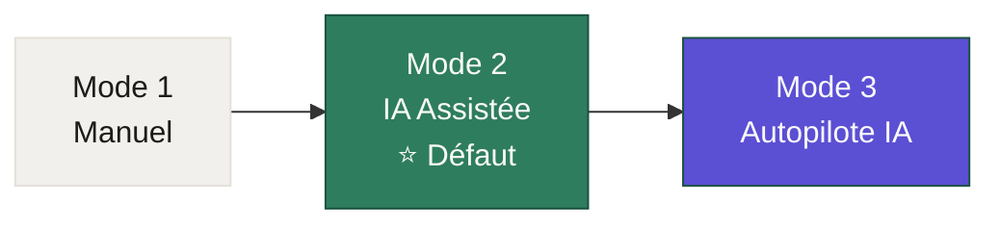
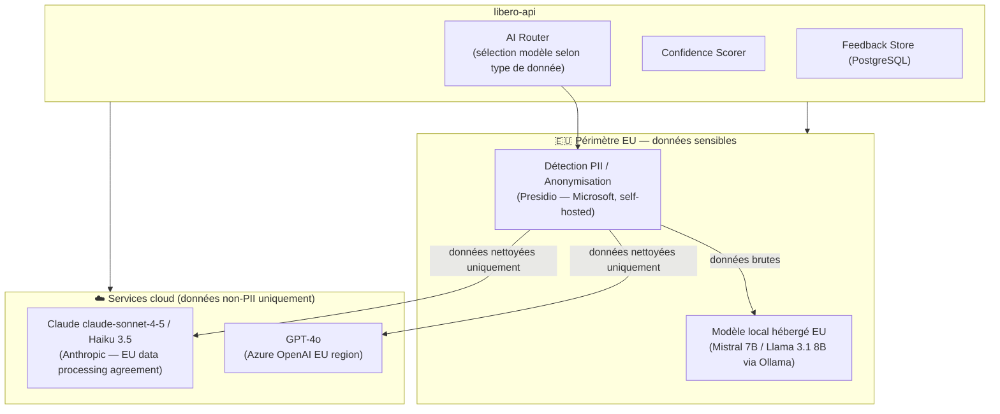
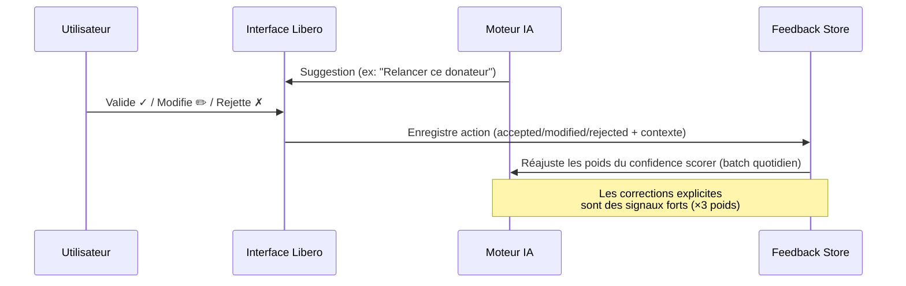
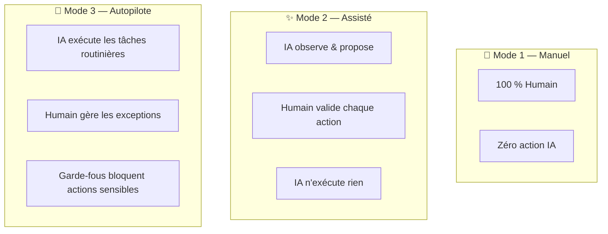

# 13 — AI Interaction Modes

> **Libero NPO Platform** — Three levels of AI collaboration for nonprofit teams.
> Last updated: 2026-02-26

---

## 0. Pourquoi ce document existe

Libero intègre une couche d'intelligence artificielle transversale à tous ses modules. Mais toutes les ONG ne sont pas prêtes — ni contraintes de la même façon — à déléguer des décisions à une IA.

Ce document définit les **trois modes d'interaction IA** de la plateforme, leurs philosophies respectives, leur configuration, leurs exemples d'usage concrets, et leurs garde-fous.

> *"L'IA dans Libero doit réduire la charge administrative sans retirer le contrôle humain sur ce qui compte."*

---

## 1. Vue d'ensemble des trois modes



| Dimension | Mode 1 : Manuel | Mode 2 : IA Assistée ⭐ | Mode 3 : Autopilote |
|---|---|---|---|
| **Qui décide ?** | L'humain seul | L'humain, guidé par l'IA | L'IA, validée sur exceptions |
| **L'IA propose ?** | Non | Oui (non-bloquant) | Oui (et exécute) |
| **L'IA exécute ?** | Non | Non | Oui (tâches routinières) |
| **Auditabilité** | Log standard | Log + explication IA | Log complet + audit IA |
| **Profil ONG** | Données sensibles, politique stricte | La plupart des ONG | ONG matures, grande volumétrie |
| **Effort humain** | 100 % | ~60 % | ~20 % (exceptions uniquement) |

---

## 2. Architecture IA de la plateforme

Avant de détailler les modes, il est nécessaire de comprendre les composants IA qui les alimentent.

### 2.1 Modèles et services IA envisagés



| Type de tâche | Modèle utilisé | Raison |
|---|---|---|
| Suggestions de texte (emails, lettres de remerciement) | Claude Haiku 3.5 | Rapide, économique, bon niveau rédactionnel |
| Analyse de tendances donateurs, scoring | Claude claude-sonnet-4-5 | Raisonnement plus fin nécessaire |
| Données bénéficiaires (notes de cas, statuts médicaux) | Modèle local EU (Mistral 7B) | Aucune donnée bénéficiaire ne quitte l'UE |
| Détection de doublons (noms, emails flous) | pg_trgm + modèle local | Matching léger, pas de LLM nécessaire |
| Classification de demandes de subventions | GPT-4o Azure EU | Bonne performance sur textes longs |
| Génération de rapports d'impact | Claude claude-sonnet-4-5 | Narration structurée et fiable |

### 2.2 Politique de données IA (non-négociable)

> **Règle absolue : aucune donnée personnelle de bénéficiaire ne quitte l'infrastructure EU.**

```
Données PII bénéficiaires (noms, dossiers, notes de cas, statuts médicaux, situations familiales)
    → TOUJOURS traitées par le modèle local hébergé sur serveur EU
    → JAMAIS envoyées à Claude API, GPT-4o ou tout autre service cloud externe

Données donateurs (noms, emails, montants)
    → Anonymisées avant envoi cloud (ex: "Donateur_A7F2" au lieu de "Marie Dupont")
    → Le mapping ID ↔ nom reste dans la DB EU

Données non-PII (statistiques agrégées, textes génériques, modèles d'email)
    → Peuvent être traitées par services cloud EU (Anthropic EU DPA, Azure EU region)
```

**Data Processing Agreement** : Libero exige un DPA conforme RGPD avec tout service d'IA cloud. Seuls les fournisseurs avec serveurs EU et DPA signé sont intégrés.

### 2.3 Système de scoring de confiance

Chaque suggestion IA porte un score de confiance calculé à partir de plusieurs signaux :

```
Confidence Score = f(
    model_certainty,        // probabilité token-level du modèle
    training_data_density,  // nombre d'exemples similaires dans l'historique org
    field_completeness,     // % des champs source renseignés
    user_feedback_history   // taux de validation des suggestions similaires passées
)
```

| Score | Label affiché | Couleur | Comportement UI |
|---|---|---|---|
| ≥ 0.85 | Haute confiance | Libero Green | Suggestion prominente avec raccourci Y/N |
| 0.65–0.84 | Confiance modérée | Amber | Suggestion avec nuance ("à vérifier") |
| 0.45–0.64 | Faible confiance | Stone (gris) | Suggestion discrète, petite taille |
| < 0.45 | Non affiché | — | Suggestion supprimée silencieusement |

### 2.4 Boucle de feedback — comment l'IA apprend



**Mécanismes de feedback :**
- **Acceptation silencieuse** : signal positif faible (l'utilisateur a cliqué "Valider")
- **Modification avant acceptation** : signal mixte (suggestion partiellement utile), le delta est enregistré
- **Rejet avec raison** : signal négatif fort (menu déroulant : "Pas pertinent / Données incorrectes / Je préfère faire manuellement")
- **Correction post-exécution** (Mode 3) : signal négatif très fort, entraîne un examen humain de la règle concernée

**Isolation par organisation** : les modèles de feedback sont propres à chaque ONG. Une ONG ne "pollue" pas les suggestions d'une autre. Les modèles globaux s'améliorent uniquement à partir de méta-statistiques anonymisées.

---

## 3. Mode 1 — Manuel (Traditional)

### 3.1 Description et philosophie

Dans le Mode Manuel, **l'IA est complètement désactivée** du point de vue de l'utilisateur. Aucune suggestion n'apparaît, aucune action n'est déclenchée automatiquement. Libero fonctionne comme un CRM classique, sans couche intelligente visible.

Ce mode ne signifie pas l'absence de technologie : les fonctions de base (recherche floue de doublons, validation de format d'email, calcul automatique des soldes de promesses) restent actives car elles ne constituent pas de l'IA générative mais de la logique métier.

**Ce qui est désactivé en Mode Manuel :**
- Suggestions inline contextuelles
- Proposals de segments donateurs
- Rédaction assistée d'emails et de lettres
- Scoring de risque de churn donateur
- Résumés automatiques de dossiers bénéficiaires
- Toute action automatique (même les tâches planifiées liées à l'IA)

### 3.2 Cas d'usage typiques

| Type d'ONG | Contexte | Raison du choix Manuel |
|---|---|---|
| ONG médicale ou humanitaire | Données de bénéficiaires ultra-sensibles (santé, statut légal, traumatismes) | Politique de données interne stricte ; conseil d'administration hostile à l'IA |
| Fondation avec DSI interne | IT governance formelle, validation sécurité requise avant tout service IA | Procédure d'homologation longue, Mode Manuel en attendant l'audit |
| Petite association locale | Équipe de 3 personnes, usage léger, pas besoin de suggestions | Simplicité voulue, surcharge cognitive évitée |
| ONG en contexte de litige | Données susceptibles d'être utilisées en procédure judiciaire | Traçabilité 100 % humaine souhaitée |
| Période de migration | Import depuis Salesforce, données pas encore vérifiées | Éviter les suggestions basées sur des données sales |

### 3.3 Activation et configuration

**Activation globale :**

```
Settings → AI & Automation → AI Mode
  ○ Mode 1 : Manuel
  ● Mode 2 : IA Assistée (défaut)
  ○ Mode 3 : Autopilote IA
```

L'administrateur de l'organisation peut forcer le Mode Manuel pour toute l'organisation. Dans ce cas, aucun utilisateur — même Admin — ne peut activer l'IA sans modifier ce paramètre global.

**Granularité par module :**

Il est possible de désactiver l'IA module par module, même en Mode 2 ou 3 global. Exemple : Mode 2 actif globalement, mais IA désactivée pour le module Bénéficiaires.

```
Settings → AI & Automation → Module Overrides
  ✓ Constituants      → IA Assistée
  ✓ Dons              → IA Assistée
  ✓ Subventions       → IA Assistée
  ✗ Bénéficiaires     → Manuel (forcé — données sensibles)
  ✓ Bénévoles         → IA Assistée
  ✓ Communications    → IA Assistée
```

**Granularité par rôle :**

Un administrateur peut activer l'IA pour les Fundraising Managers mais la laisser désactivée pour les Case Workers qui gèrent les bénéficiaires.

```
Settings → Roles → Case Worker → AI Access
  [ ] Suggestions IA actives pour ce rôle
```

### 3.4 Exemple d'interaction UI — Mode Manuel

**Scénario : Enregistrement d'un don**

```
┌─────────────────────────────────────────────────────────┐
│  Nouveau don                                            │
│                                                         │
│  Donateur      [ Rechercher... ]                        │
│  Montant       [ __________ € ]                         │
│  Campagne      [ Sélectionner ▼ ]                       │
│  Date          [ 2026-02-26 ]                           │
│  Mode de paiement [ Virement ▼ ]                        │
│                                                         │
│  Notes         [ _________________________ ]            │
│                                                         │
│                 [Annuler]  [Enregistrer le don]         │
└─────────────────────────────────────────────────────────┘
```

En Mode Manuel, aucun panneau de suggestion ne s'affiche. L'utilisateur remplit tous les champs manuellement. Pas de proposition de campagne basée sur l'historique donateur, pas de suggestion de montant, pas d'alerte "ce donateur est inactif depuis 18 mois".

### 3.5 Limites et garde-fous

- Le Mode Manuel ne désactive pas les **validations de format** (email valide, IBAN valide, date cohérente) — ce sont des garde-fous, pas de l'IA.
- La détection de **doublons exacts** (même email) reste active — c'est de la logique base de données, pas de l'IA générative.
- L'**audit log** reste complet : toutes les actions humaines sont tracées.
- Si l'organisation repasse en Mode 2 ou 3, l'IA reprend sans rupture : elle a continué d'observer les événements (sans les exposer à l'utilisateur) pour maintenir ses modèles à jour.

### 3.6 Indicateur visuel du mode actif

En Mode Manuel, un bandeau discret apparaît dans le coin supérieur droit de chaque page :

```
[ 🔧 Mode Manuel — L'IA est désactivée pour votre organisation ]  ×
```

Ce bandeau est dismissable par session mais réapparaît à chaque connexion pour rappeler le contexte.

---

## 4. Mode 2 — IA Assistée (AI-Assisted) ⭐ Défaut recommandé

### 4.1 Description et philosophie

Le Mode IA Assistée est le **mode par défaut** de Libero pour toutes les nouvelles organisations. Dans ce mode, l'IA joue le rôle d'un **assistant expert discret** : elle observe le contexte de chaque écran et propose des suggestions pertinentes, mais **n'agit jamais sans validation humaine explicite**.

Chaque suggestion est :
- **Non-bloquante** : l'utilisateur peut l'ignorer sans conséquence
- **Expliquée** : accompagnée d'une phrase "Pourquoi cette suggestion ?" et de sa source
- **Scorée** : le niveau de confiance est visible
- **Réversible** : si l'utilisateur valide une suggestion et change d'avis, il peut annuler

> *"L'IA propose. L'humain dispose."*

**Ce que l'IA Assistée ne fait pas :**
- Elle n'envoie pas d'email sans confirmation
- Elle ne modifie pas de donnée sans que l'utilisateur clique "Valider"
- Elle ne supprime rien
- Elle ne prend pas de décision financière

### 4.2 Composant UI — La Suggestion Card

La Suggestion Card est le composant central du Mode 2. Elle apparaît contextuellement, sans interrompre le flux de travail.

```
┌──────────────────────────────────────────────────────────────┐
│ ✨ Suggestion IA                           [Confiance : 87%] │
│                                                              │
│  "Cédric Morin n'a pas donné depuis 22 mois. Envisagez une  │
│   relance personnalisée pour la campagne Fin d'année 2026."  │
│                                                              │
│  Pourquoi ? ↳ Historique : 4 dons entre 2021 et 2024.       │
│               Dernier don : 320 € (avril 2024).              │
│               Taux de réponse aux relances : 67 % pour ce   │
│               segment d'âge et montant moyen.                │
│                                                              │
│  [✓ Créer la relance]  [✏ Modifier]  [✗ Ignorer]  [?]       │
└──────────────────────────────────────────────────────────────┘
```

**Raccourcis clavier :** `Y` pour valider, `N` ou `Échap` pour ignorer, `E` pour modifier avant validation.

### 4.3 Exemples par module

---

#### 4.3.1 Module Dons

**Situation : Enregistrement d'un don depuis un chèque reçu**

```
┌─────────────────────────────────────────────────────────────┐
│  Nouveau don — Sophie Renard                                │
│                                                             │
│  Montant   [ 150,00 € ]                                     │
│                                                             │
│  ┌─────────────────────────────────────────────────────┐   │
│  │ ✨ IA — Confiance : 91 %                            │   │
│  │  Campagne suggérée : "Hiver 2026 — Aide alimentaire" │   │
│  │  ↳ Sophie a donné à cette campagne les 3 dernières   │   │
│  │    années (120 €, 100 €, 135 €). Chèque reçu en      │   │
│  │    janvier → cohérent avec le calendrier habituel.   │   │
│  │  [✓ Appliquer]  [✗ Ignorer]                          │   │
│  └─────────────────────────────────────────────────────┘   │
│                                                             │
│  Campagne   [ Hiver 2026 — Aide alimentaire ▼ ]  ← prérempli│
│  Mode de paiement [ Chèque ▼ ]                              │
│                                                             │
│                   [Annuler]  [Enregistrer]                  │
└─────────────────────────────────────────────────────────────┘
```

**Autres suggestions IA dans le module Dons :**

| Déclencheur | Suggestion | Confiance typique |
|---|---|---|
| Don d'un prospect sans historique | "Ce donateur ressemble au profil 'primo-donateur fidélisable' — planifier un appel de bienvenue ?" | 72 % |
| Don > 1 000 € | "Ce don dépasse le seuil major donor. Mettre à jour le stade de cycle de vie ?" | 96 % |
| Donateur inactif depuis 18 mois qui redonne | "Sophie Renard réactive après 20 mois ! Envoyer un message de bienvenue personnalisé ?" | 88 % |
| Promesse en retard de paiement | "L'installment de mars de Jean-Pierre Müller est en retard de 8 jours. Envoyer une relance douce ?" | 79 % |
| Double saisie potentielle | "Un don similaire (même donateur, même montant, même semaine) existe déjà. Doublon probable." | 93 % |

---

#### 4.3.2 Module Subventions (Grants)

**Situation : Ouverture d'un dossier de subvention en cours**

```
┌──────────────────────────────────────────────────────────────┐
│  Subvention — Fondation Léa Rousseau                        │
│  Montant : 45 000 € / Statut : En cours de reporting        │
│                                                              │
│  ┌──────────────────────────────────────────────────────┐   │
│  │ ✨ IA — Confiance : 94 %                             │   │
│  │  Rapport intermédiaire à rendre dans 12 jours.       │   │
│  │  Sur la base des données enregistrées dans Programs, │   │
│  │  un brouillon de rapport est prêt (83 % complété).   │   │
│  │  Indicateurs manquants : "Nb bénéficiaires femmes"   │   │
│  │  et "Heures de formation dispensées".                │   │
│  │  [✓ Ouvrir le brouillon]  [✗ Ignorer]               │   │
│  └──────────────────────────────────────────────────────┘   │
│                                                              │
│  Livrables     ████████████░░░░ 75 % complétés              │
│  Prochaine échéance : Rapport intermédiaire — 10 mars 2026  │
└──────────────────────────────────────────────────────────────┘
```

**Autres suggestions IA dans le module Subventions :**

| Déclencheur | Suggestion |
|---|---|
| Subvention arrivant à expiration dans 60 jours | "Fondation Béatrice Keller — subvention actuelle expire en juin. Leurs appels à projets ouvrent en mars. Créer une opportunité de renouvellement ?" |
| Dépense sur fonds restreint dépassant 90 % du budget | "Le fonds 'Programme Réinsertion 2026' est utilisé à 91 %. Prévenir le financeur avant dépassement ?" |
| Rapport en retard sans note | "Aucune action enregistrée sur la subvention EU ERASMUS+ depuis 45 jours. Des mises à jour sont disponibles dans Programs." |

---

#### 4.3.3 Module Programmes & Bénéficiaires

> **Rappel** : dans ce module, toutes les suggestions IA sont traitées par le **modèle local EU**. Aucune donnée de bénéficiaire ne quitte l'infrastructure.

**Situation : Ouverture d'un dossier bénéficiaire**

```
┌──────────────────────────────────────────────────────────────┐
│  Dossier — Amara Diallo  [Confidentiel]  🔒 Modèle local    │
│  Programme : Hébergement d'urgence                           │
│                                                              │
│  ┌──────────────────────────────────────────────────────┐   │
│  │ ✨ IA — Confiance : 78 %                             │   │
│  │  Résumé du dossier (dernières 6 semaines) :          │   │
│  │  "Amara est entrée dans le programme le 15 jan.      │   │
│  │   5 entretiens réalisés. Stabilisation du logement   │   │
│  │   confirmée. Prochaine étape selon le protocole :    │   │
│  │   orientation emploi (bilan compétences)."           │   │
│  │  ↳ Généré depuis les notes de cas. Non modifié.      │   │
│  │  [✓ Valider le résumé]  [✏ Modifier]  [✗ Fermer]     │   │
│  └──────────────────────────────────────────────────────┘   │
└──────────────────────────────────────────────────────────────┘
```

**Autres suggestions IA dans le module Programmes :**

| Déclencheur | Suggestion |
|---|---|
| Absence de note de cas depuis > 21 jours | "Aucune note enregistrée pour Amara Diallo depuis 23 jours. Mise à jour recommandée." |
| Programme proche de la capacité maximale | "Programme Hébergement d'urgence à 94 % de capacité (47/50 places). Gérer la liste d'attente ?" |
| Bénéficiaire en liste d'attente depuis > 30 jours | "3 bénéficiaires attendent depuis plus d'un mois. Une place vient de se libérer. Notifier le suivant ?" |

---

#### 4.3.4 Module Bénévoles

**Situation : Planification d'un nouveau shift**

```
┌──────────────────────────────────────────────────────────────┐
│  Nouveau shift — Distribution alimentaire 15 mars 2026      │
│  Créneaux requis : 8 bénévoles                              │
│                                                              │
│  ┌──────────────────────────────────────────────────────┐   │
│  │ ✨ IA — Confiance : 88 %                             │   │
│  │  8 bénévoles disponibles et qualifiés identifiés :   │   │
│  │  → 5 ont déjà fait ce shift (taux présence : 94 %)   │   │
│  │  → 3 nouveaux disponibles selon leur agenda déclaré  │   │
│  │  Exclut : Paul Girard (DBS expiré le 1er mars 2026)  │   │
│  │  [✓ Inviter les 8]  [👁 Voir la liste]  [✗ Annuler]  │   │
│  └──────────────────────────────────────────────────────┘   │
└──────────────────────────────────────────────────────────────┘
```

**Autres suggestions IA dans le module Bénévoles :**

| Déclencheur | Suggestion |
|---|---|
| Bénévole sans shift depuis > 60 jours | "Fatima Benali est inactive depuis 73 jours. Lui envoyer un message pour maintenir le lien ?" |
| Renouvellement DBS dans 30 jours | "Le casier judiciaire de Marc Leroy expire le 28 mars. Lui envoyer les instructions de renouvellement ?" |
| Shift avec moins de 50 % de bénévoles confirmés | "Shift du 22 mars : seulement 3/8 bénévoles ont confirmé. Envoyer une relance aux 5 restants ?" |

---

#### 4.3.5 Module Communications

**Situation : Rédaction d'une lettre de remerciement**

```
┌──────────────────────────────────────────────────────────────┐
│  Lettre de remerciement — Thomas Weber                      │
│  Don : 500 € — Campagne : Urgence Ukraine 2026              │
│                                                              │
│  ┌──────────────────────────────────────────────────────┐   │
│  │ ✨ IA — Brouillon généré — Confiance : 82 %          │   │
│  │                                                      │   │
│  │  "Cher Thomas,                                       │   │
│  │   Nous vous remercions chaleureusement pour votre    │   │
│  │   don généreux de 500 €...                           │   │
│  │   [voir brouillon complet ↓]"                        │   │
│  │                                                      │   │
│  │  Ton détecté : formel / langue : allemand suggérée   │   │
│  │  (Thomas Weber — adresse DE)                         │   │
│  │  [✓ Utiliser ce brouillon]  [✏ Modifier]  [✗ Écrire moi-même]│
│  └──────────────────────────────────────────────────────┘   │
└──────────────────────────────────────────────────────────────┘
```

### 4.4 Auditabilité des suggestions IA (Mode 2)

Chaque suggestion IA génère un enregistrement dans la table `ai_suggestions` :

```json
{
  "id": "018f1a2b-3c4d-7e8f-...",
  "org_id": "018e1234-...",
  "user_id": "018e5678-...",
  "module": "donations",
  "entity_id": "018f9abc-...",
  "suggestion_type": "campaign_assignment",
  "model_used": "claude-haiku-3-5",
  "prompt_hash": "sha256:a3f2...",
  "suggestion_text": "Campagne suggérée : Hiver 2026 — Aide alimentaire",
  "confidence_score": 0.91,
  "rationale": "Sophie a donné à cette campagne les 3 dernières années",
  "outcome": "accepted",
  "user_modification": null,
  "created_at": "2026-02-26T10:34:22Z",
  "decided_at": "2026-02-26T10:34:31Z"
}
```

**Accès à l'audit IA :**

```
Settings → AI & Automation → Journal des suggestions IA
  Filtres : module / date / utilisateur / outcome (accepté / modifié / rejeté)
  Export CSV disponible
```

### 4.5 Limite et garde-fous du Mode 2

| Ce que l'IA Assistée ne fera JAMAIS | Raison |
|---|---|
| Envoyer un email sans validation explicite | Risque réputationnel, conformité RGPD |
| Modifier un montant de don enregistré | Intégrité financière |
| Supprimer un enregistrement | Irréversible sans confirmation double |
| Accéder aux données bénéficiaires via un modèle cloud | RGPD et politique EU |
| Proposer des décisions médicales ou légales | Hors périmètre, risque de responsabilité |
| Modifier les droits d'accès utilisateurs | Périmètre admin uniquement |

---

## 5. Mode 3 — Autopilote IA (AI-Delegated)

### 5.1 Description et philosophie

Dans le Mode Autopilote, l'IA prend en charge les **tâches routinières à faible risque** de manière autonome. L'équipe humaine ne voit que les exceptions, les décisions sensibles, et le résumé de ce que l'IA a accompli.

Ce mode ne signifie pas "set and forget". Il signifie : **l'IA gère la routine, les humains restent en contrôle**.

> *"L'IA fait le travail de nuit. L'humain donne les orientations et gère les surprises."*

**Conditions préalables pour activer le Mode 3 :**
1. L'organisation est en Mode 2 depuis au moins 30 jours
2. Le taux de validation des suggestions IA est ≥ 75 % sur les 30 derniers jours
3. Au moins un administrateur a confirmé avoir lu ce document de politique IA
4. L'organisation a configuré au minimum une règle d'escalade (qui alerter en cas d'exception)

### 5.2 Tâches automatisées en Mode 3

#### 5.2.1 Tableau complet des automatisations

| Module | Tâche automatisée | Déclencheur | Escalade si |
|---|---|---|---|
| **Dons** | Accusé de réception par email | Don enregistré (< 5 min) | Bounced, adresse manquante |
| **Dons** | Génération et envoi du reçu fiscal | Don confirmé et vérifié | Montant > 2 000 € → validation humaine |
| **Dons** | Relance de promesse de don en retard | J+7, J+14 après échéance | 2 relances sans réponse → escalade |
| **Dons** | Mise à jour du stade donateur (cycle de vie) | Calcul hebdomadaire | Passage "lapsed" → notification équipe |
| **Subventions** | Alerte de renouvellement de subvention | 90, 60, 30 jours avant expiration | Aucune action après 3 alertes |
| **Subventions** | Rappel de rapport de subvention | 30, 14, 7, 1 jours avant échéance | Rapport non soumis à J-1 → escalade manager |
| **Bénévoles** | Rappel de shift (email + SMS) | J-48h, J-2h avant shift | Aucune confirmation → escalade coordinator |
| **Bénévoles** | Alerte expiration DBS | 60, 30, 7 jours avant expiration | DBS expiré → blocage automatique des assignments |
| **Bénévoles** | Déprogrammation bénévole absent | Absence non justifiée après J+24h | Toujours loggé + notification coordinator |
| **Communications** | Rapport mensuel d'activité (PDF auto) | 1er du mois | Erreur génération → notification admin |
| **Impact** | Mise à jour des tableaux de bord KPI | Hebdomadaire (lundi 07:00) | Données manquantes → alerte programme manager |
| **Constituants** | Détection et alerte doublons potentiels | Import ou création | Score > 85 % → suggestion fusion automatique |

#### 5.2.2 Flux détaillé — Accusé de réception automatique

```
Événement : donation.created (Sophie Renard, 150 €, Campagne Hiver 2026)
    │
    ▼
Worker : job AcceptanceReceipt enqueued
    │
    ├─ Vérification : email valide ? → oui
    ├─ Vérification : préférence comms "no email" ? → non
    ├─ Vérification : montant dans seuil auto (< 2 000 €) ? → oui
    │
    ▼
Génération email via template "acknowledgement_fr"
    ├─ Merge fields : Prénom, Montant, Campagne, Numéro de reçu
    ├─ Langue détectée : français (adresse FR)
    ├─ Signataire : Directrice Marie-Claire Fontaine (configuré dans Settings)
    │
    ▼
Envoi via Resend API (EU relay)
    │
    ▼
Log dans ai_actions :
    {type: "auto_acknowledgement", status: "sent", entity: "donation:018f...",
     model: "template_render", escalated: false, sent_at: "2026-02-26T11:02:14Z"}
    │
    ▼
Notification dans le fil d'activité (vue humaine) :
    "✅ Accusé de réception envoyé automatiquement à Sophie Renard (il y a 3 min)"
    [Voir l'email] [Annuler si < 5 min]
```

#### 5.2.3 Flux détaillé — Déprogrammation de bénévole absent

```
Contexte : Marc Leroy ne s'est pas présenté au shift du 14 mars (Distribution alimentaire)
    │
Shift end_time passé + aucune heure loggée pour Marc Leroy
    │
    ▼
Job : AbsenceDetection (lancé J+1, 09:00)
    │
    ├─ Statut shift Marc : "assigned" (non "completed" ni "cancelled")
    ├─ Aucune note d'absence préventive
    ├─ Première absence non justifiée : oui
    │
    ▼
Actions automatiques :
    ├─ Shift Marc → statut "absent_unexcused"
    ├─ Email Marc : "Nous n'avons pas reçu votre confirmation — tout va bien ?"
    ├─ Note automatique sur profil bénévole : "Absence non justifiée — 14/03/2026"
    │
    ▼
Log ai_actions + notification coordinateur :
    "⚠️ Marc Leroy — Absence non justifiée détectée le 14/03.
     Un message lui a été envoyé automatiquement. [Voir] [Archiver]"
    │
    ├─ Si 2ème absence dans 60 jours → escalade : désactivation temporaire requiert validation humaine
    └─ Désactivation définitive du profil bénévole → TOUJOURS requiert validation humaine explicite
```

### 5.3 Le tableau de bord du Pilote Automatique

L'humain n'est jamais exclu du tableau. Une vue dédiée — **"Ce que l'IA a fait"** — permet de voir, en temps réel, toutes les actions autonomes.

```
┌──────────────────────────────────────────────────────────────┐
│  🤖 Actions IA — Aujourd'hui (26 fév 2026)                  │
│                                                              │
│  ✅ 12 accusés de réception envoyés                          │
│  ✅  3 rappels de shift envoyés (confirmation 14h avant)     │
│  ✅  1 alerte subvention Fondation Keller (60 jours)        │
│  ⚠️  1 escalade : Promesse Paul Girard (2e relance, no reply)│
│  ⏳  1 rapport mensuel en génération (est. 5 min)            │
│                                                              │
│  [Voir le détail complet]  [Exporter le journal]            │
│                                                              │
│  ──── Escalades en attente de décision humaine ────         │
│                                                              │
│  ❗ Paul Girard — Promesse 200 € (mars) sans réponse × 2    │
│     → [Appeler]  [Clore la promesse]  [Ignorer]             │
│                                                              │
│  ❗ Rapport Fondation Béatrice Keller dû dans 1 jour        │
│     → [Ouvrir le rapport]  [Notifier le financeur]          │
└──────────────────────────────────────────────────────────────┘
```

### 5.4 Garde-fous absolus — Actions JAMAIS automatisées

Quelle que soit la configuration, ces actions ne peuvent **jamais** être exécutées de manière autonome par l'IA :

| Action | Pourquoi jamais automatisée |
|---|---|
| Toute opération financière (virements, remboursements, corrections de don) | Risque financier direct ; réglementation comptable |
| Suppression de données (constituants, dons, dossiers) | Irréversible ; risque RGPD ; piste d'audit |
| Exécution d'une demande d'effacement RGPD | Procédure légale ; validation identité requise |
| Modification du statut de consentement RGPD | Droit fondamental de la personne concernée |
| Modification des rôles et droits utilisateurs | Sécurité de l'accès aux données |
| Envoi de communications à > 1 000 destinataires | Risque de mass email non contrôlé |
| Clôture définitive d'un dossier bénéficiaire | Impact sur la personne concernée |
| Toute action impliquant des données de mineurs | Protection de l'enfance |
| Mise à jour des coordonnées bancaires (IBAN) | Risque de fraude |
| Intégration comptable (export GL, posting) | Clôture comptable est un acte formalisé |

**Mécanisme de blocage technique :**

Ces catégories d'actions sont marquées `ai_executable: false` au niveau de l'API. Même si un prompt IA génère un appel à ces endpoints, le middleware `ai_execution_guard` retourne `403 Forbidden` avec le code `AI_RESTRICTED_ACTION`. Ce blocage n'est pas configurable par les administrators d'organisation.

### 5.5 Annulation et correction post-exécution

**Fenêtre d'annulation :** Pour les actions réversibles (emails envoyés non encore ouverts, logs de notes), une fenêtre de 5 minutes permet l'annulation via le bandeau de notification.

**Audit trail complet :**

```
Settings → AI & Automation → Journal complet des actions IA
  Filtres : type d'action / statut / module / date / escaladé oui/non
  
  Chaque entrée contient :
  - L'action effectuée
  - Le déclencheur (événement ou règle planifiée)
  - Le modèle IA utilisé
  - Les données ayant déclenché la décision
  - L'outcome (envoyé / escaladé / échoué / annulé)
  - Si annulé : par qui et quand
```

**Correction post-exécution :**

Si l'IA a fait une erreur (ex: envoyé un email avec un mauvais prénom mergé), l'utilisateur peut :
1. Annoter l'action dans le journal : "Erreur de merge field"
2. L'IA enregistre ce signal fort (le template est temporairement mis en quarantaine)
3. L'administrateur reçoit une notification pour réviser le template concerné
4. L'action ne sera pas répétée tant que le template n'est pas validé manuellement

### 5.6 Configuration du Mode 3

```
Settings → AI & Automation → Autopilote IA
  
  ⚠️ Ce mode permet à l'IA d'agir de manière autonome.
     Toutes les actions restent auditables et la plupart sont réversibles.
  
  Activation globale   [ON / OFF]
  
  Règles actives :
  ☑ Accusés de réception automatiques      Délai : 5 min  [Configurer]
  ☑ Reçus fiscaux automatiques             Seuil max : 2 000 €  [Configurer]
  ☑ Relances de promesses                  J+7, J+14  [Configurer]
  ☑ Rappels de shift bénévoles             J-48h, J-2h  [Configurer]
  ☑ Alertes subventions                    90/60/30 jours  [Configurer]
  ☐ Rapports mensuels automatiques         [Activer]
  ☐ Déprogrammation bénévoles absents     [Activer — requiert validation admin]
  
  Responsable des escalades :
  → Email d'escalade : direction@ong-example.org
  → Délai avant escalade si aucune action : 48h
  
  Contacts de notification IA :
  → Marie-Claire Fontaine (Directrice) — escalades critiques
  → Ahmed Khalil (Fundraising Manager) — dons et subventions
  → Isabelle Moreau (Coordinatrice Bénévoles) — bénévoles
```

### 5.7 Exemple de rapport hebdomadaire automatique

Le Mode 3 peut générer automatiquement un rapport hebdomadaire d'activité :

```
══════════════════════════════════════════════════════
  RAPPORT HEBDOMADAIRE — Semaine du 17 au 23 fév 2026
  ONG Espoir & Solidarité | Généré automatiquement
══════════════════════════════════════════════════════

DONS
  • 23 dons enregistrés — Total : 4 820 €
  • Campagne Hiver 2026 : 3 180 € / objectif 15 000 € (21 %)
  • 2 nouveaux donateurs primo-accédants
  • Stade "lapsed" : 3 donateurs basculés — relance planifiée

BÉNÉVOLES
  • 6 shifts réalisés — 47 heures bénévoles valorisées (2 350 €)
  • 1 absence non justifiée — Marc Leroy — [Action requise ↗]
  • 2 DBS expirant en mars — rappels envoyés ✅

SUBVENTIONS
  • Fondation Keller : rapport attendu dans 12 jours — [Action requise ↗]
  • EU ERASMUS+ : livrable Q1 complété à 75 %

ACTIONS IA EXÉCUTÉES
  • 23 accusés de réception envoyés ✅
  • 18 rappels de shift envoyés ✅
  • 1 relance de promesse (Paul Girard) — sans réponse — [Action requise ↗]

[Voir le rapport complet]  [Partager avec l'équipe]  [Exporter PDF]
══════════════════════════════════════════════════════
```

---

## 6. Transition entre les modes

### 6.1 Comment changer de mode

Le changement de mode est instantané et enregistré dans l'audit log de l'organisation. Un email de confirmation est envoyé à tous les administrateurs.

```
Settings → AI & Automation → Mode IA
  
  Mode actuel : IA Assistée (Mode 2)
  
  [ Passer en Mode Manuel ]   → Désactive toutes suggestions IA immédiatement
  [ Passer en Autopilote ]    → Requiert validation des prérequis (voir §5.1)
```

### 6.2 Downgrade d'urgence

Si une anomalie est détectée (ex: l'IA envoie des emails incorrects), n'importe quel administrateur peut **basculer en Mode Manuel en un clic** depuis la barre de navigation :

```
[ ⚙ Mode IA : Autopilote ]  →  Clic →  [ ⚠️ Désactiver l'IA maintenant ]
                                         → Confirmation : "Basculer en Mode Manuel"
                                         → Appliqué immédiatement, audit loggé
```

### 6.3 Impact du changement de mode sur les actions en cours

| Situation | Comportement |
|---|---|
| Mode 3 → Mode 1 : email en file d'attente | Email annulé si non encore envoyé (dans les 5 min) |
| Mode 3 → Mode 1 : rapport en génération | Rapport complété, mais non envoyé — mis en "révision manuelle requise" |
| Mode 2 → Mode 1 : suggestions déjà affichées | Disparaissent immédiatement à la prochaine interaction |
| Mode 1 → Mode 2 : activation | L'IA commence à observer, premières suggestions après 24h d'apprentissage |

---

## 7. Matrice de responsabilité par mode



| Action | Mode 1 | Mode 2 | Mode 3 |
|---|---|---|---|
| Enregistrer un don | Humain | Humain (IA suggère campagne/fonds) | Humain |
| Envoyer un accusé de réception | Humain | Humain (IA prépare le texte) | **IA automatique** |
| Générer un reçu fiscal | Humain | Humain (IA génère le PDF, humain envoie) | **IA automatique** (< 2 000 €) |
| Relancer une promesse en retard | Humain | Humain (IA suggère la relance) | **IA automatique** (J+7, J+14) |
| Planifier les shifts bénévoles | Humain | Humain (IA propose les bénévoles) | Humain (IA envoie rappels) |
| Clôturer un dossier bénéficiaire | Humain | Humain (IA résume l'historique) | Humain (toujours) |
| Supprimer une donnée | Humain | Humain | **Jamais IA** |
| Corriger un montant financier | Humain | Humain | **Jamais IA** |
| Exécuter une demande RGPD | Humain | Humain | **Jamais IA** |

---

## 8. Gouvernance et évolution de la politique IA

### 8.1 Révision trimestrielle obligatoire

Chaque organisation utilisant le Mode 3 reçoit un rapport trimestriel résumant :
- Le nombre d'actions autonomes exécutées
- Le taux d'escalade (% d'actions nécessitant intervention humaine)
- Les erreurs détectées et corrigées
- L'évolution du confidence score moyen

Si le taux d'escalade dépasse 20 % sur un type de tâche, cette tâche est automatiquement rétrogradée en Mode 2 jusqu'à révision manuelle.

### 8.2 Mise à jour des modèles IA

- Les mises à jour de modèles (ex: passage de Claude Haiku 3.5 à une version ultérieure) sont testées en shadow mode pendant 14 jours avant déploiement.
- En shadow mode, l'ancienne version sert les utilisateurs ; la nouvelle version génère des suggestions en parallèle, sans les afficher. Les deux sets de suggestions sont comparés statistiquement.
- Aucune mise à jour de modèle ne peut réduire les garde-fous existants sans validation explicite de l'équipe produit Libero et notification préalable des administrateurs d'organisation.

### 8.3 Transparence algorithmique

Sur demande, n'importe quel administrateur peut consulter :
- La liste exhaustive des règles déclenchant des actions automatiques
- Les modèles IA utilisés pour chaque type de tâche
- Les données envoyées à des services externes (avec confirmation qu'aucune donnée PII bénéficiaire n'en fait partie)
- L'historique complet des versions de modèle utilisées

---

## 9. Glossaire

| Terme | Définition |
|---|---|
| **Confidence Score** | Score de 0 à 1 indiquant la fiabilité estimée d'une suggestion IA |
| **Escalade** | Transfert d'une décision vers un humain car l'IA ne peut ou ne doit pas agir seule |
| **Feedback loop** | Mécanisme d'apprentissage par lequel les corrections humaines améliorent les modèles |
| **Modèle local EU** | Modèle IA hébergé sur infrastructure européenne, sans appel externe |
| **Shadow mode** | Mode de test où un nouveau modèle génère des sorties sans les exposer aux utilisateurs |
| **Suggestion Card** | Composant UI affichant une proposition IA de manière contextuelle et non-bloquante |
| **ai_actions** | Table de base de données enregistrant toutes les actions autonomes de l'IA (Mode 3) |
| **ai_suggestions** | Table de base de données enregistrant toutes les suggestions IA (Mode 2) |
| **Audit trail** | Historique immuable de toutes les actions (humaines et IA) sur la plateforme |
| **KITT principle** | "Quiet Intelligent Tool in the background" — l'IA comme assistant discret, pas comme chatbot |

---

*Document maintenu par l'équipe produit Libero. Revu à chaque évolution majeure du moteur IA.*
*Contributeurs : Product Architect, Design Architect, Platform Architect, DPO.*
