# 14 — Screen Inventory

> **Libero NPO Platform** — Inventaire complet de tous les écrans (v1)
> Last updated: 2026-02-26
> Owner: Design Architect agent

---

## Table des matières

1. [Sitemap Mermaid](#sitemap)
2. [Auth](#module-auth)
3. [Dashboard](#module-dashboard)
4. [Constituants](#module-constituants)
5. [Dons](#module-dons)
6. [Campagnes](#module-campagnes)
7. [Subventions](#module-subventions)
8. [Programmes](#module-programmes)
9. [Bénévoles](#module-benevoles)
10. [Impact](#module-impact)
11. [Communications](#module-communications)
12. [Finance](#module-finance)
13. [RGPD](#module-rgpd)
14. [Migration](#module-migration)
15. [Admin](#module-admin)
16. [Rapports](#module-rapports)

---

## Sitemap Mermaid {#sitemap}

```mermaid
flowchart TD
    ROOT["/"] --> AUTH["/auth"]
    ROOT --> APP["/(app)"]

    AUTH --> LOGIN["/auth/login"]
    AUTH --> SSO["/auth/sso"]
    AUTH --> FORGOT["/auth/forgot-password"]
    AUTH --> RESET["/auth/reset-password"]
    AUTH --> ONBOARD["/auth/onboarding"]
    ONBOARD --> OB1["/auth/onboarding/1 — Org"]
    ONBOARD --> OB2["/auth/onboarding/2 — Équipe"]
    ONBOARD --> OB3["/auth/onboarding/3 — Données"]
    ONBOARD --> OB4["/auth/onboarding/4 — RGPD"]
    ONBOARD --> OB5["/auth/onboarding/5 — Terminé"]

    APP --> DASH["/dashboard"]

    APP --> CONST["/constituents"]
    CONST --> CLIST["/constituents — Liste"]
    CONST --> CNEW["/constituents/new"]
    CONST --> CIMPORT["/constituents/import"]
    CONST --> CIND["/:id — Fiche individu"]
    CONST --> CORG["/constituents/organizations/:id"]
    CONST --> CHORGS["/constituents/organizations — Liste orgs"]
    CONST --> CHOUSE["/constituents/households/:id"]
    CONST --> CHOUSES["/constituents/households — Liste ménages"]

    APP --> DONA["/donations"]
    DONA --> DLIST["/donations — Liste"]
    DONA --> DNEW["/donations/new"]
    DONA --> DDET["/donations/:id"]
    DONA --> DRECEIPT["/donations/:id/receipt"]
    DONA --> DBATCH["/donations/batches"]
    DONA --> DBATCHDET["/donations/batches/:id"]

    APP --> CAMP["/campaigns"]
    CAMP --> CAMPLIST["/campaigns — Liste"]
    CAMP --> CAMPNEW["/campaigns/new"]
    CAMP --> CAMPDET["/campaigns/:id"]
    CAMP --> CAMPSTATS["/campaigns/:id/stats"]

    APP --> GRANT["/grants"]
    GRANT --> GKANBAN["/grants — Kanban pipeline"]
    GRANT --> GNEW["/grants/new"]
    GRANT --> GDET["/grants/:id"]
    GRANT --> GDEAD["/grants/deadlines"]

    APP --> PROG["/programs"]
    PROG --> PLIST["/programs — Liste"]
    PROG --> PNEW["/programs/new"]
    PROG --> PDET["/programs/:id"]
    PROG --> PENROLL["/programs/:id/beneficiaries"]
    PROG --> PBENEF["/programs/:id/beneficiaries/:enrollmentId"]
    PROG --> PNOTES["/programs/:id/beneficiaries/:enrollmentId/notes"]

    APP --> VOL["/volunteers"]
    VOL --> VLIST["/volunteers — Liste"]
    VOL --> VDET["/volunteers/:id"]
    VOL --> VSCHED["/volunteers/schedule"]
    VOL --> VHOURS["/volunteers/hours"]

    APP --> IMPACT["/impact"]
    IMPACT --> IDASH["/impact — Dashboard KPIs"]
    IMPACT --> IENTRY["/impact/indicators/:id/entries/new"]
    IMPACT --> IREP["/impact/report"]

    APP --> COMM["/communications"]
    COMM --> COMLIST["/communications — Liste envois"]
    COMM --> COMNEW["/communications/compose"]
    COMM --> COMDET["/communications/:id"]
    COMM --> COMHIST["/communications/history/:constituentId"]

    APP --> FIN["/finance"]
    FIN --> FEXP["/finance/export"]
    FIN --> FREC["/finance/reconciliation"]
    FIN --> FFUND["/finance/restricted-funds"]

    APP --> GDPR["/gdpr"]
    GDPR --> GCONSENT["/gdpr/consents"]
    GDPR --> GREQS["/gdpr/requests"]
    GDPR --> GDEL["/gdpr/erasure/:requestId"]

    APP --> MIG["/migration"]
    MIG --> MS1["/migration/step/1 — Source"]
    MIG --> MS2["/migration/step/2 — Mapping"]
    MIG --> MS3["/migration/step/3 — Validation"]
    MIG --> MS4["/migration/step/4 — Import"]
    MIG --> MS5["/migration/step/5 — Confirmation"]

    APP --> ADMIN["/admin"]
    ADMIN --> AORG["/admin/organization"]
    ADMIN --> AUSERS["/admin/users"]
    ADMIN --> AROLES["/admin/roles"]
    ADMIN --> AINT["/admin/integrations"]
    ADMIN --> ABIL["/admin/billing"]

    APP --> REP["/reports"]
    REP --> RLIB["/reports — Bibliothèque"]
    REP --> RCUST["/reports/builder"]
    REP --> RSCHED["/reports/scheduled"]
    REP --> RVIEW["/reports/:id"]
```

---

## Légende des rôles

| Rôle | Description |
|---|---|
| `super_admin` | Administrateur système (Libero) |
| `org_admin` | Administrateur de l'organisation |
| `fundraiser` | Gestionnaire collecte de fonds |
| `program_officer` | Chargé de programme / travailleur social |
| `volunteer_manager` | Gestionnaire bénévoles |
| `finance_officer` | Responsable finance |
| `reporter` | Accès lecture + rapports uniquement |
| `volunteer` | Portail bénévole (accès restreint) |

---

## Légende des priorités

| Code | Signification |
|---|---|
| `MUST` | MVP — obligatoire pour le lancement |
| `SHOULD` | v1.1 — important, non bloquant |
| `NICE` | Futur — amélioration souhaitée |

---

## Module AUTH {#module-auth}

### AUTH-001 — Page de connexion

| Champ | Valeur |
|---|---|
| **ID** | AUTH-001 |
| **Module** | Auth |
| **Nom de l'écran** | Connexion |
| **URL pattern** | `/auth/login` |
| **Description** | Page d'authentification principale. L'utilisateur saisit son email et son mot de passe. Affiche le logo Libero et le nom de l'organisation si détecté via sous-domaine. Lien vers SSO si configuré par l'org. |
| **États** | Default, Loading (validation), Error (identifiants incorrects), Success (redirection) |
| **Actions principales** | 1. Se connecter (email + mot de passe) · 2. Connexion SSO · 3. Mot de passe oublié · 4. Demander un accès (lien vers site marketing) |
| **Données affichées** | Logo org (si sous-domaine), champ email, champ mot de passe, bouton connexion, lien SSO conditionnel, lien mot de passe oublié |
| **Rôles autorisés** | Non authentifié (public) |
| **Composants clés** | `Form`, `Input`, `Button`, `Alert` (erreur), `Logo`, `Link` |
| **Interactions IA** | Aucune |
| **Priorité** | MUST |

---

### AUTH-002 — Connexion SSO

| Champ | Valeur |
|---|---|
| **ID** | AUTH-002 |
| **Module** | Auth |
| **Nom de l'écran** | Connexion SSO |
| **URL pattern** | `/auth/sso` |
| **Description** | Page intermédiaire de connexion via SSO (Google Workspace, Microsoft Entra, SAML 2.0). L'utilisateur choisit son fournisseur ou est redirigé automatiquement selon le domaine email. |
| **États** | Default, Loading (redirection vers IdP), Error (provider indisponible ou accès refusé) |
| **Actions principales** | 1. Connexion Google Workspace · 2. Connexion Microsoft Entra · 3. Connexion SAML custom · 4. Retour connexion classique |
| **Données affichées** | Liste des fournisseurs SSO configurés, champ email pour auto-détection, indicateur de chargement pendant redirection |
| **Rôles autorisés** | Non authentifié (public) |
| **Composants clés** | `Button` (avec logo fournisseur), `Input`, `Divider`, `Alert` |
| **Interactions IA** | Aucune |
| **Priorité** | SHOULD |

---

### AUTH-003 — Mot de passe oublié

| Champ | Valeur |
|---|---|
| **ID** | AUTH-003 |
| **Module** | Auth |
| **Nom de l'écran** | Mot de passe oublié |
| **URL pattern** | `/auth/forgot-password` |
| **Description** | L'utilisateur saisit son adresse email pour recevoir un lien de réinitialisation. Confirmation affichée systématiquement (même si email non trouvé, pour éviter l'énumération d'adresses). |
| **États** | Default, Loading, Success (email envoyé — message générique), Error (rate limit atteint) |
| **Actions principales** | 1. Envoyer le lien de réinitialisation · 2. Retour à la connexion |
| **Données affichées** | Champ email, confirmation d'envoi |
| **Rôles autorisés** | Non authentifié (public) |
| **Composants clés** | `Form`, `Input`, `Button`, `Alert` |
| **Interactions IA** | Aucune |
| **Priorité** | MUST |

---

### AUTH-004 — Réinitialisation du mot de passe

| Champ | Valeur |
|---|---|
| **ID** | AUTH-004 |
| **Module** | Auth |
| **Nom de l'écran** | Réinitialisation du mot de passe |
| **URL pattern** | `/auth/reset-password?token=:token` |
| **Description** | Formulaire de saisie d'un nouveau mot de passe après clic sur le lien reçu par email. Validation du token JWT (expiration 1h). Indicateur de force du mot de passe. |
| **États** | Default, Loading, Success (redirection vers login), Error (token expiré ou invalide) |
| **Actions principales** | 1. Définir nouveau mot de passe · 2. Retour connexion si token invalide |
| **Données affichées** | Champ nouveau mot de passe, champ confirmation, indicateur de force (faible/moyen/fort), règles de sécurité |
| **Rôles autorisés** | Non authentifié (lien tokenisé) |
| **Composants clés** | `Form`, `PasswordInput`, `StrengthMeter`, `Button`, `Alert` |
| **Interactions IA** | Aucune |
| **Priorité** | MUST |

---

### AUTH-005 — Onboarding Wizard — Étape 1 : Organisation

| Champ | Valeur |
|---|---|
| **ID** | AUTH-005 |
| **Module** | Auth |
| **Nom de l'écran** | Onboarding — Étape 1 : Votre organisation |
| **URL pattern** | `/auth/onboarding/1` |
| **Description** | Première étape du wizard d'initialisation après la création de compte. L'admin configure les informations de base de l'organisation : nom, pays, type, devise principale, numéro d'enregistrement caritatif. Barre de progression 5 étapes visible. |
| **États** | Default, Loading (sauvegarde), Error (validation), Success (passage étape 2) |
| **Actions principales** | 1. Continuer à l'étape 2 · 2. Sauvegarder et reprendre plus tard |
| **Données affichées** | Nom organisation, pays (selector EU-27 + UK + CH + NO), type (association/fondation/ASBL/etc.), devise (EUR/GBP/CHF), numéro enregistrement légal, logo upload, barre de progression |
| **Rôles autorisés** | `org_admin` (premier accès) |
| **Composants clés** | `WizardProgress`, `Form`, `Input`, `Select` (pays, devise, type), `FileUpload` (logo), `Button` |
| **Interactions IA** | Suggestion du type légal basée sur le pays sélectionné |
| **Priorité** | MUST |

---

### AUTH-006 — Onboarding Wizard — Étape 2 : Équipe

| Champ | Valeur |
|---|---|
| **ID** | AUTH-006 |
| **Module** | Auth |
| **Nom de l'écran** | Onboarding — Étape 2 : Inviter votre équipe |
| **URL pattern** | `/auth/onboarding/2` |
| **Description** | L'admin invite les membres de l'équipe par email et leur attribue un rôle. Possibilité d'en ajouter plusieurs à la fois. Les invitations sont envoyées en différé (batch). |
| **États** | Default, Loading (envoi invitations), Error (email invalide ou déjà utilisé), Success |
| **Actions principales** | 1. Ajouter un membre (email + rôle) · 2. Supprimer un membre de la liste · 3. Envoyer les invitations · 4. Passer cette étape |
| **Données affichées** | Liste des membres à inviter (email, rôle, statut), résumé des rôles disponibles avec description |
| **Rôles autorisés** | `org_admin` (onboarding) |
| **Composants clés** | `WizardProgress`, `InviteRow` (email + RoleSelect), `Button`, `Badge` (rôle), `Table` |
| **Interactions IA** | Suggestion de rôles selon le titre du poste saisi (optionnel) |
| **Priorité** | MUST |

---

### AUTH-007 — Onboarding Wizard — Étape 3 : Données initiales

| Champ | Valeur |
|---|---|
| **ID** | AUTH-007 |
| **Module** | Auth |
| **Nom de l'écran** | Onboarding — Étape 3 : Importer vos données |
| **URL pattern** | `/auth/onboarding/3` |
| **Description** | Présente trois options : importer depuis Salesforce (redirection assistant migration), importer un CSV constituants, ou commencer de zéro. Si CSV choisi, upload immédiat avec aperçu de mapping. |
| **États** | Default, Loading (upload CSV), Error (format invalide), Success (import planifié) |
| **Actions principales** | 1. Migrer depuis Salesforce · 2. Importer CSV constituants · 3. Commencer de zéro |
| **Données affichées** | 3 cartes d'option avec description, aperçu du template CSV à télécharger, indicateur d'avancement si import en cours |
| **Rôles autorisés** | `org_admin` (onboarding) |
| **Composants clés** | `WizardProgress`, `OptionCard`, `FileUpload`, `ProgressBar`, `Button` |
| **Interactions IA** | Aucune |
| **Priorité** | MUST |

---

### AUTH-008 — Onboarding Wizard — Étape 4 : RGPD

| Champ | Valeur |
|---|---|
| **ID** | AUTH-008 |
| **Module** | Auth |
| **Nom de l'écran** | Onboarding — Étape 4 : Paramètres RGPD |
| **URL pattern** | `/auth/onboarding/4` |
| **Description** | Configuration initiale des paramètres RGPD : pays de résidence des données (datacenter), délais de rétention par défaut, configuration du registre de consentements. Lien vers la politique de confidentialité type à adapter. |
| **États** | Default, Loading, Error, Success |
| **Actions principales** | 1. Configurer résidence des données · 2. Définir politiques de rétention · 3. Télécharger modèle politique de confidentialité · 4. Continuer |
| **Données affichées** | Selector datacenter (EU-West, EU-Central), délais de rétention (constituants inactifs, dons archivés), cases à cocher conformité, lien vers ressources RGPD |
| **Rôles autorisés** | `org_admin` (onboarding) |
| **Composants clés** | `WizardProgress`, `Form`, `Select`, `NumberInput`, `Checkbox`, `Alert` (information), `Button` |
| **Interactions IA** | Suggestion des délais de rétention selon le pays et le type d'organisation |
| **Priorité** | MUST |

---

### AUTH-009 — Onboarding Wizard — Étape 5 : Terminé

| Champ | Valeur |
|---|---|
| **ID** | AUTH-009 |
| **Module** | Auth |
| **Nom de l'écran** | Onboarding — Étape 5 : Tout est prêt |
| **URL pattern** | `/auth/onboarding/5` |
| **Description** | Page de conclusion du wizard. Récapitulatif de ce qui a été configuré, checklist de démarrage (constituants importés, première campagne, paramètres RGPD validés). Lien vers la documentation et vidéos tutoriels. Bouton d'accès au dashboard. |
| **États** | Default (toujours terminal) |
| **Actions principales** | 1. Accéder au tableau de bord · 2. Voir la documentation · 3. Regarder la vidéo de démarrage |
| **Données affichées** | Checklist de démarrage avec statuts, résumé de la configuration, ressources d'aide |
| **Rôles autorisés** | `org_admin` (onboarding) |
| **Composants clés** | `WizardProgress`, `ChecklistItem`, `Card`, `Button`, `IllustrationEmpty` |
| **Interactions IA** | Aucune |
| **Priorité** | MUST |

---

## Module DASHBOARD {#module-dashboard}

### DASH-001 — Tableau de bord principal

| Champ | Valeur |
|---|---|
| **ID** | DASH-001 |
| **Module** | Dashboard |
| **Nom de l'écran** | Tableau de bord |
| **URL pattern** | `/dashboard` |
| **Description** | Vue d'ensemble de l'activité de l'organisation. Affiche des widgets configurables selon le rôle de l'utilisateur : KPIs financiers, campagnes actives, échéances subventions, tâches en attente, activité récente. Checklist d'installation visible jusqu'à complétion. |
| **États** | Default, Loading (skeleton), Empty (organisation nouvelle), Error (données indisponibles) |
| **Actions principales** | 1. Personnaliser les widgets · 2. Accès rapide création (don, constituant, note) · 3. Voir toutes les alertes · 4. Lancer recherche globale (Cmd+K) |
| **Données affichées** | Total dons du mois courant vs N-1, nombre de constituants actifs, campagnes actives avec % objectif, prochaines échéances subventions (7j), activité récente (timeline), tâches assignées à l'utilisateur, checklist d'installation (si non complète) |
| **Rôles autorisés** | Tous les rôles authentifiés |
| **Composants clés** | `StatWidget`, `CampaignProgress`, `GrantStatusBadge`, `ActivityFeed`, `SetupChecklist`, `DashboardGrid` (drag & drop widgets) |
| **Interactions IA** | Alertes proactives : "3 donateurs majeurs n'ont pas donné depuis 12 mois — voir la liste" / "Le rapport de subvention Fondation XYZ est dû dans 5 jours" |
| **Priorité** | MUST |

---

### DASH-002 — Configuration des widgets

| Champ | Valeur |
|---|---|
| **ID** | DASH-002 |
| **Module** | Dashboard |
| **Nom de l'écran** | Personnalisation du tableau de bord |
| **URL pattern** | `/dashboard/customize` |
| **Description** | Mode édition du tableau de bord. L'utilisateur peut activer/désactiver des widgets, les réorganiser par glisser-déposer, et configurer leurs paramètres (période de référence, filtres). Les préférences sont sauvegardées par utilisateur. |
| **États** | Edit mode (overlay de personnalisation), Loading (sauvegarde), Success (retour dashboard) |
| **Actions principales** | 1. Ajouter un widget · 2. Supprimer un widget · 3. Réorganiser (drag & drop) · 4. Configurer un widget (paramètres) · 5. Sauvegarder · 6. Annuler |
| **Données affichées** | Catalogue de widgets disponibles par catégorie (Finance, Constituants, Programmes, Bénévoles, Subventions), disposition actuelle |
| **Rôles autorisés** | Tous les rôles authentifiés |
| **Composants clés** | `WidgetGallery`, `DraggableGrid`, `WidgetConfigPanel`, `Button` |
| **Interactions IA** | Suggestion de widgets pertinents selon le rôle et l'usage récent |
| **Priorité** | SHOULD |

---

## Module CONSTITUANTS {#module-constituants}

### CON-001 — Liste des constituants (individus)

| Champ | Valeur |
|---|---|
| **ID** | CON-001 |
| **Module** | Constituants |
| **Nom de l'écran** | Liste des constituants — Individus |
| **URL pattern** | `/constituents` |
| **Description** | Table paginée de tous les constituants individuels. Filtres avancés (type, tags, statut, dernière activité, montant total dons). Recherche fulltext. Actions en masse (export, tag, assignment). Indicateur de doublons potentiels. |
| **États** | Default, Loading (skeleton rows), Empty (aucun constituant), Error (erreur réseau), Readonly (rôle `reporter`) |
| **Actions principales** | 1. Créer un constituant · 2. Importer CSV · 3. Filtrer / rechercher · 4. Actions en masse · 5. Exporter |
| **Données affichées** | Avatar/initiales, nom complet, email, téléphone, type de constituant, statut lifecycle (prospect/donateur/bénéficiaire), dernier don (montant + date), tags, actions rapides (voir, modifier) |
| **Rôles autorisés** | `org_admin`, `fundraiser`, `program_officer`, `volunteer_manager`, `reporter` (lecture) |
| **Composants clés** | `DataTable`, `FilterBar`, `SearchInput`, `BulkActionsBar`, `Badge` (statut), `Pagination`, `ExportButton` |
| **Interactions IA** | Suggestion de segment : "23 donateurs correspondent à votre critère — créer un segment ?" |
| **Priorité** | MUST |

---

### CON-002 — Fiche constituant — Individu

| Champ | Valeur |
|---|---|
| **ID** | CON-002 |
| **Module** | Constituants |
| **Nom de l'écran** | Fiche constituant — Individu |
| **URL pattern** | `/constituents/:id` |
| **Description** | Page de détail d'un constituant individuel. En-tête avec nom, avatar, badges de rôle (donateur, bénévole, bénéficiaire). Corps en onglets : Informations, Activité, Dons, Programmes, Bénévolat, Communications, RGPD. |
| **États** | Default, Loading, Error (constituant introuvable), Readonly (rôle `reporter`), Archived (constituant archivé — bannière) |
| **Actions principales** | 1. Modifier les informations · 2. Enregistrer un don · 3. Ajouter une note · 4. Envoyer une communication · 5. Gérer le consentement RGPD |
| **Données affichées** | **Informations** : prénom, nom, civilité, date de naissance, email(s), téléphone(s), adresse, ménage, organisation liée, relations, tags, champs personnalisés · **Activité** : timeline chronologique (dons, notes, emails, bénévolat, inscriptions programmes) · **Dons** : historique dons avec montants, campagnes, statuts · **Programmes** : inscriptions actives/terminées · **Bénévolat** : missions passées, total heures · **Communications** : emails envoyés/reçus · **RGPD** : consentements, base légale, date dernière mise à jour |
| **Rôles autorisés** | `org_admin`, `fundraiser`, `program_officer`, `volunteer_manager`, `reporter` (lecture) |
| **Composants clés** | `ConstituentCard`, `TabPanel`, `DonorTimeline`, `DataTable` (dons), `ConsentBadge`, `RelationshipGraph`, `NoteCard`, `Button` |
| **Interactions IA** | "Ce donateur n'a pas été contacté depuis 14 mois — suggérer un email de réactivation ?" / "Doublons potentiels détectés — voir" |
| **Priorité** | MUST |

---

### CON-003 — Fiche organisation

| Champ | Valeur |
|---|---|
| **ID** | CON-003 |
| **Module** | Constituants |
| **Nom de l'écran** | Fiche organisation |
| **URL pattern** | `/constituents/organizations/:id` |
| **Description** | Page de détail d'une organisation (entreprise, fondation, administration). Affiche les contacts principaux rattachés, les subventions accordées, les dons d'entreprise, les bénévoles employés. |
| **États** | Default, Loading, Error, Readonly |
| **Actions principales** | 1. Modifier l'organisation · 2. Ajouter un contact · 3. Créer une subvention liée · 4. Enregistrer un don d'entreprise · 5. Gérer les relations |
| **Données affichées** | Nom organisation, type, numéro d'enregistrement, secteur, adresse siège, site web, contacts principaux (liste), subventions liées, dons (en tant que donateur entreprise), total contributions, notes, relations avec d'autres organisations |
| **Rôles autorisés** | `org_admin`, `fundraiser`, `program_officer`, `reporter` (lecture) |
| **Composants clés** | `OrgCard`, `ContactList`, `RelatedGrantsTable`, `DonorTimeline`, `TabPanel`, `Button` |
| **Interactions IA** | "Cette fondation n'a pas été sollicitée cette année — voir les subventions précédentes et préparer une demande ?" |
| **Priorité** | MUST |

---

### CON-004 — Liste des organisations

| Champ | Valeur |
|---|---|
| **ID** | CON-004 |
| **Module** | Constituants |
| **Nom de l'écran** | Liste des organisations |
| **URL pattern** | `/constituents/organizations` |
| **Description** | Table paginée de toutes les organisations (entreprises, fondations, partenaires, administrations). Filtres par type, secteur, montant total dons, statut. |
| **États** | Default, Loading, Empty, Error |
| **Actions principales** | 1. Créer une organisation · 2. Filtrer / rechercher · 3. Exporter · 4. Actions en masse |
| **Données affichées** | Nom, type, secteur, contact principal, total contributions, nombre de subventions actives, dernière interaction, actions rapides |
| **Rôles autorisés** | `org_admin`, `fundraiser`, `program_officer`, `reporter` (lecture) |
| **Composants clés** | `DataTable`, `FilterBar`, `SearchInput`, `Pagination`, `Badge` (type org), `ExportButton` |
| **Interactions IA** | Aucune |
| **Priorité** | MUST |

---

### CON-005 — Fiche ménage (household)

| Champ | Valeur |
|---|---|
| **ID** | CON-005 |
| **Module** | Constituants |
| **Nom de l'écran** | Fiche ménage |
| **URL pattern** | `/constituents/households/:id` |
| **Description** | Vue agrégée d'un ménage familial. Regroupe plusieurs constituants individuels pour les besoins du reçu fiscal (somme des dons du foyer). Affiche le membre principal, les membres du ménage, et le récapitulatif financier consolidé. |
| **États** | Default, Loading, Error |
| **Actions principales** | 1. Ajouter un membre · 2. Désigner le contact principal · 3. Générer un reçu fiscal consolidé · 4. Voir les dons du ménage |
| **Données affichées** | Nom du ménage, adresse commune, membres (liste avec rôle : principal/membre), total dons cumulés du ménage par année fiscale, historique reçus émis |
| **Rôles autorisés** | `org_admin`, `fundraiser`, `reporter` (lecture) |
| **Composants clés** | `HouseholdCard`, `MemberList`, `DonationSummaryByYear`, `Button` |
| **Interactions IA** | "Générer automatiquement le reçu fiscal annuel pour ce ménage ?" |
| **Priorité** | MUST |

---

### CON-006 — Liste des ménages

| Champ | Valeur |
|---|---|
| **ID** | CON-006 |
| **Module** | Constituants |
| **Nom de l'écran** | Liste des ménages |
| **URL pattern** | `/constituents/households` |
| **Description** | Table de tous les ménages. Filtres par nombre de membres, total dons. Utile pour la gestion des reçus fiscaux agrégés. |
| **États** | Default, Loading, Empty, Error |
| **Actions principales** | 1. Créer un ménage · 2. Filtrer · 3. Exporter pour reçus |
| **Données affichées** | Nom ménage, membres (nombre + noms), adresse, total dons année en cours, total dons all-time |
| **Rôles autorisés** | `org_admin`, `fundraiser`, `reporter` (lecture) |
| **Composants clés** | `DataTable`, `FilterBar`, `Pagination` |
| **Interactions IA** | Aucune |
| **Priorité** | MUST |

---

### CON-007 — Création d'un constituant

| Champ | Valeur |
|---|---|
| **ID** | CON-007 |
| **Module** | Constituants |
| **Nom de l'écran** | Nouveau constituant |
| **URL pattern** | `/constituents/new` |
| **Description** | Formulaire de création d'un constituant individuel ou organisation. Détection de doublons en temps réel (fuzzy match sur nom + email). Affichage des doublons potentiels avant soumission avec option merge ou ignorer. |
| **États** | Default, Loading (recherche doublons), DuplicateWarning (doublons détectés), Success (créé — redirection vers fiche), Error (validation) |
| **Actions principales** | 1. Sauvegarder · 2. Sauvegarder et ajouter un don · 3. Annuler · 4. Fusionner avec doublon détecté |
| **Données affichées** | Type (individu/organisation), civilité, prénom, nom, email, téléphone, adresse, tags, source (comment ils nous ont trouvé), notes initiales, ménage (optionnel), organisation liée (optionnel), champs personnalisés |
| **Rôles autorisés** | `org_admin`, `fundraiser`, `program_officer`, `volunteer_manager` |
| **Composants clés** | `Form`, `Input`, `Select`, `AddressInput`, `DuplicateAlert`, `TagInput`, `Button` |
| **Interactions IA** | Détection temps réel de doublons · Suggestion de la source d'acquisition basée sur le contexte |
| **Priorité** | MUST |

---

### CON-008 — Import CSV constituants

| Champ | Valeur |
|---|---|
| **ID** | CON-008 |
| **Module** | Constituants |
| **Nom de l'écran** | Import de constituants (CSV) |
| **URL pattern** | `/constituents/import` |
| **Description** | Assistant en 3 étapes : (1) Upload du fichier CSV, (2) Mapping des colonnes vers les champs Libero, (3) Validation et confirmation avant import. Aperçu des données, erreurs détectées (emails invalides, doublons), et rapport post-import. |
| **États** | Step1/Upload, Step2/Mapping, Step3/Validation, Loading (traitement), Error (fichier invalide), Success (import terminé) |
| **Actions principales** | 1. Uploader le fichier · 2. Mapper les colonnes · 3. Valider et importer · 4. Télécharger le rapport d'erreurs · 5. Annuler |
| **Données affichées** | Aperçu des 5 premières lignes, mapping colonnes CSV → champs Libero, compteurs (valides, erreurs, doublons), rapport post-import (importés, ignorés, erreurs) |
| **Rôles autorisés** | `org_admin`, `fundraiser` |
| **Composants clés** | `FileUpload`, `ColumnMapper`, `DataPreviewTable`, `ImportSummary`, `ProgressBar`, `Button`, `Alert` |
| **Interactions IA** | Mapping automatique des colonnes par reconnaissance de nom (ex: "First Name" → `first_name`) |
| **Priorité** | MUST |

---

## Module DONS {#module-dons}

### DON-001 — Liste des dons

| Champ | Valeur |
|---|---|
| **ID** | DON-001 |
| **Module** | Dons |
| **Nom de l'écran** | Liste des dons |
| **URL pattern** | `/donations` |
| **Description** | Table paginée de tous les dons. Filtres par période, campagne, fonds, type (ponctuel/récurrent/en nature), montant, statut (confirmé/en attente/annulé). Totaux visibles en bas de page. |
| **États** | Default, Loading, Empty, Error, Readonly |
| **Actions principales** | 1. Enregistrer un don · 2. Filtrer / rechercher · 3. Exporter · 4. Clôturer un batch · 5. Actions en masse (générer reçus) |
| **Données affichées** | Date, donateur (nom + lien), montant, devise, campagne, fonds, type, mode de paiement, statut, reçu généré (oui/non), actions rapides |
| **Rôles autorisés** | `org_admin`, `fundraiser`, `finance_officer`, `reporter` (lecture) |
| **Composants clés** | `DataTable`, `FilterBar`, `DateRangePicker`, `Badge` (type, statut), `CurrencyDisplay`, `ExportButton`, `Pagination` |
| **Interactions IA** | "3 dons récurrents ont échoué ce mois — voir la liste et relancer ?" |
| **Priorité** | MUST |

---

### DON-002 — Formulaire nouveau don

| Champ | Valeur |
|---|---|
| **ID** | DON-002 |
| **Module** | Dons |
| **Nom de l'écran** | Enregistrer un don |
| **URL pattern** | `/donations/new` |
| **Description** | Formulaire de saisie d'un nouveau don (one-time ou récurrent). Sélection du donateur (existant ou création rapide). Allocation à un fonds (splitté possible). Attribution à une campagne. Génération automatique du reçu si demandé. |
| **États** | Default, Loading (sauvegarde + génération reçu), Error (validation), Success (don créé — options de suite) |
| **Actions principales** | 1. Sauvegarder le don · 2. Sauvegarder et générer le reçu · 3. Sauvegarder et ajouter un autre don · 4. Annuler |
| **Données affichées** | Donateur (search autocomplete), type de don (one-time/pledge/in-kind), date, montant, devise, mode de paiement (espèces/chèque/virement/CB/SEPA/autre), campagne, fonds (avec allocation multiple), notes internes, numéro de référence externe, option reçu fiscal (oui/non) |
| **Rôles autorisés** | `org_admin`, `fundraiser`, `finance_officer` |
| **Composants clés** | `Form`, `ConstituentSearch`, `CurrencyInput`, `DatePicker`, `FundAllocator`, `CampaignSelect`, `Select`, `Button` |
| **Interactions IA** | Suggestion du fonds selon la campagne choisie / Suggestion de montant basée sur historique donateur |
| **Priorité** | MUST |

---

### DON-003 — Détail d'un don

| Champ | Valeur |
|---|---|
| **ID** | DON-003 |
| **Module** | Dons |
| **Nom de l'écran** | Détail du don |
| **URL pattern** | `/donations/:id` |
| **Description** | Vue complète d'un don individuel. Affiche toutes les informations du don, son allocation aux fonds, les reçus émis, l'historique des modifications (audit), et les informations de paiement. |
| **États** | Default, Loading, Error (don introuvable), Readonly (don clôturé/posté en GL) |
| **Actions principales** | 1. Modifier le don (si non clôturé) · 2. Générer / re-générer le reçu · 3. Annuler le don · 4. Voir le profil du donateur |
| **Données affichées** | ID interne, donateur (lien fiche), date, montant, devise, type, mode de paiement, référence bancaire, campagne, allocations fonds (tableau), statut, reçu (lien PDF), notes, historique modifications (qui / quand / quoi), statut GL export |
| **Rôles autorisés** | `org_admin`, `fundraiser`, `finance_officer`, `reporter` (lecture) |
| **Composants clés** | `DetailCard`, `FundAllocationTable`, `AuditLog`, `ReceiptDownload`, `Button`, `Badge` (statut) |
| **Interactions IA** | Aucune |
| **Priorité** | MUST |

---

### DON-004 — Reçu fiscal

| Champ | Valeur |
|---|---|
| **ID** | DON-004 |
| **Module** | Dons |
| **Nom de l'écran** | Reçu fiscal |
| **URL pattern** | `/donations/:id/receipt` |
| **Description** | Aperçu du reçu fiscal généré pour le don. Format PDF responsive (aperçu en iframe). Inclut les mentions légales selon le pays de l'organisation (numéro d'enregistrement caritatif, mention RGPD, mention déductibilité fiscale selon pays). |
| **États** | Default (aperçu), Loading (génération PDF), Error (données manquantes pour génération) |
| **Actions principales** | 1. Télécharger PDF · 2. Envoyer par email au donateur · 3. Re-générer · 4. Retour au don |
| **Données affichées** | Logo organisation, nom organisation, numéro d'enregistrement, adresse, date d'émission, nom donateur, adresse donateur, montant en lettres et chiffres, date du don, mode de paiement, mentions légales (pays-spécifique), signature numérique |
| **Rôles autorisés** | `org_admin`, `fundraiser`, `finance_officer` |
| **Composants clés** | `PDFPreview`, `Button`, `Alert` (si données manquantes) |
| **Interactions IA** | Aucune |
| **Priorité** | MUST |

---

### DON-005 — Gestion des batches de dons

| Champ | Valeur |
|---|---|
| **ID** | DON-005 |
| **Module** | Dons |
| **Nom de l'écran** | Batches de dons |
| **URL pattern** | `/donations/batches` |
| **Description** | Liste des batches de dons (groupements pour export GL). Chaque batch correspond à une session de saisie ou une période comptable. Statuts : Ouvert (saisie en cours), Soumis (prêt à poster), Posté (exporté en GL — en lecture seule). |
| **États** | Default, Loading, Empty, Error |
| **Actions principales** | 1. Créer un nouveau batch · 2. Clôturer un batch · 3. Exporter vers GL · 4. Voir le détail d'un batch |
| **Données affichées** | ID batch, période, nombre de dons, montant total, statut, créé par, date clôture, lien export GL |
| **Rôles autorisés** | `org_admin`, `finance_officer` |
| **Composants clés** | `DataTable`, `Badge` (statut batch), `Button`, `ExportButton` |
| **Interactions IA** | Aucune |
| **Priorité** | MUST |

---

### DON-006 — Détail d'un batch

| Champ | Valeur |
|---|---|
| **ID** | DON-006 |
| **Module** | Dons |
| **Nom de l'écran** | Détail batch de dons |
| **URL pattern** | `/donations/batches/:id` |
| **Description** | Détail d'un batch avec la liste des dons inclus. Permettre d'ajouter/retirer des dons si le batch est encore ouvert. Affiche les totaux par fonds et par mode de paiement. Bouton de clôture et d'export GL. |
| **États** | Default (ouvert), Soumis (lecture seule partielle), Posté (lecture seule totale), Loading |
| **Actions principales** | 1. Ajouter un don au batch · 2. Retirer un don · 3. Clôturer le batch · 4. Exporter GL · 5. Annuler le batch (si ouvert) |
| **Données affichées** | Métadonnées batch, liste des dons (table), totaux par fonds, totaux par mode de paiement, récapitulatif comptable |
| **Rôles autorisés** | `org_admin`, `finance_officer` |
| **Composants clés** | `DataTable`, `SummaryCard`, `Button`, `Badge`, `Alert` (batch posté = lecture seule) |
| **Interactions IA** | Aucune |
| **Priorité** | MUST |

---

## Module CAMPAGNES {#module-campagnes}

### CAMP-001 — Liste des campagnes

| Champ | Valeur |
|---|---|
| **ID** | CAMP-001 |
| **Module** | Campagnes |
| **Nom de l'écran** | Liste des campagnes |
| **URL pattern** | `/campaigns` |
| **Description** | Vue liste ou grille de toutes les campagnes. Filtres par statut (planifiée/active/terminée), type (email/courrier/événement/digital), année. Indicateurs visuels de progression vers l'objectif. |
| **États** | Default (liste), Loading, Empty (aucune campagne), Error |
| **Actions principales** | 1. Créer une campagne · 2. Filtrer · 3. Voir le calendrier des campagnes · 4. Exporter |
| **Données affichées** | Nom, type, dates (début-fin), objectif financier, montant collecté, % atteint (barre de progression), nombre de donateurs, statut, actions rapides |
| **Rôles autorisés** | `org_admin`, `fundraiser`, `reporter` (lecture) |
| **Composants clés** | `DataTable` ou `CardGrid`, `CampaignProgress`, `Badge` (statut, type), `FilterBar`, `Button` |
| **Interactions IA** | "La campagne Été 2026 est à 42% de son objectif à 10j de la fin — voulez-vous relancer les donateurs qui n'ont pas encore répondu ?" |
| **Priorité** | MUST |

---

### CAMP-002 — Détail d'une campagne

| Champ | Valeur |
|---|---|
| **ID** | CAMP-002 |
| **Module** | Campagnes |
| **Nom de l'écran** | Détail de la campagne |
| **URL pattern** | `/campaigns/:id` |
| **Description** | Page de détail d'une campagne avec ses KPIs en temps réel, la liste des dons liés, les sous-campagnes (hiérarchie), les communications envoyées et l'historique des activités. |
| **États** | Default, Loading, Error, Readonly (campagne archivée) |
| **Actions principales** | 1. Modifier la campagne · 2. Enregistrer un don lié · 3. Envoyer une communication · 4. Voir les statistiques détaillées · 5. Clôturer la campagne |
| **Données affichées** | Nom, type, objectif, montant collecté, % atteint, nombre donateurs, don moyen, coût campagne, ROI, dates, description, sous-campagnes, dons liés (table), communications envoyées, code source |
| **Rôles autorisés** | `org_admin`, `fundraiser`, `reporter` (lecture) |
| **Composants clés** | `CampaignProgress`, `StatWidget`, `DataTable`, `TabPanel`, `Badge`, `Button` |
| **Interactions IA** | "Taux de réponse inférieur à la moyenne de vos campagnes précédentes — analyser les profils non-répondants ?" |
| **Priorité** | MUST |

---

### CAMP-003 — Création / édition d'une campagne

| Champ | Valeur |
|---|---|
| **ID** | CAMP-003 |
| **Module** | Campagnes |
| **Nom de l'écran** | Créer / modifier une campagne |
| **URL pattern** | `/campaigns/new` · `/campaigns/:id/edit` |
| **Description** | Formulaire de création ou d'édition d'une campagne. Champs de base + configuration des codes sources, objectifs par canal, hiérarchie parent/enfant. |
| **États** | Default, Loading, Error (validation), Success |
| **Actions principales** | 1. Sauvegarder · 2. Sauvegarder et ajouter des objectifs · 3. Annuler |
| **Données affichées** | Nom, type (email/courrier/événement/digital/autre), campagne parente (optionnel), objectif financier, dates début-fin, description, code source, fonds cible, responsable, notes |
| **Rôles autorisés** | `org_admin`, `fundraiser` |
| **Composants clés** | `Form`, `Input`, `DateRangePicker`, `Select`, `CurrencyInput`, `CampaignParentSelect`, `Button` |
| **Interactions IA** | Suggestion du fonds cible selon le type de campagne |
| **Priorité** | MUST |

---

### CAMP-004 — Statistiques campagne

| Champ | Valeur |
|---|---|
| **ID** | CAMP-004 |
| **Module** | Campagnes |
| **Nom de l'écran** | Statistiques de la campagne |
| **URL pattern** | `/campaigns/:id/stats` |
| **Description** | Vue analytique approfondie d'une campagne. Graphiques : évolution des dons dans le temps, répartition par canal, profil des donateurs (nouveaux vs récurrents), comparaison avec campagnes précédentes. |
| **États** | Default, Loading, Empty (aucun don), Error |
| **Actions principales** | 1. Exporter en PDF · 2. Exporter les données en CSV · 3. Comparer avec une autre campagne |
| **Données affichées** | Courbe de collecte (dons cumulés par jour), répartition par type de don, répartition par canal, top 10 donateurs, nouveaux donateurs vs récurrents, taux de rétention, don médian, analyse géographique, ROI |
| **Rôles autorisés** | `org_admin`, `fundraiser`, `reporter` |
| **Composants clés** | `LineChart`, `PieChart`, `BarChart`, `StatWidget`, `DataTable` (top donateurs), `ExportButton` |
| **Interactions IA** | Analyse automatique : "Le pic de dons le mardi correspond à vos envois emails — optimiser le timing ?" |
| **Priorité** | SHOULD |

---

## Module SUBVENTIONS {#module-subventions}

### GRANT-001 — Pipeline subventions (Kanban)

| Champ | Valeur |
|---|---|
| **ID** | GRANT-001 |
| **Module** | Subventions |
| **Nom de l'écran** | Pipeline des subventions |
| **URL pattern** | `/grants` |
| **Description** | Vue Kanban des subventions par étape du pipeline : Prospection → Candidature préparée → Dossier soumis → En évaluation → Accordée → Refusée → Reporting. Chaque carte affiche le bailleur, le montant et la prochaine échéance. Drag & drop pour changer le statut. Vue liste disponible en alternative. |
| **États** | Default (Kanban), ListView (alternatif), Loading, Empty (aucune subvention), Error |
| **Actions principales** | 1. Créer une subvention · 2. Déplacer une carte (drag & drop) · 3. Filtrer par responsable / fonds / bailleur · 4. Voir les échéances · 5. Exporter |
| **Données affichées** | Colonnes Kanban par statut, cartes (bailleur, montant, responsable, prochaine échéance, badges urgence), totaux par colonne |
| **Rôles autorisés** | `org_admin`, `fundraiser`, `reporter` (lecture) |
| **Composants clés** | `KanbanBoard`, `GrantCard`, `GrantStatusBadge`, `FilterBar`, `Button`, `DragDropContext` |
| **Interactions IA** | "L'échéance du rapport Fondation X est dans 5 jours — démarrer la rédaction ?" |
| **Priorité** | MUST |

---

### GRANT-002 — Détail d'une subvention

| Champ | Valeur |
|---|---|
| **ID** | GRANT-002 |
| **Module** | Subventions |
| **Nom de l'écran** | Détail de la subvention |
| **URL pattern** | `/grants/:id` |
| **Description** | Fiche complète d'une subvention. Informations sur le bailleur, le montant, les fonds restreints associés, les tranches de versement, les contacts du bailleur, les livrables et les échéances de rapport. |
| **États** | Default, Loading, Error, Readonly (subvention clôturée/archivée) |
| **Actions principales** | 1. Modifier · 2. Changer le statut · 3. Enregistrer un versement · 4. Ajouter un livrable · 5. Générer un rapport de subvention |
| **Données affichées** | Bailleur (lien fiche org), montant total, montant versé à ce jour, tranches de versement (table), fonds restreint lié, objectif/programme lié, contacts bailleur, statut, dates candidature/décision/fin, description projet, livrables (checklist), échéances rapport, notes internes, documents joints |
| **Rôles autorisés** | `org_admin`, `fundraiser`, `reporter` (lecture) |
| **Composants clés** | `DetailCard`, `TrancheTable`, `DeliverableChecklist`, `DeadlineAlert`, `TabPanel`, `FileAttachments`, `Button`, `GrantStatusBadge` |
| **Interactions IA** | "Rapport dû dans 7 jours — générer un brouillon basé sur les indicateurs d'impact liés au programme ?" |
| **Priorité** | MUST |

---

### GRANT-003 — Formulaire subvention

| Champ | Valeur |
|---|---|
| **ID** | GRANT-003 |
| **Module** | Subventions |
| **Nom de l'écran** | Créer / modifier une subvention |
| **URL pattern** | `/grants/new` · `/grants/:id/edit` |
| **Description** | Formulaire de saisie d'une subvention. Pour une subvention pluriannuelle, possibilité d'ajouter des tranches annuelles avec leurs propres montants et dates de versement. |
| **États** | Default, Loading, Error (validation), Success |
| **Actions principales** | 1. Sauvegarder · 2. Ajouter une tranche · 3. Supprimer une tranche · 4. Annuler |
| **Données affichées** | Bailleur (search autocomplete), montant total, devise, type (ponctuelle/pluriannuelle), fonds restreint, programme lié, responsable interne, contacts bailleur, statut initial, dates, description, critères d'éligibilité, restrictions d'utilisation, tranches (tableau dynamique) |
| **Rôles autorisés** | `org_admin`, `fundraiser` |
| **Composants clés** | `Form`, `OrgSearch`, `CurrencyInput`, `DatePicker`, `FundSelect`, `ProgramSelect`, `TrancheEditor`, `Button` |
| **Interactions IA** | Suggestion du fonds restreint selon le bailleur (historique) |
| **Priorité** | MUST |

---

### GRANT-004 — Tableau de bord échéances

| Champ | Valeur |
|---|---|
| **ID** | GRANT-004 |
| **Module** | Subventions |
| **Nom de l'écran** | Échéances et rapports de subventions |
| **URL pattern** | `/grants/deadlines` |
| **Description** | Vue calendrier et liste de toutes les échéances de rapports de subventions. Code couleur selon urgence (rouge <7j, orange <30j, vert >30j). Possibilité de marquer une échéance comme complétée. |
| **États** | Default (vue liste + calendrier), Loading, Empty |
| **Actions principales** | 1. Voir le détail de la subvention · 2. Marquer l'échéance comme complétée · 3. Filtrer par responsable · 4. Exporter le calendrier (iCal) |
| **Données affichées** | Liste triée par date : subvention, bailleur, type d'échéance (rapport intermédiaire/final/financier), date due, responsable, statut (en attente/soumis/en retard), badge urgence |
| **Rôles autorisés** | `org_admin`, `fundraiser`, `reporter` (lecture) |
| **Composants clés** | `DeadlineList`, `CalendarView`, `Badge` (urgence), `Button`, `FilterBar` |
| **Interactions IA** | Alertes automatiques envoyées 30, 14 et 7 jours avant échéance |
| **Priorité** | MUST |

---

## Module PROGRAMMES {#module-programmes}

### PROG-001 — Liste des programmes

| Champ | Valeur |
|---|---|
| **ID** | PROG-001 |
| **Module** | Programmes |
| **Nom de l'écran** | Liste des programmes |
| **URL pattern** | `/programs` |
| **Description** | Liste de tous les programmes de service delivery. Filtres par statut (actif/archivé), type, fonds bailleur. Indicateurs : nombre de bénéficiaires actifs, taux d'occupation (si capacité définie). |
| **États** | Default, Loading, Empty, Error |
| **Actions principales** | 1. Créer un programme · 2. Filtrer · 3. Voir les bénéficiaires d'un programme · 4. Exporter |
| **Données affichées** | Nom, type, statut, bénéficiaires actifs, capacité max, fonds/bailleur principal, responsable, dates (début-fin), taux d'occupation |
| **Rôles autorisés** | `org_admin`, `program_officer`, `reporter` (lecture) |
| **Composants clés** | `DataTable`, `FilterBar`, `ProgressBar` (occupation), `Badge` (statut), `Button` |
| **Interactions IA** | Aucune |
| **Priorité** | MUST |

---

### PROG-002 — Détail d'un programme

| Champ | Valeur |
|---|---|
| **ID** | PROG-002 |
| **Module** | Programmes |
| **Nom de l'écran** | Détail du programme |
| **URL pattern** | `/programs/:id` |
| **Description** | Fiche programme complète. Description, critères d'éligibilité, indicateurs d'impact liés, bénéficiaires inscrits, historique des services délivrés, subventions / fonds finançant le programme. |
| **États** | Default, Loading, Error, Readonly (programme archivé) |
| **Actions principales** | 1. Modifier le programme · 2. Inscrire un bénéficiaire · 3. Enregistrer des services · 4. Voir les indicateurs d'impact · 5. Archiver le programme |
| **Données affichées** | Nom, type, description, critères d'éligibilité, capacité, responsable, dates, indicateurs d'impact liés (liste), bénéficiaires actifs (nombre + liste), services délivrés (total unités), fonds finançant, documents de programme |
| **Rôles autorisés** | `org_admin`, `program_officer`, `reporter` (lecture) |
| **Composants clés** | `DetailCard`, `TabPanel`, `BeneficiaryList`, `ServiceSummary`, `ImpactIndicatorList`, `Button` |
| **Interactions IA** | "Taux d'abandon supérieur à la norme — analyser les cas à risque ?" |
| **Priorité** | MUST |

---

### PROG-003 — Bénéficiaires inscrits

| Champ | Valeur |
|---|---|
| **ID** | PROG-003 |
| **Module** | Programmes |
| **Nom de l'écran** | Bénéficiaires inscrits au programme |
| **URL pattern** | `/programs/:id/beneficiaries` |
| **Description** | Liste des bénéficiaires inscrits au programme avec leur statut d'inscription. Filtres par statut (actif/en attente/terminé/sorti), chargé de cas, date d'inscription. Actions en masse. |
| **États** | Default, Loading, Empty (aucune inscription), Error |
| **Actions principales** | 1. Inscrire un bénéficiaire · 2. Changer de statut d'inscription · 3. Voir la fiche bénéficiaire · 4. Actions en masse · 5. Exporter |
| **Données affichées** | Nom bénéficiaire, date inscription, statut, chargé de cas, dernière note, services reçus (compteur), prochaine action |
| **Rôles autorisés** | `org_admin`, `program_officer` |
| **Composants clés** | `DataTable`, `FilterBar`, `Badge` (statut inscription), `Button`, `BulkActionsBar` |
| **Interactions IA** | "8 bénéficiaires n'ont pas eu de note de cas depuis 30 jours — voir la liste ?" |
| **Priorité** | MUST |

---

### PROG-004 — Fiche bénéficiaire (enrollment)

| Champ | Valeur |
|---|---|
| **ID** | PROG-004 |
| **Module** | Programmes |
| **Nom de l'écran** | Fiche bénéficiaire — inscription programme |
| **URL pattern** | `/programs/:id/beneficiaries/:enrollmentId` |
| **Description** | Vue détaillée de l'inscription d'un bénéficiaire à un programme. Inclut les informations d'inscription, l'historique des services délivrés, les notes de cas, les pièces jointes et le statut du suivi. |
| **États** | Default, Loading, Error, Readonly (inscription clôturée) |
| **Actions principales** | 1. Enregistrer un service délivré · 2. Ajouter une note de cas · 3. Clôturer l'inscription (avec outcome) · 4. Référer vers un autre organisme · 5. Imprimer le dossier |
| **Données affichées** | Informations du bénéficiaire (lien fiche constituant), programme, date inscription, chargé de cas, statut, services délivrés (chronologie), notes de cas (liste), référencements (entrée/sortie), documents joints, historique statut |
| **Rôles autorisés** | `org_admin`, `program_officer` (seul le chargé de cas assigné peut voir les notes de cas des autres par défaut) |
| **Composants clés** | `DetailCard`, `ServiceDeliveryLog`, `CaseNoteList`, `ReferralCard`, `FileAttachments`, `Button`, `TabPanel` |
| **Interactions IA** | Résumé automatique de l'historique du bénéficiaire pour un nouveau chargé de cas |
| **Priorité** | MUST |

---

### PROG-005 — Notes de cas

| Champ | Valeur |
|---|---|
| **ID** | PROG-005 |
| **Module** | Programmes |
| **Nom de l'écran** | Notes de cas |
| **URL pattern** | `/programs/:id/beneficiaries/:enrollmentId/notes` |
| **Description** | Interface de consultation et saisie des notes de cas narratives. Les notes sont horodatées, signées (auteur), et non modifiables après 24h (traçabilité réglementaire). Saisie en mode texte riche. |
| **États** | Default (liste notes + formulaire saisie), Loading, Error |
| **Actions principales** | 1. Ajouter une note · 2. Modifier une note (< 24h) · 3. Filtrer par auteur / période · 4. Imprimer les notes |
| **Données affichées** | Liste chronologique des notes (auteur, date, heure, texte), indicateur "modifiable / en lecture seule", formulaire de saisie en bas de page |
| **Rôles autorisés** | `org_admin`, `program_officer` |
| **Composants clés** | `NoteCard` (avec état editable/locked), `RichTextEditor`, `Button`, `FilterBar` |
| **Interactions IA** | Suggestion de complétion de note basée sur les services récemment délivrés (optionnel, désactivable) |
| **Priorité** | MUST |

---

## Module BÉNÉVOLES {#module-benevoles}

### VOL-001 — Liste des bénévoles

| Champ | Valeur |
|---|---|
| **ID** | VOL-001 |
| **Module** | Bénévoles |
| **Nom de l'écran** | Liste des bénévoles |
| **URL pattern** | `/volunteers` |
| **Description** | Table des bénévoles actifs et archivés. Filtres par compétences, disponibilité, statut casier judiciaire / DBS, total heures, mission. Indicateur d'alerte si vérification DBS expirée. |
| **États** | Default, Loading, Empty, Error |
| **Actions principales** | 1. Ajouter un bénévole · 2. Planifier une mission · 3. Exporter pour rapport · 4. Filtrer |
| **Données affichées** | Photo/initiales, nom, compétences (badges), disponibilité, statut DBS (valide/expiré/manquant), total heures cette année, prochaine mission, statut (actif/en pause/archivé) |
| **Rôles autorisés** | `org_admin`, `volunteer_manager`, `reporter` (lecture) |
| **Composants clés** | `DataTable`, `FilterBar`, `Badge` (compétences, statut DBS), `Alert` (DBS expiré), `Button` |
| **Interactions IA** | "5 bénévoles ont leur vérification DBS qui expire dans 30 jours — envoyer un rappel ?" |
| **Priorité** | MUST |

---

### VOL-002 — Fiche bénévole

| Champ | Valeur |
|---|---|
| **ID** | VOL-002 |
| **Module** | Bénévoles |
| **Nom de l'écran** | Fiche bénévole |
| **URL pattern** | `/volunteers/:id` |
| **Description** | Profil complet d'un bénévole. Étend la fiche constituant avec les informations spécifiques : compétences, disponibilité, vérifications de sécurité, total heures, missions passées et à venir, formations complétées. |
| **États** | Default, Loading, Error, Readonly (bénévole archivé) |
| **Actions principales** | 1. Modifier le profil · 2. Assigner à une mission · 3. Valider des heures · 4. Enregistrer une vérification DBS · 5. Archiver le bénévole |
| **Données affichées** | Informations personnelles (lien fiche constituant), compétences (tags), disponibilité (jours/créneaux), contact urgence, statut DBS (date + expiration), formations (liste), missions passées (historique), missions à venir, total heures (année + all-time), valeur monétaire des heures, notes internes |
| **Rôles autorisés** | `org_admin`, `volunteer_manager` |
| **Composants clés** | `VolunteerCard`, `SkillsBadges`, `AvailabilityGrid`, `DBSStatusBadge`, `MissionHistory`, `HoursSummary`, `TabPanel`, `Button` |
| **Interactions IA** | "Ce bénévole a les compétences pour la mission Atelier Jardinage le 15/03 — l'inviter ?" |
| **Priorité** | MUST |

---

### VOL-003 — Planning des missions

| Champ | Valeur |
|---|---|
| **ID** | VOL-003 |
| **Module** | Bénévoles |
| **Nom de l'écran** | Planning des missions bénévoles |
| **URL pattern** | `/volunteers/schedule` |
| **Description** | Vue calendrier hebdomadaire / mensuelle des missions bénévoles. Affiche les créneaux disponibles, les bénévoles assignés et les postes vacants. Permet d'assigner des bénévoles via drag & drop ou modal de sélection. |
| **États** | Default (vue calendrier), Loading, Error, EmptyWeek (aucune mission cette semaine) |
| **Actions principales** | 1. Créer une mission · 2. Assigner un bénévole · 3. Confirmer les bénévoles assignés · 4. Envoyer les confirmations par email · 5. Vue semaine / mois |
| **Données affichées** | Calendrier avec créneaux, missions par jour (nom, lieu, postes requis, postes assignés, postes vacants), noms des bénévoles assignés, indicateur "postes vacants" |
| **Rôles autorisés** | `org_admin`, `volunteer_manager` |
| **Composants clés** | `CalendarView`, `MissionCard`, `ShiftAssignmentModal`, `Badge` (vacants), `Button` |
| **Interactions IA** | Suggestion automatique de bénévoles disponibles pour les postes vacants selon compétences et disponibilité |
| **Priorité** | MUST |

---

### VOL-004 — Saisie des heures bénévoles

| Champ | Valeur |
|---|---|
| **ID** | VOL-004 |
| **Module** | Bénévoles |
| **Nom de l'écran** | Saisie des heures bénévoles |
| **URL pattern** | `/volunteers/hours` |
| **Description** | Interface de saisie et validation des heures travaillées par les bénévoles. Peut être fait par le gestionnaire (pour toute une mission) ou par le bénévole lui-même (portail). Inclut le calcul automatique de la valeur monétaire. |
| **États** | Default, Loading, Error, Success (heures validées) |
| **Actions principales** | 1. Saisir des heures pour une mission · 2. Valider les heures soumises · 3. Corriger des heures · 4. Exporter le rapport d'heures |
| **Données affichées** | Mission sélectionnée, liste des bénévoles assignés, heures prévues vs saisies, statut (soumis/validé/rejeté), taux horaire de référence, total valeur monétaire |
| **Rôles autorisés** | `org_admin`, `volunteer_manager` (validation) · `volunteer` (saisie propre) |
| **Composants clés** | `HoursEntryTable`, `NumberInput`, `Badge` (statut), `Button`, `HoursSummaryCard` |
| **Interactions IA** | Aucune |
| **Priorité** | MUST |

---

## Module IMPACT {#module-impact}

### IMP-001 — Tableau de bord KPIs

| Champ | Valeur |
|---|---|
| **ID** | IMP-001 |
| **Module** | Impact |
| **Nom de l'écran** | Tableau de bord Impact |
| **URL pattern** | `/impact` |
| **Description** | Vue d'ensemble des indicateurs d'impact de l'organisation. Widgets KPIs configurables, graphiques d'évolution, comparaison cibles vs réalisé. Peut être filtré par programme, période, bailleur. Exportable en PDF pour les rapports annuels. |
| **États** | Default, Loading, Empty (aucun indicateur configuré), Error |
| **Actions principales** | 1. Configurer les indicateurs · 2. Saisir de nouvelles mesures · 3. Exporter en PDF · 4. Filtrer par programme / période |
| **Données affichées** | KPIs par indicateur (valeur actuelle, cible, %, tendance), graphiques d'évolution temporelle, répartition par programme, top 5 indicateurs, dernière saisie par indicateur |
| **Rôles autorisés** | `org_admin`, `program_officer`, `fundraiser`, `reporter` |
| **Composants clés** | `StatWidget`, `KPIGauge`, `LineChart`, `BarChart`, `FilterBar`, `ExportButton` |
| **Interactions IA** | "L'indicateur 'Repas servis' est en dessous de l'objectif trimestriel de 15% — analyser les causes ?" |
| **Priorité** | MUST |

---

### IMP-002 — Saisie d'indicateurs

| Champ | Valeur |
|---|---|
| **ID** | IMP-002 |
| **Module** | Impact |
| **Nom de l'écran** | Saisir des mesures d'indicateur |
| **URL pattern** | `/impact/indicators/:id/entries/new` |
| **Description** | Formulaire de saisie d'une nouvelle mesure pour un indicateur spécifique. Permet d'entrer la valeur réelle, la période de référence, la source de la donnée et des notes de contexte. |
| **États** | Default, Loading, Error (validation), Success |
| **Actions principales** | 1. Sauvegarder la mesure · 2. Voir l'historique des mesures · 3. Annuler |
| **Données affichées** | Indicateur (nom, unité, fréquence, dernière valeur), champ valeur, période de référence (mois/trimestre/année), source de données, notes, pièce jointe (source doc) |
| **Rôles autorisés** | `org_admin`, `program_officer` |
| **Composants clés** | `Form`, `Input`, `Select`, `DatePicker`, `FileUpload`, `Button`, `MiniChart` (historique) |
| **Interactions IA** | Détection d'anomalie : "Cette valeur est 3× supérieure à la moyenne — confirmer ?" |
| **Priorité** | MUST |

---

### IMP-003 — Rapport d'impact

| Champ | Valeur |
|---|---|
| **ID** | IMP-003 |
| **Module** | Impact |
| **Nom de l'écran** | Rapport d'impact |
| **URL pattern** | `/impact/report` |
| **Description** | Générateur de rapport d'impact narratif + données. L'utilisateur sélectionne la période, les programmes et les indicateurs à inclure. Le rapport peut être exporté en PDF (mise en page rapport annuel) ou partagé via lien. |
| **États** | Default (configurateur), Generating (loading), Preview (aperçu rapport), Error |
| **Actions principales** | 1. Configurer le rapport · 2. Générer l'aperçu · 3. Exporter PDF · 4. Copier le lien de partage · 5. Planifier génération automatique |
| **Données affichées** | Sélecteur de période, sélecteur de programmes, sélecteur d'indicateurs, aperçu du rapport avec données réelles, graphiques intégrés |
| **Rôles autorisés** | `org_admin`, `program_officer`, `fundraiser`, `reporter` |
| **Composants clés** | `ReportConfigurator`, `PDFPreview`, `StatWidget`, `LineChart`, `Button`, `ShareLink` |
| **Interactions IA** | Génération d'un texte narratif de synthèse des résultats (proposition à valider) |
| **Priorité** | MUST |

---

## Module COMMUNICATIONS {#module-communications}

### COM-001 — Liste des envois

| Champ | Valeur |
|---|---|
| **ID** | COM-001 |
| **Module** | Communications |
| **Nom de l'écran** | Liste des envois |
| **URL pattern** | `/communications` |
| **Description** | Historique de tous les envois (emails, lettres générées, SMS). Filtres par type, statut (envoyé/échec/brouillon/planifié), campagne, date. Métriques d'ouverture / clic pour les emails. |
| **États** | Default, Loading, Empty, Error |
| **Actions principales** | 1. Composer un nouvel envoi · 2. Filtrer · 3. Voir le rapport d'un envoi · 4. Dupliquer un envoi |
| **Données affichées** | Objet/nom, type (email/SMS/lettre), date d'envoi (ou planifiée), destinataires (nombre), ouvertures %, clics %, désinscriptions, statut, campagne liée |
| **Rôles autorisés** | `org_admin`, `fundraiser`, `reporter` (lecture) |
| **Composants clés** | `DataTable`, `FilterBar`, `Badge` (statut, type), `MetricsBadge` (taux ouverture/clic), `Button` |
| **Interactions IA** | "L'envoi de la semaine dernière a un taux d'ouverture de 12% — en dessous de votre moyenne de 28% — analyser ?" |
| **Priorité** | MUST |

---

### COM-002 — Composition d'un email

| Champ | Valeur |
|---|---|
| **ID** | COM-002 |
| **Module** | Communications |
| **Nom de l'écran** | Composer un email |
| **URL pattern** | `/communications/compose` |
| **Description** | Éditeur d'email avec sélection du segment de destinataires, éditeur WYSIWYG avec champs de fusion, aperçu mobile/desktop, planification d'envoi. Vérification automatique des suppressions RGPD avant envoi. |
| **États** | Default (brouillon), Loading (calcul segment / envoi), Preview, Scheduled, Sent, Error |
| **Actions principales** | 1. Sauvegarder en brouillon · 2. Prévisualiser · 3. Envoyer maintenant · 4. Planifier l'envoi · 5. Tester (envoyer à soi-même) |
| **Données affichées** | Objet, expéditeur, destinataires (segment builder), éditeur email (WYSIWYG), champs de fusion disponibles, aperçu desktop/mobile, compteur de destinataires, rappel des suppressions actives |
| **Rôles autorisés** | `org_admin`, `fundraiser` |
| **Composants clés** | `EmailEditor` (WYSIWYG), `SegmentBuilder`, `MergeFieldPicker`, `PreviewPane` (desktop/mobile), `DateTimePicker`, `Button`, `Alert` (suppressions) |
| **Interactions IA** | Suggestion d'objet optimisé selon l'historique · Détection de champs de fusion manquants · "23 destinataires seront supprimés car non consentants" |
| **Priorité** | MUST |

---

### COM-003 — Détail d'un envoi

| Champ | Valeur |
|---|---|
| **ID** | COM-003 |
| **Module** | Communications |
| **Nom de l'écran** | Détail de l'envoi |
| **URL pattern** | `/communications/:id` |
| **Description** | Rapport complet d'un envoi email. Métriques détaillées, liste des destinataires avec statut individuel (reçu/ouvert/cliqué/désinscrit/bounced), contenu envoyé. |
| **États** | Default, Loading, Error |
| **Actions principales** | 1. Dupliquer l'envoi · 2. Exporter la liste des destinataires · 3. Voir les désinscriptions |
| **Données affichées** | Métriques globales (envoyés, délivrés, ouvertures, clics, désinscriptions, bounces), graphique d'ouvertures dans le temps, liste des destinataires avec statut individuel, aperçu du contenu envoyé, lien de désabonnement |
| **Rôles autorisés** | `org_admin`, `fundraiser`, `reporter` (lecture) |
| **Composants clés** | `StatWidget` (métriques), `LineChart` (ouvertures/temps), `DataTable` (destinataires), `EmailPreview`, `Button` |
| **Interactions IA** | Aucune |
| **Priorité** | SHOULD |

---

### COM-004 — Historique communications d'un constituant

| Champ | Valeur |
|---|---|
| **ID** | COM-004 |
| **Module** | Communications |
| **Nom de l'écran** | Historique communications — Constituant |
| **URL pattern** | `/communications/history/:constituentId` |
| **Description** | Vue filtrée de toutes les communications envoyées ou reçues pour un constituant spécifique. Accessible depuis la fiche constituant (onglet Communications). |
| **États** | Default, Loading, Empty (aucune communication), Error |
| **Actions principales** | 1. Envoyer un email à ce constituant · 2. Voir le détail d'un envoi · 3. Filtrer par type / période |
| **Données affichées** | Chronologie : date, type (email/SMS/lettre), objet, statut (envoyé/ouvert/bounce), campagne liée |
| **Rôles autorisés** | `org_admin`, `fundraiser`, `program_officer` |
| **Composants clés** | `TimelineItem`, `Badge` (type, statut), `Button`, `FilterBar` |
| **Interactions IA** | Aucune |
| **Priorité** | MUST |

---

## Module FINANCE {#module-finance}

### FIN-001 — Export GL (Grand Livre)

| Champ | Valeur |
|---|---|
| **ID** | FIN-001 |
| **Module** | Finance |
| **Nom de l'écran** | Export Grand Livre |
| **URL pattern** | `/finance/export` |
| **Description** | Interface de génération et téléchargement des écritures comptables à destination du logiciel de comptabilité. Sélection de la période, du batch, du format (CSV, JSON, Xero, QuickBooks). Historique des exports précédents. |
| **États** | Default, Loading (génération), Error (données manquantes — mapping fonds/codes), Success (fichier prêt) |
| **Actions principales** | 1. Générer l'export · 2. Configurer le mapping fonds → codes comptables · 3. Télécharger · 4. Voir l'historique des exports |
| **Données affichées** | Sélecteur période, sélecteur batch, format export, aperçu des écritures (tableau), mapping fonds/codes comptables actuels, historique exports (date, période, format, utilisateur) |
| **Rôles autorisés** | `org_admin`, `finance_officer` |
| **Composants clés** | `Form`, `DateRangePicker`, `Select` (format), `DataTable` (aperçu écritures), `HistoryTable`, `Button`, `DownloadButton` |
| **Interactions IA** | Détection de dons non alloués à un fonds avant export |
| **Priorité** | MUST |

---

### FIN-002 — Réconciliation

| Champ | Valeur |
|---|---|
| **ID** | FIN-002 |
| **Module** | Finance |
| **Nom de l'écran** | Réconciliation des paiements |
| **URL pattern** | `/finance/reconciliation` |
| **Description** | Interface de réconciliation entre les paiements reçus (Stripe, Mollie, virement manuel) et les dons enregistrés dans Libero. Affiche les paiements non rapprochés avec suggestions de matching. |
| **États** | Default, Loading (import relevé), Error, Empty (tout réconcilié) |
| **Actions principales** | 1. Importer un relevé bancaire · 2. Valider un rapprochement suggéré · 3. Créer un don depuis un paiement non rapproché · 4. Ignorer un paiement · 5. Exporter le rapport de réconciliation |
| **Données affichées** | Paiements non rapprochés (montant, date, référence, libellé), suggestions de matching avec score de confiance, dons non rapprochés de la période, récapitulatif réconcilié / non réconcilié |
| **Rôles autorisés** | `org_admin`, `finance_officer` |
| **Composants clés** | `ReconciliationTable`, `MatchSuggestion`, `Badge` (confiance matching), `Button`, `FileUpload` (relevé) |
| **Interactions IA** | Matching automatique basé sur montant + date + référence (score de confiance affiché) |
| **Priorité** | SHOULD |

---

### FIN-003 — Rapport fonds restreints

| Champ | Valeur |
|---|---|
| **ID** | FIN-003 |
| **Module** | Finance |
| **Nom de l'écran** | Rapport fonds restreints |
| **URL pattern** | `/finance/restricted-funds` |
| **Description** | Vue de tous les fonds restreints avec leur solde courant. Pour chaque fonds : total reçu, total dépensé (via GL), solde disponible, subventions associées, date d'expiration du fonds. Alerte si solde négatif ou fonds en retard d'utilisation. |
| **États** | Default, Loading, Empty, Error |
| **Actions principales** | 1. Configurer un nouveau fonds · 2. Exporter le rapport pour l'auditeur · 3. Filtrer par bailleur / statut |
| **Données affichées** | Nom fonds, bailleur, montant total reçu, total dépensé, solde disponible, % utilisé, date fin autorisation, statut (actif/clôturé/en retard), subventions liées |
| **Rôles autorisés** | `org_admin`, `finance_officer`, `reporter` (lecture) |
| **Composants clés** | `DataTable`, `ProgressBar` (% utilisé), `Badge` (statut), `Alert` (solde négatif), `Button`, `ExportButton` |
| **Interactions IA** | "Le fonds Fondation Y expire dans 2 mois avec 30% non dépensé — prévoir une utilisation avant expiration ?" |
| **Priorité** | MUST |

---

## Module RGPD {#module-rgpd}

### GDPR-001 — Registre des consentements

| Champ | Valeur |
|---|---|
| **ID** | GDPR-001 |
| **Module** | RGPD |
| **Nom de l'écran** | Registre des consentements |
| **URL pattern** | `/gdpr/consents` |
| **Description** | Vue tabulaire de tous les consentements enregistrés dans le système. Filtres par base légale, canal, statut (actif/révoqué/expiré), constituant. Audit trail complet. Export pour audit RGPD. |
| **États** | Default, Loading, Empty, Error |
| **Actions principales** | 1. Enregistrer un consentement · 2. Filtrer · 3. Exporter le registre (format DPA) · 4. Voir l'historique d'un constituant |
| **Données affichées** | Constituant (nom + lien), type de consentement (email marketing, traitement données, etc.), base légale (consentement/intérêt légitime/obligation légale), canal de recueil, date, statut, date révocation (si applicable) |
| **Rôles autorisés** | `org_admin`, `reporter` (lecture audit) |
| **Composants clés** | `DataTable`, `FilterBar`, `Badge` (base légale, statut), `ExportButton`, `Button` |
| **Interactions IA** | Aucune |
| **Priorité** | MUST |

---

### GDPR-002 — Demandes d'accès (SAR)

| Champ | Valeur |
|---|---|
| **ID** | GDPR-002 |
| **Module** | RGPD |
| **Nom de l'écran** | Demandes d'accès aux données (SAR) |
| **URL pattern** | `/gdpr/requests` |
| **Description** | Gestion des Subject Access Requests (SAR) et autres demandes RGPD (portabilité, rectification, limitation). Workflow structuré pour respecter le délai légal de 30 jours. |
| **États** | Default, Loading, Empty, Error |
| **Actions principales** | 1. Créer une demande · 2. Changer le statut · 3. Générer le rapport de données · 4. Marquer comme traitée · 5. Filtrer par statut / délai |
| **Données affichées** | Constituant demandeur, type de demande (accès/portabilité/rectification/effacement/limitation), date de réception, délai légal (J+30), statut (en cours/traité/en retard), assigné à, actions effectuées |
| **Rôles autorisés** | `org_admin` |
| **Composants clés** | `DataTable`, `DeadlineBadge` (J+X, couleur urgence), `Badge` (type, statut), `Button`, `Alert` (en retard) |
| **Interactions IA** | Rappel automatique à J+20 si non traitée |
| **Priorité** | MUST |

---

### GDPR-003 — Procédure d'effacement

| Champ | Valeur |
|---|---|
| **ID** | GDPR-003 |
| **Module** | RGPD |
| **Nom de l'écran** | Procédure d'effacement (droit à l'oubli) |
| **URL pattern** | `/gdpr/erasure/:requestId` |
| **Description** | Écran de traitement d'une demande d'effacement (droit à l'oubli). Affiche toutes les données du constituant réparties par catégorie avec les motifs de conservation légale applicables (ex: archives comptables 10 ans). L'admin valide ce qui peut être effacé vs ce qui doit être conservé. Double confirmation avant exécution. |
| **États** | Default (audit des données), Review (sélection effacement), ConfirmationModal, Processing, Completed, Error |
| **Actions principales** | 1. Voir les données par catégorie · 2. Marquer les données à effacer · 3. Confirmer les données à conserver (avec base légale) · 4. Exécuter l'effacement · 5. Générer le certificat d'effacement |
| **Données affichées** | Inventaire données du constituant (données personnelles, dons, communications, notes de cas, activités RGPD), base légale de conservation par catégorie, récapitulatif de l'action d'effacement proposée |
| **Rôles autorisés** | `org_admin` |
| **Composants clés** | `DataInventoryList`, `ConservationBadge` (base légale), `Checkbox`, `ConfirmationDialog` (conséquences explicites), `Button`, `Alert` |
| **Interactions IA** | Identification automatique des données effaçables vs à conserver selon la réglementation applicable au pays de l'org |
| **Priorité** | MUST |

---

## Module MIGRATION {#module-migration}

### MIG-001 — Assistant migration — Étape 1 : Source

| Champ | Valeur |
|---|---|
| **ID** | MIG-001 |
| **Module** | Migration |
| **Nom de l'écran** | Assistant de migration — Étape 1 : Sélection de la source |
| **URL pattern** | `/migration/step/1` |
| **Description** | Première étape de l'assistant de migration Salesforce vers Libero. L'utilisateur choisit la source (Salesforce NPSP via API OAuth, export CSV Salesforce, ou autre CRM). Pour Salesforce, authentification OAuth 2.0 pour accéder à l'instance. |
| **États** | Default, Connecting (OAuth Salesforce), Connected (succès connexion), Error (accès refusé), Loading |
| **Actions principales** | 1. Connecter Salesforce (OAuth) · 2. Uploader export CSV Salesforce · 3. Sélectionner autre source · 4. Continuer à l'étape 2 |
| **Données affichées** | 3 options de source, formulaire OAuth (URL instance Salesforce), statut de connexion, aperçu des objets disponibles (Contacts, Accounts, Opportunities) si connexion réussie |
| **Rôles autorisés** | `org_admin` |
| **Composants clés** | `WizardProgress`, `OptionCard`, `OAuthConnectButton`, `FileUpload`, `ConnectionStatus`, `Button` |
| **Interactions IA** | Aucune |
| **Priorité** | SHOULD |

---

### MIG-002 — Assistant migration — Étape 2 : Mapping

| Champ | Valeur |
|---|---|
| **ID** | MIG-002 |
| **Module** | Migration |
| **Nom de l'écran** | Assistant de migration — Étape 2 : Mapping des champs |
| **URL pattern** | `/migration/step/2` |
| **Description** | Mapping entre les champs Salesforce NPSP et les champs Libero. Mapping automatique proposé pour les champs standard (Contact.FirstName → constituent.first_name), avec possibilité d'ajustement manuel. Les champs personnalisés Salesforce peuvent être mappés vers les champs personnalisés Libero. |
| **États** | Default, Loading (chargement schéma), Error, ReviewMapping |
| **Actions principales** | 1. Valider un mapping suggéré · 2. Modifier un mapping · 3. Ignorer un champ · 4. Créer un champ personnalisé cible · 5. Retour étape 1 · 6. Continuer étape 3 |
| **Données affichées** | Table de mapping (colonne Salesforce → colonne Libero, confiance du mapping auto, statut : mappé/ignoré/avertissement), statistiques (% champs mappés), champs non mappés |
| **Rôles autorisés** | `org_admin` |
| **Composants clés** | `WizardProgress`, `MappingTable`, `Select` (cible), `Badge` (confiance), `Alert` (champs non mappés), `Button` |
| **Interactions IA** | Mapping automatique intelligent (similarité de nom + type de données + contexte NPSP) |
| **Priorité** | SHOULD |

---

### MIG-003 — Assistant migration — Étape 3 : Validation

| Champ | Valeur |
|---|---|
| **ID** | MIG-003 |
| **Module** | Migration |
| **Nom de l'écran** | Assistant de migration — Étape 3 : Validation des données |
| **URL pattern** | `/migration/step/3` |
| **Description** | Analyse des données source avec rapport de qualité : doublons potentiels, emails invalides, champs requis manquants, valeurs hors plage. L'utilisateur peut corriger certains problèmes avant import ou choisir de les ignorer. |
| **États** | Default, Loading (analyse en cours — peut prendre minutes), Error, ValidationComplete |
| **Actions principales** | 1. Corriger les problèmes détectés · 2. Ignorer les avertissements · 3. Télécharger le rapport de validation · 4. Retour étape 2 · 5. Continuer étape 4 |
| **Données affichées** | Résumé (total enregistrements, erreurs bloquantes, avertissements, prêts à importer), détail des problèmes par catégorie (table), exemples de données problématiques |
| **Rôles autorisés** | `org_admin` |
| **Composants clés** | `WizardProgress`, `ValidationSummary`, `DataTable` (problèmes), `Badge` (severité), `ProgressBar`, `Button` |
| **Interactions IA** | Aucune |
| **Priorité** | SHOULD |

---

### MIG-004 — Assistant migration — Étape 4 : Import

| Champ | Valeur |
|---|---|
| **ID** | MIG-004 |
| **Module** | Migration |
| **Nom de l'écran** | Assistant de migration — Étape 4 : Import en cours |
| **URL pattern** | `/migration/step/4` |
| **Description** | Exécution de l'import des données. Barre de progression en temps réel. Le processus tourne en arrière-plan ; l'utilisateur peut fermer la fenêtre et revenir. Notification par email à la fin. |
| **États** | Queued (en attente), Running (barre de progression), Paused (erreur bloquante), Completed, Error |
| **Actions principales** | 1. Démarrer l'import · 2. Mettre en pause (si erreur) · 3. Voir les logs en temps réel · 4. Continuer en arrière-plan |
| **Données affichées** | Barre de progression globale, progression par type d'objet (Constituants, Dons, Campagnes...), compteurs (importés / erreurs / ignorés), logs d'erreurs temps réel, estimation temps restant |
| **Rôles autorisés** | `org_admin` |
| **Composants clés** | `WizardProgress`, `ProgressBar`, `LogStream`, `ImportStats`, `Button` |
| **Interactions IA** | Aucune |
| **Priorité** | SHOULD |

---

### MIG-005 — Assistant migration — Étape 5 : Confirmation

| Champ | Valeur |
|---|---|
| **ID** | MIG-005 |
| **Module** | Migration |
| **Nom de l'écran** | Assistant de migration — Étape 5 : Migration terminée |
| **URL pattern** | `/migration/step/5` |
| **Description** | Résumé final de la migration. Rapport complet avec statistiques, enregistrements ignorés et erreurs. Liens vers les données importées pour vérification. Checklist post-migration. |
| **États** | Default (toujours terminal, succès ou partiel) |
| **Actions principales** | 1. Télécharger le rapport complet · 2. Voir les constituants importés · 3. Voir les erreurs · 4. Accéder au tableau de bord |
| **Données affichées** | Résumé migration (importés, ignorés, erreurs par type), rapport téléchargeable, liens vers données importées, checklist post-migration (vérifier doublons, configurer les consentements RGPD, tester un reçu) |
| **Rôles autorisés** | `org_admin` |
| **Composants clés** | `WizardProgress`, `MigrationReport`, `ChecklistItem`, `Button`, `DownloadButton` |
| **Interactions IA** | "25 doublons potentiels détectés après import — lancer la fusion guidée ?" |
| **Priorité** | SHOULD |

---

## Module ADMIN {#module-admin}

### ADM-001 — Paramètres de l'organisation

| Champ | Valeur |
|---|---|
| **ID** | ADM-001 |
| **Module** | Admin |
| **Nom de l'écran** | Paramètres de l'organisation |
| **URL pattern** | `/admin/organization` |
| **Description** | Page de configuration générale de l'organisation. Informations légales, logos, locale (langue, devise, format date), pays (pour les formats fiscaux), paramètres de reçus fiscaux, données d'en-tête (utilisées sur les PDF). |
| **États** | Default, Loading (sauvegarde), Error (validation), Success |
| **Actions principales** | 1. Modifier les informations · 2. Uploader le logo · 3. Configurer les formats légaux · 4. Paramétrer les reçus fiscaux · 5. Sauvegarder |
| **Données affichées** | Nom légal, type légal, numéro d'enregistrement, adresse siège, pays, devise, langue, logo, en-tête de reçu fiscal, pied de page légal, domaine email (pour les envois), fuseau horaire |
| **Rôles autorisés** | `org_admin` |
| **Composants clés** | `Form`, `Input`, `Select`, `FileUpload` (logo), `TextArea`, `Button`, `FormSection` |
| **Interactions IA** | Aucune |
| **Priorité** | MUST |

---

### ADM-002 — Gestion des utilisateurs

| Champ | Valeur |
|---|---|
| **ID** | ADM-002 |
| **Module** | Admin |
| **Nom de l'écran** | Gestion des utilisateurs |
| **URL pattern** | `/admin/users` |
| **Description** | Liste de tous les utilisateurs de l'organisation avec leur rôle, statut (actif/invité/désactivé), dernière connexion. Possibilité d'inviter de nouveaux utilisateurs, de modifier les rôles, de désactiver des comptes. |
| **États** | Default, Loading, Empty (seul admin), Error |
| **Actions principales** | 1. Inviter un utilisateur · 2. Modifier le rôle d'un utilisateur · 3. Désactiver un compte · 4. Réactiver un compte · 5. Renvoyer l'invitation |
| **Données affichées** | Photo/initiales, nom, email, rôle, statut (actif/invité/désactivé), dernière connexion, date de création |
| **Rôles autorisés** | `org_admin` |
| **Composants clés** | `DataTable`, `Badge` (rôle, statut), `InviteModal`, `RoleSelect`, `Button`, `Alert` (invitations en attente) |
| **Interactions IA** | Aucune |
| **Priorité** | MUST |

---

### ADM-003 — Gestion des rôles

| Champ | Valeur |
|---|---|
| **ID** | ADM-003 |
| **Module** | Admin |
| **Nom de l'écran** | Rôles et permissions |
| **URL pattern** | `/admin/roles` |
| **Description** | Vue des rôles disponibles avec leurs permissions détaillées. Les rôles prédéfinis (org_admin, fundraiser, etc.) ne sont pas modifiables mais servent de base pour créer des rôles personnalisés (v1.1). |
| **États** | Default, Loading, Error |
| **Actions principales** | 1. Voir les permissions d'un rôle · 2. Créer un rôle personnalisé (v1.1) · 3. Assigner un rôle à un utilisateur (lien vers ADM-002) |
| **Données affichées** | Liste des rôles, matrice permissions (module × action : lecture/écriture/export/admin), utilisateurs assignés à chaque rôle |
| **Rôles autorisés** | `org_admin` |
| **Composants clés** | `RoleCard`, `PermissionsMatrix`, `Badge` (nb utilisateurs), `Button` |
| **Interactions IA** | Aucune |
| **Priorité** | SHOULD |

---

### ADM-004 — Intégrations

| Champ | Valeur |
|---|---|
| **ID** | ADM-004 |
| **Module** | Admin |
| **Nom de l'écran** | Intégrations |
| **URL pattern** | `/admin/integrations` |
| **Description** | Catalogue des intégrations disponibles (Stripe, Mollie, Xero, QuickBooks, Mailchimp, Twilio, Google Workspace, Microsoft 365). Statut de connexion, configuration et logs pour chaque intégration active. |
| **États** | Default, Loading (test connexion), Connected, Error (connexion échouée) |
| **Actions principales** | 1. Connecter une intégration · 2. Tester la connexion · 3. Configurer les paramètres · 4. Déconnecter |
| **Données affichées** | Catalogue intégrations (catégorie, nom, description, statut installé/non installé), pour les actives : statut connexion, dernière synchronisation, logs d'erreurs récents |
| **Rôles autorisés** | `org_admin` |
| **Composants clés** | `IntegrationCard`, `Badge` (statut), `ConnectionForm`, `LogStream`, `Button` |
| **Interactions IA** | Aucune |
| **Priorité** | MUST |

---

### ADM-005 — Facturation et abonnement

| Champ | Valeur |
|---|---|
| **ID** | ADM-005 |
| **Module** | Admin |
| **Nom de l'écran** | Facturation et abonnement |
| **URL pattern** | `/admin/billing` |
| **Description** | Gestion de l'abonnement Libero : plan actuel, nombre de sièges, prochaine facture, historique des factures. Mise à jour de la carte bancaire. Possibilité d'upgrader ou de downgrader le plan. |
| **États** | Default, Loading, Error (paiement échoué — bannière), PaymentRequired |
| **Actions principales** | 1. Changer de plan · 2. Modifier le moyen de paiement · 3. Télécharger une facture · 4. Contacter le support |
| **Données affichées** | Plan actuel (nom, prix/mois, fonctionnalités), sièges utilisés / alloués, prochaine date de facturation, montant, historique factures (liste téléchargeable), moyen de paiement actuel (masqué) |
| **Rôles autorisés** | `org_admin` |
| **Composants clés** | `PlanCard`, `InvoiceTable`, `PaymentMethodCard`, `Button`, `Alert` (paiement en retard) |
| **Interactions IA** | Aucune |
| **Priorité** | MUST |

---

## Module RAPPORTS {#module-rapports}

### REP-001 — Bibliothèque de rapports

| Champ | Valeur |
|---|---|
| **ID** | REP-001 |
| **Module** | Rapports |
| **Nom de l'écran** | Bibliothèque de rapports |
| **URL pattern** | `/reports` |
| **Description** | Catalogue de tous les rapports disponibles : rapports standard pré-configurés (LYBUNT, SYBUNT, rapport de rétention, rapport de campagne, etc.) et rapports personnalisés enregistrés par l'organisation. Filtres par catégorie, accès récent. |
| **États** | Default, Loading, Empty (aucun rapport personnalisé), Error |
| **Actions principales** | 1. Exécuter un rapport · 2. Créer un rapport personnalisé · 3. Planifier un rapport · 4. Dupliquer un rapport · 5. Exporter |
| **Données affichées** | Carte rapport (nom, catégorie, description courte, dernière exécution, créé par), catégories (Constituants, Dons, Campagnes, Subventions, Programmes, Bénévoles, Finance, RGPD), rapports favoris, rapports récents |
| **Rôles autorisés** | `org_admin`, `fundraiser`, `program_officer`, `finance_officer`, `reporter` |
| **Composants clés** | `ReportCard`, `CategoryFilter`, `SearchInput`, `Badge` (catégorie), `Button` |
| **Interactions IA** | "Rapport LYBUNT : basé sur votre historique, 47 donateurs de l'an dernier n'ont pas encore donné cette année" |
| **Priorité** | MUST |

---

### REP-002 — Générateur de rapports personnalisés

| Champ | Valeur |
|---|---|
| **ID** | REP-002 |
| **Module** | Rapports |
| **Nom de l'écran** | Générateur de rapports |
| **URL pattern** | `/reports/builder` |
| **Description** | Interface de création de rapports ad-hoc par drag & drop ou sélection de champs. L'utilisateur choisit la source de données (constituants, dons, programmes, etc.), les colonnes à afficher, les filtres, le tri et le regroupement. Aperçu en temps réel. Possibilité de sauvegarder et partager. |
| **États** | Default (vide), Building (données chargées, aperçu), Saving, Error (requête invalide), Saved |
| **Actions principales** | 1. Sélectionner la source · 2. Ajouter des colonnes · 3. Ajouter des filtres · 4. Grouper / agréger · 5. Prévisualiser · 6. Sauvegarder · 7. Exporter immédiatement |
| **Données affichées** | Panneau source (objets disponibles), panneau colonnes (champs sélectionnés), panneau filtres (conditions), panneau tri/regroupement, aperçu des résultats (table, max 100 lignes), compteur de résultats |
| **Rôles autorisés** | `org_admin`, `fundraiser`, `program_officer`, `finance_officer`, `reporter` |
| **Composants clés** | `ReportBuilder` (drag & drop), `FieldPicker`, `FilterBuilder`, `DataTable` (aperçu), `Button`, `SaveModal` |
| **Interactions IA** | Suggestion de filtres pertinents selon les champs sélectionnés · Suggestion de rapports similaires existants |
| **Priorité** | MUST |

---

### REP-003 — Vue d'un rapport

| Champ | Valeur |
|---|---|
| **ID** | REP-003 |
| **Module** | Rapports |
| **Nom de l'écran** | Vue d'un rapport |
| **URL pattern** | `/reports/:id` |
| **Description** | Résultats d'un rapport enregistré. Affiche les données sous forme de table, avec options de visualisation (graphique bar, camembert, ligne). Export en CSV, Excel, PDF. |
| **États** | Default (résultats affichés), Loading (exécution), Empty (aucun résultat pour les filtres), Error, Stale (données > 24h) |
| **Actions principales** | 1. Re-exécuter le rapport · 2. Exporter CSV / Excel / PDF · 3. Modifier le rapport · 4. Planifier l'envoi · 5. Partager |
| **Données affichées** | En-tête (nom rapport, date exécution, filtres actifs), tableau de résultats paginé, visualisation graphique (si applicable), totaux et agrégats |
| **Rôles autorisés** | `org_admin`, `fundraiser`, `program_officer`, `finance_officer`, `reporter` |
| **Composants clés** | `DataTable`, `BarChart` / `PieChart` / `LineChart`, `ExportButton`, `Button`, `Alert` (données périmées) |
| **Interactions IA** | Aucune |
| **Priorité** | MUST |

---

### REP-004 — Planification des exports de rapports

| Champ | Valeur |
|---|---|
| **ID** | REP-004 |
| **Module** | Rapports |
| **Nom de l'écran** | Rapports planifiés |
| **URL pattern** | `/reports/scheduled` |
| **Description** | Gestion des rapports planifiés : liste des rapports envoyés automatiquement par email à une fréquence définie (quotidien, hebdomadaire, mensuel). L'utilisateur peut configurer les destinataires et le format. |
| **États** | Default, Loading, Empty (aucune planification), Error |
| **Actions principales** | 1. Planifier un nouveau rapport · 2. Modifier la planification · 3. Désactiver · 4. Exécuter maintenant |
| **Données affichées** | Rapport planifié (nom, fréquence, prochaine exécution, destinataires, format), statut (actif/pausé), dernière exécution (date + statut succès/erreur) |
| **Rôles autorisés** | `org_admin`, `fundraiser`, `program_officer`, `finance_officer` |
| **Composants clés** | `DataTable`, `Badge` (fréquence, statut), `ScheduleModal`, `Button` |
| **Interactions IA** | Aucune |
| **Priorité** | SHOULD |

---

## Annexe A — Écrans globaux / transversaux

### GLO-001 — Commande globale (Command Palette)

| Champ | Valeur |
|---|---|
| **ID** | GLO-001 |
| **Module** | Global |
| **Nom de l'écran** | Palette de commandes |
| **URL pattern** | Overlay (déclenché par `Cmd+K` / `Ctrl+K` sur toute page) |
| **Description** | Overlay de recherche et navigation rapide. Recherche fulltext sur constituants, dons, campagnes, subventions, programmes. Navigation rapide vers n'importe quelle section. Actions rapides (créer, exporter). |
| **États** | Closed, Open (idle), Searching (résultats en cours), Results, Empty |
| **Actions principales** | 1. Rechercher un constituant / don / campagne · 2. Naviguer vers une page · 3. Créer un enregistrement · 4. Lancer une action rapide |
| **Données affichées** | Champ de recherche, résultats groupés par type (Constituants, Dons, Campagnes, Subventions), actions rapides, raccourcis récents |
| **Rôles autorisés** | Tous les rôles authentifiés |
| **Composants clés** | `CommandPalette`, `SearchInput`, `ResultItem`, `Kbd` (raccourcis clavier) |
| **Interactions IA** | Suggestions d'actions contextuelles basées sur la navigation récente |
| **Priorité** | MUST |

---

### GLO-002 — Page 404

| Champ | Valeur |
|---|---|
| **ID** | GLO-002 |
| **Module** | Global |
| **Nom de l'écran** | Page non trouvée (404) |
| **URL pattern** | `/*` (catch-all) |
| **Description** | Page d'erreur 404. Message clair, non accusatoire. Lien vers le tableau de bord et recherche globale. Illustration custom Libero. |
| **États** | Default |
| **Actions principales** | 1. Retour au tableau de bord · 2. Rechercher |
| **Données affichées** | Illustration, message d'erreur clair, bouton retour, champ de recherche |
| **Rôles autorisés** | Tous |
| **Composants clés** | `IllustrationEmpty`, `Button`, `SearchInput` |
| **Interactions IA** | Aucune |
| **Priorité** | MUST |

---

### GLO-003 — Page d'erreur serveur (500)

| Champ | Valeur |
|---|---|
| **ID** | GLO-003 |
| **Module** | Global |
| **Nom de l'écran** | Erreur serveur (500) |
| **URL pattern** | Overlay / page fallback |
| **Description** | Page d'erreur serveur inattendue. Message calme et constructif. Notification automatique envoyée à l'équipe Libero. Bouton de rechargement et lien de contact support. |
| **États** | Default |
| **Actions principales** | 1. Réessayer · 2. Retour au tableau de bord · 3. Contacter le support |
| **Données affichées** | Illustration, message d'erreur (non technique), ID d'erreur (pour support), boutons de récupération |
| **Rôles autorisés** | Tous |
| **Composants clés** | `IllustrationEmpty`, `Button`, `Alert` |
| **Interactions IA** | Aucune |
| **Priorité** | MUST |

---

### GLO-004 — Notifications et alertes en temps réel

| Champ | Valeur |
|---|---|
| **ID** | GLO-004 |
| **Module** | Global |
| **Nom de l'écran** | Centre de notifications |
| **URL pattern** | Panneau latéral (accessible via icône cloche dans la nav) |
| **Description** | Panneau de notifications en temps réel pour l'utilisateur connecté : alertes subventions, tâches assignées, actions AI en attente, rapports générés, invitations en attente. |
| **États** | Default (non lu), AllRead, Loading |
| **Actions principales** | 1. Marquer tout comme lu · 2. Accéder à l'élément notifié · 3. Filtrer par type · 4. Configurer les préférences de notification |
| **Données affichées** | Liste de notifications (icône type, message, temps relatif, lien vers action), badge compteur (non lus) |
| **Rôles autorisés** | Tous les rôles authentifiés |
| **Composants clés** | `NotificationPanel`, `NotificationItem`, `Badge` (non lus), `Button` |
| **Interactions IA** | Agrégation intelligente des alertes similaires |
| **Priorité** | MUST |

---

## Annexe B — Inventaire complet (index)

| ID | Module | Nom de l'écran | URL | Priorité |
|---|---|---|---|---|
| AUTH-001 | Auth | Connexion | `/auth/login` | MUST |
| AUTH-002 | Auth | Connexion SSO | `/auth/sso` | SHOULD |
| AUTH-003 | Auth | Mot de passe oublié | `/auth/forgot-password` | MUST |
| AUTH-004 | Auth | Réinitialisation mot de passe | `/auth/reset-password` | MUST |
| AUTH-005 | Auth | Onboarding — Étape 1 : Organisation | `/auth/onboarding/1` | MUST |
| AUTH-006 | Auth | Onboarding — Étape 2 : Équipe | `/auth/onboarding/2` | MUST |
| AUTH-007 | Auth | Onboarding — Étape 3 : Données | `/auth/onboarding/3` | MUST |
| AUTH-008 | Auth | Onboarding — Étape 4 : RGPD | `/auth/onboarding/4` | MUST |
| AUTH-009 | Auth | Onboarding — Étape 5 : Terminé | `/auth/onboarding/5` | MUST |
| DASH-001 | Dashboard | Tableau de bord principal | `/dashboard` | MUST |
| DASH-002 | Dashboard | Configuration des widgets | `/dashboard/customize` | SHOULD |
| CON-001 | Constituants | Liste individus | `/constituents` | MUST |
| CON-002 | Constituants | Fiche individu | `/constituents/:id` | MUST |
| CON-003 | Constituants | Fiche organisation | `/constituents/organizations/:id` | MUST |
| CON-004 | Constituants | Liste organisations | `/constituents/organizations` | MUST |
| CON-005 | Constituants | Fiche ménage | `/constituents/households/:id` | MUST |
| CON-006 | Constituants | Liste ménages | `/constituents/households` | MUST |
| CON-007 | Constituants | Nouveau constituant | `/constituents/new` | MUST |
| CON-008 | Constituants | Import CSV | `/constituents/import` | MUST |
| DON-001 | Dons | Liste des dons | `/donations` | MUST |
| DON-002 | Dons | Nouveau don | `/donations/new` | MUST |
| DON-003 | Dons | Détail don | `/donations/:id` | MUST |
| DON-004 | Dons | Reçu fiscal | `/donations/:id/receipt` | MUST |
| DON-005 | Dons | Batches | `/donations/batches` | MUST |
| DON-006 | Dons | Détail batch | `/donations/batches/:id` | MUST |
| CAMP-001 | Campagnes | Liste campagnes | `/campaigns` | MUST |
| CAMP-002 | Campagnes | Détail campagne | `/campaigns/:id` | MUST |
| CAMP-003 | Campagnes | Créer / modifier campagne | `/campaigns/new` | MUST |
| CAMP-004 | Campagnes | Statistiques campagne | `/campaigns/:id/stats` | SHOULD |
| GRANT-001 | Subventions | Pipeline Kanban | `/grants` | MUST |
| GRANT-002 | Subventions | Détail subvention | `/grants/:id` | MUST |
| GRANT-003 | Subventions | Formulaire subvention | `/grants/new` | MUST |
| GRANT-004 | Subventions | Tableau bord échéances | `/grants/deadlines` | MUST |
| PROG-001 | Programmes | Liste programmes | `/programs` | MUST |
| PROG-002 | Programmes | Détail programme | `/programs/:id` | MUST |
| PROG-003 | Programmes | Bénéficiaires inscrits | `/programs/:id/beneficiaries` | MUST |
| PROG-004 | Programmes | Fiche bénéficiaire | `/programs/:id/beneficiaries/:enrollmentId` | MUST |
| PROG-005 | Programmes | Notes de cas | `/programs/:id/beneficiaries/:enrollmentId/notes` | MUST |
| VOL-001 | Bénévoles | Liste bénévoles | `/volunteers` | MUST |
| VOL-002 | Bénévoles | Fiche bénévole | `/volunteers/:id` | MUST |
| VOL-003 | Bénévoles | Planning missions | `/volunteers/schedule` | MUST |
| VOL-004 | Bénévoles | Saisie des heures | `/volunteers/hours` | MUST |
| IMP-001 | Impact | Dashboard KPIs | `/impact` | MUST |
| IMP-002 | Impact | Saisie indicateur | `/impact/indicators/:id/entries/new` | MUST |
| IMP-003 | Impact | Rapport d'impact | `/impact/report` | MUST |
| COM-001 | Communications | Liste envois | `/communications` | MUST |
| COM-002 | Communications | Composer un email | `/communications/compose` | MUST |
| COM-003 | Communications | Détail envoi | `/communications/:id` | SHOULD |
| COM-004 | Communications | Historique par constituant | `/communications/history/:constituentId` | MUST |
| FIN-001 | Finance | Export GL | `/finance/export` | MUST |
| FIN-002 | Finance | Réconciliation | `/finance/reconciliation` | SHOULD |
| FIN-003 | Finance | Fonds restreints | `/finance/restricted-funds` | MUST |
| GDPR-001 | RGPD | Registre consentements | `/gdpr/consents` | MUST |
| GDPR-002 | RGPD | Demandes d'accès (SAR) | `/gdpr/requests` | MUST |
| GDPR-003 | RGPD | Procédure effacement | `/gdpr/erasure/:requestId` | MUST |
| MIG-001 | Migration | Étape 1 : Source | `/migration/step/1` | SHOULD |
| MIG-002 | Migration | Étape 2 : Mapping | `/migration/step/2` | SHOULD |
| MIG-003 | Migration | Étape 3 : Validation | `/migration/step/3` | SHOULD |
| MIG-004 | Migration | Étape 4 : Import | `/migration/step/4` | SHOULD |
| MIG-005 | Migration | Étape 5 : Confirmation | `/migration/step/5` | SHOULD |
| ADM-001 | Admin | Paramètres organisation | `/admin/organization` | MUST |
| ADM-002 | Admin | Gestion utilisateurs | `/admin/users` | MUST |
| ADM-003 | Admin | Rôles et permissions | `/admin/roles` | SHOULD |
| ADM-004 | Admin | Intégrations | `/admin/integrations` | MUST |
| ADM-005 | Admin | Facturation | `/admin/billing` | MUST |
| REP-001 | Rapports | Bibliothèque rapports | `/reports` | MUST |
| REP-002 | Rapports | Générateur rapports | `/reports/builder` | MUST |
| REP-003 | Rapports | Vue d'un rapport | `/reports/:id` | MUST |
| REP-004 | Rapports | Rapports planifiés | `/reports/scheduled` | SHOULD |
| GLO-001 | Global | Command Palette | overlay (`Cmd+K`) | MUST |
| GLO-002 | Global | Page 404 | `/*` | MUST |
| GLO-003 | Global | Erreur 500 | fallback | MUST |
| GLO-004 | Global | Centre de notifications | panneau latéral | MUST |

---

## Annexe C — Composants UI récurrents

| Composant | Utilisé dans | Description |
|---|---|---|
| `DataTable` | CON-001, DON-001, CAMP-001, GRANT, VOL-001, REP-003, ... | Table paginée avec tri, filtres, sélection multi, actions en masse. Dense / Comfortable toggle. |
| `FilterBar` | Toutes les listes | Barre de filtres avec chips actifs, reset, filtres avancés